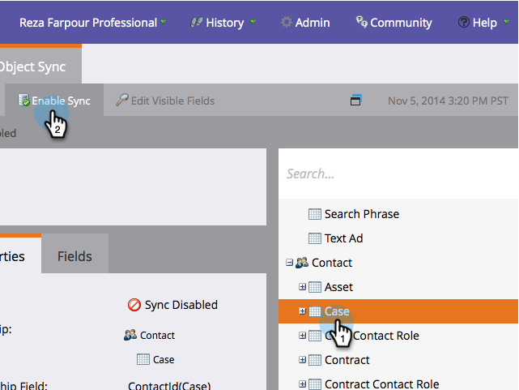

# カスタムオブジェクト同期の有効化/無効化 {#enable-disable-custom-object-sync}

Salesforceインスタンスで作成されたカスタムオブジェクトは、Marketoの一部にすることもできます。 設定方法を次に示します。

## カスタムオブジェクト同期の有効化/無効化 {#enable-disable-custom-object-sync-1}

>[!NOTE]
>
>管理者権限が必要です。

1. 「 **管理者**」をクリックします。

   ** 

   **

1. データベース管理メニューで、「 **Salesforce** Objects Sync ****」をクリックします。

   

1. これが最初のカスタムオブジェクトの場合は、「スキーマを **同期」をクリックします。** それ以外の場合は、「 **スキーマを更新** 」をクリックして最新の状態にします。

   

1. グローバル同期が実行中の場合は、[グローバル同期の **無効化]をクリックして無効にする必要があります。**

   

   >[!NOTE]
   >
   >Salesforceカスタムオブジェクトスキーマの同期には数分かかる場合があります。

1. 「 **スキーマの更新**」をクリックします。

   

1. 同期するオブジェクトを選択し、「同期を **有効にする**」をクリックします。

   >[!TIP]
   >
   >Marketorは、Salesforceのリード、連絡先、またはアカウントオブジェクトと直接関係がある場合にのみ、カスタムオブジェクトを同期できます。

   

1. 「同期 **を有効にする** 」を再度クリックします。

   ** 

   **

1. 「 **Salesforce** 」タブに戻り、「同期を **有効にする**」をクリックします。

   

## カスタムオブジェクトの使用 {#using-your-custom-objects}

>[!NOTE]
>
>トリガーを使用したスマートキャンペーンでは、カスタムオブジェクトを使用できません。

1. スマートリストで、「 **Has Opportunity」**&#x200B;フィルターの上にドラッグし、「true **」に設定します**。

   

1. 次に、フィルター制約を使用してフォーカスを絞り込みます。

   

   素晴らしい！ これで、このカスタムオブジェクトのデータをスマートキャンペーンとスマートリストで使用できます。

>[!NOTE]
>
>**関連記事**
>
>* [スマートリスト/トリガー制約としての追加カスタムオブジェクトフィールドの削除](add-remove-custom-object-field-as-smart-list-trigger-constraints.md)

>

