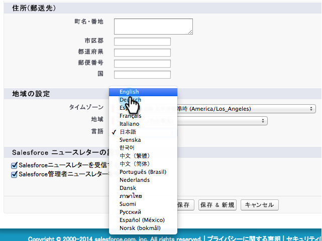

# 英語以外のカスタムオブジェクトの同期を有効にする {#enable-non-english-custom-object-sync}

Marketoの同期ユーザーが英語以外の言語に設定されている場合、カスタムオブジェクトの同期を有効にしようとするとエラーが発生する場合があります。

## エラー {#the-error}

## 取り組み {#getting-around-it}

1. ユーザーを同期するマーケティングツールを使用してSalesforceにログインします。

   

1. ユーザー名の下で、「 **設定**」に移動します。

   

1. 「 **個人情報**」で、「 **個人情報**」をクリックします。

   

1. 「 **編集**」をクリックします。

   

1. 言語 **を** 英語に変更します ****。

   

1. 「 **保存**」をクリックします。

   

1. Marketoに戻るには、 **管理者/Salesforce/オブジェクト** (スキーマの **更新)をクリックします**。

   

1. これは英語でオブジェクトリストを引き出します。 次に、選択するオブジェクトを選択し、「同期を **有効にする**」をクリックします。

   

1. カスタムオブジェクトが有効になり、同期が行われていることに注意してください。

   

1. 次に、Salesforceに戻り、上記の手順を使用して、同期ユーザーを希望の言語に戻します。

>[!NOTE]
>
>**Reminder**
>
>最後にスキーマを更新して、オブジェクトを再び使用するのを忘れないでください。

