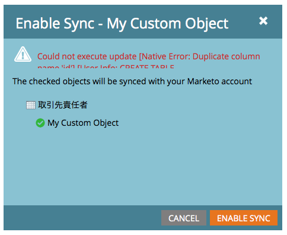

# 英語以外のカスタムオブジェクト同期の有効化 {#enable-non-english-custom-object-sync}

Marketo 同期ユーザーが英語以外の言語に設定されている場合、カスタムオブジェクト同期を有効にしようとするとエラーが発生することがあります。

## 解決方法 {#how-to-fix}

1. Marketo 同期ユーザを使用して [!DNL Salesforce] にログインします。

   

1. ユーザー名ドロップダウンをクリックし、**[!UICONTROL 設定]**&#x200B;を選択します。

   

1. 「**[!UICONTROL 個人情報]**」で、「**[!UICONTROL 個人情報]**」をクリックします。

   

1. 「**[!UICONTROL 編集]**」をクリックします。

   

1. 「**[!UICONTROL 言語]**」を&#x200B;**[!UICONTROL 英語]**&#x200B;に変更します。

   

1. 「**[!UICONTROL 保存]**」をクリックします。

   

1. [Adobe Account Profile](https://account.adobe.com/profile){target="_blank"}で、**[!UICONTROL Preferred languages]**&#x200B;までスクロールして、最初の言語が英語に設定されていることを確認します。

   

1. Marketo Engageで、**[!UICONTROL 管理者]** > **[!UICONTROL Salesforce]** > **[!UICONTROL オブジェクト]**&#x200B;に移動します。 「**[!UICONTROL スキーマを更新]**」をクリックします。

   

1. これは英語でオブジェクトリストを引き出します。 目的のオブジェクトを選択し、**[!UICONTROL 同期を有効にする]**&#x200B;をクリックします。

   

1. カスタムオブジェクトが有効になり、同期されます。

   

1. [!DNL Salesforce]に戻り、上記の手順を使用して、同期ユーザーを目的の言語に戻します。

>[!NOTE]
>
>オブジェクトを言語に戻すために、スキーマを最後に1回更新します。
