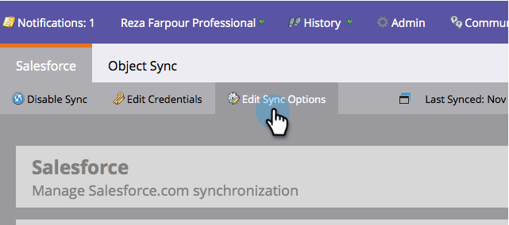
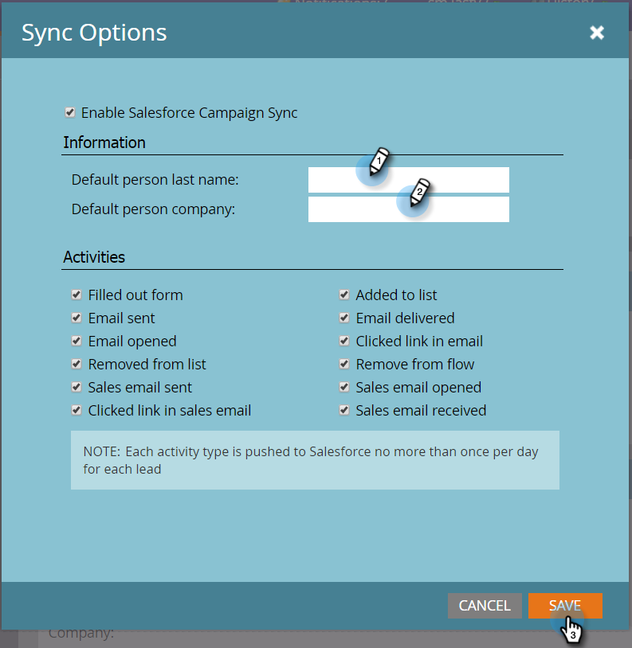

# デフォルトのリーダーの姓と会社名の設定 {#set-default-person-last-name-and-company-name}

[!DNL Salesforce] のリードと取引先責任者には最低限で姓と会社名が必要です。 不完全なレコードは [!DNL Salesforce] と同期されません。 部分的なレコードを同期する場合は、Marketo が [!DNL Salesforce] で使用するデフォルト値を設定する必要があります。

1. 「**[!UICONTROL 管理者]**」に移動し、「**[!DNL Salesforce]**」をクリックします。

   

1. 「**[!UICONTROL 同期オプションを編集]**」をクリックします。

   

1. 「**[!UICONTROL デフォルト人物の姓]**」および「**[!UICONTROL デフォルト人物の会社]**」を入力してから「**[!UICONTROL 保存]**」をクリックします。

   

   >[!NOTE]
   >
   >Marketo Engage は、レコードが最初に Salesforce に同期されたときに、必須フィールドのいずれかが空の場合にのみ、デフォルト値を割り当てます。

ユーザーに姓または会社名が見つからない場合は、レコードを同期する際にMarketoがデフォルト値を追加します。
