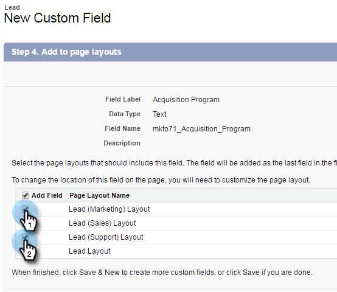
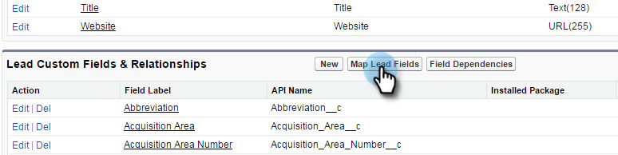

# 手順 1／3：Marketo フィールドの Salesforce への追加（Professional） {#step-of-add-marketo-fields-to-salesforce-professional}

>[!PREREQUISITES]
>
>Marketo と Salesforce の間でデータを同期するには、Salesforce API へのアクセス権が必要です。

Marketo は、一連のフィールドを使用して、特定の種類のマーケティング関連情報を取り込みます。Salesforce でこのデータを使用する場合は、以下の手順に従ってください。

1. Salesforce でリードと連絡先オブジェクトの 3 つのカスタムフィールド（スコア、獲得プログラム、獲得日）を作成します。
1. これらのカスタムフィールドをリードと連絡先の間にマッピングし、Salesforce でのコンバージョン時に値が持ち越されるようにします。
1. 必要に応じて、その他のフィールドを作成できます（以下の表を参照）。

これらのカスタムフィールドはすべてオプションで、Marketo と Salesforce を同期するのに必須ではありません。ベストプラクティスとして、「スコア」、「獲得プログラム」、「獲得日」のフィールドを作成することをお勧めします。

## Marketo フィールドを Salesforce に追加 {#add-marketo-fields-to-salesforce}

上記の Salesforce 内のリードおよび連絡先オブジェクトに 3 つのカスタムフィールドを追加します。さらに追加する場合は、この節の最後にある使用可能フィールドのテーブルを参照してください。

3 つのカスタムフィールドのそれぞれに対して、次の手順を実行して追加します。「**スコア**」から始めます。

1. Salesforce にログインし、「**設定**」をクリックします。

   

1. 左側のビルドメニューで、「**カスタマイズ**」をクリックし、「**リード**」を選択します。「**フィールド**」をクリックします。

   

1. ページ下部のカスタムフィールドと関係セクションで「**新規**」をクリックします。

   

1. 適切なフィールドタイプを選択します（スコア - **数値**、獲得プログラム - **テキスト**、獲得日 - **日時**）。

   

1. 「**次へ**」をクリックします。

   

1. 次の表に示すように、フィールドの「フィールドラベル」、「長さ」、「フィールド名」を入力します。

<table> 
 <thead> 
  <tr> 
   <th> 
    

      フィールドラベル 
    
</th> 
   <th> 
    

      フィールド名 
    
</th> 
   <th> 
    

      データタイプ 
    
</th> 
   <th> 
    

      フィールド属性 
    
</th> 
  </tr> 
 </thead> 
 <tbody> 
  <tr> 
   <td>スコア</td> 
   <td>mkto71_Lead_Score</td> 
   <td>数字</td> 
   <td>長さ 10  小数点以下桁数 0 </td> 
  </tr> 
  <tr> 
   <td>取得日</td> 
   <td>mkto71_Acquisition_Date</td> 
   <td>日時</td> 
   <td> </td> 
  </tr> 
  <tr> 
   <td>新規顧客獲得プログラム</td> 
   <td>mkto71_Acquisition_Program</td> 
   <td>テキスト</td> 
   <td>長さ 255</td> 
  </tr> 
 </tbody> 
</table>

>[!NOTE]
>
>Salesforce では、フィールド名を使用して API 名を作成するときに、フィールド名に __c を追加します。

>[!NOTE]
>
>テキストフィールドと数値フィールドには長さが必要ですが、日付/時間フィールドには必要ありません。説明はオプションです。

1. 「**次へ**」をクリックします。

   

1. アクセス設定を指定し、「**次へ**」をクリックします。

   * すべての役割を&#x200B;**表示**&#x200B;および&#x200B;**読み取り専用**&#x200B;に設定します。

   * 同期ユーザーのプロファイルの&#x200B;**読み取り専用**&#x200B;のチェックをオフにします。

      * 同期ユーザーとして&#x200B;_システム管理者_&#x200B;のプロファイルを持つユーザーがいる場合は、システム管理者プロファイルの&#x200B;**読み取り専用**&#x200B;のチェックをオフにします（以下を参照）。

      * 同期ユーザーに&#x200B;_カスタムプロファイル_&#x200B;を作成した場合は、のカスタムプロファイルの&#x200B;**読み取り専用**&#x200B;のチェックをオフにします。

   

1. フィールドを表示するページレイアウトを選択します。

   

1. 「**保存して新規作成**」をクリックして戻り、他の 2 つのカスタムフィールドのそれぞれを作成します。3 つとも完成したら、「**保存**」をクリックします。

   

1. 左側のビルドメニューで、「**カスタマイズ**」をクリックし、「**連絡先**」を選択します。「**フィールド**」をクリックします。
1. リードオブジェクトと同様に、連絡先オブジェクトの「スコア」、「獲得日」、「獲得プログラム」フィールドについて手順 3 ～ 10 を実行します。
1. 必要に応じて、このテーブルの追加のカスタムフィールドに対して上記の手順を実行します。

<table> 
 <tbody> 
  <tr> 
   <th>フィールドラベル</th> 
   <th>フィールド名</th> 
   <th>データタイプ</th> 
   <th>フィールド属性</th> 
  </tr> 
  <tr> 
   <td>新規顧客獲得プログラム ID</td> 
   <td>mkto71_Acquisition_Program_Id</td> 
   <td>数字</td> 
   <td>長さ 18  小数点以下桁数 0 </td> 
  </tr> 
  <tr> 
   <td>訪問者の参照元</td> 
   <td>mkto71_Original_Referrer</td> 
   <td>テキスト</td> 
   <td>長さ 255</td> 
  </tr> 
  <tr> 
   <td>参照元検索エンジン</td> 
   <td>mkto71_Original_Search_Engine</td> 
   <td>テキスト</td> 
   <td>長さ 255</td> 
  </tr> 
  <tr> 
   <td>参照元検索フレーズ</td> 
   <td>mkto71_Original_Search_Phrase</td> 
   <td>テキスト</td> 
   <td>長さ 255</td> 
  </tr> 
  <tr> 
   <td>参照元のソース情報</td> 
   <td>mkto71_Original_Source_Info</td> 
   <td>テキスト</td> 
   <td>長さ 255</td> 
  </tr> 
  <tr> 
   <td>参照元のソースのタイプ</td> 
   <td>mkto71_Original_Source_Type</td> 
   <td>テキスト</td> 
   <td>長さ 255</td> 
  </tr> 
  <tr> 
   <td>推測される市区町村</td> 
   <td>mkto71_Inferred_City</td> 
   <td>テキスト</td> 
   <td>長さ 255</td> 
  </tr> 
  <tr> 
   <td>推測される企業</td> 
   <td>mkto71_Inferred_Company</td> 
   <td>テキスト</td> 
   <td>長さ 255</td> 
  </tr> 
  <tr> 
   <td>推測される国</td> 
   <td>mkto71_Inferred_Country</td> 
   <td>テキスト</td> 
   <td>長さ 255</td> 
  </tr> 
  <tr> 
   <td>推測される都市圏</td> 
   <td>mkto71_Inferred_Metropolitan_Area</td> 
   <td>テキスト</td> 
   <td>長さ 255</td> 
  </tr> 
  <tr> 
   <td>推測される市外局番</td> 
   <td>mkto71_Inferred_Phone_Area_Code</td> 
   <td>テキスト</td> 
   <td>長さ 255</td> 
  </tr> 
  <tr> 
   <td>推測される郵便番号</td> 
   <td>mkto71_Inferred_Postal_Code</td> 
   <td>テキスト</td> 
   <td>長さ 255</td> 
  </tr> 
  <tr> 
   <td>推測される都道府県／地域</td> 
   <td>mkto71_Inferred_State_Region</td> 
   <td>テキスト</td> 
   <td>長さ 255</td> 
  </tr> 
 </tbody> 
</table>

>[!NOTE]
>
>Marketo によって自動的に割り当てられたフィールドの値は、新しいフィールドが作成されたときに Salesforce ですぐに使用できるわけではありません。Marketo は、次のアップデート時にいずれかのシステム上のレコードに対して Salesforce とデータを同期します（つまり、Marketo と Salesforce の間で同期されているフィールドのアップデート）。

## コンバージョン用のカスタムフィールドのマッピング  {#map-custom-fields-for-conversions}

コンバージョンが発生した際にデータが引き継がれるように、Salesforce 内のリードオブジェクトのカスタムフィールドを連絡先オブジェクトの連絡先フィールドにマッピングする必要があります。

1. 右上隅で、「設定」をクリックします。

   

1. ナビゲーション検索で「fields」と入力します。Enter は押しません。フィールドは色々なオブジェクトの下に表示されます。リードの下の「フィールド」をクリックします。

   

1. リードのカスタムフィールドと関係セクションに移動し、「リードフィールドをマッピングする」をクリックします。

   

1. マッピングするフィールドの横にあるドロップダウンをクリックします。

   

1. 対応する連絡先カスタムフィールドを選択します。

   

1. 作成した他のフィールドに対して、上記の手順を繰り返します。

1. 完了したら、「保存」をクリックします。

簡単ですね。

>[!MORELIKETHIS]
>
>[手順 2 / 3：Marketo 用の Salesforce ユーザーの作成（Professional）](/help/marketo/product-docs/crm-sync/salesforce-sync/setup/professional-edition/step-2-of-3-create-a-salesforce-user-for-marketo-professional.md)
