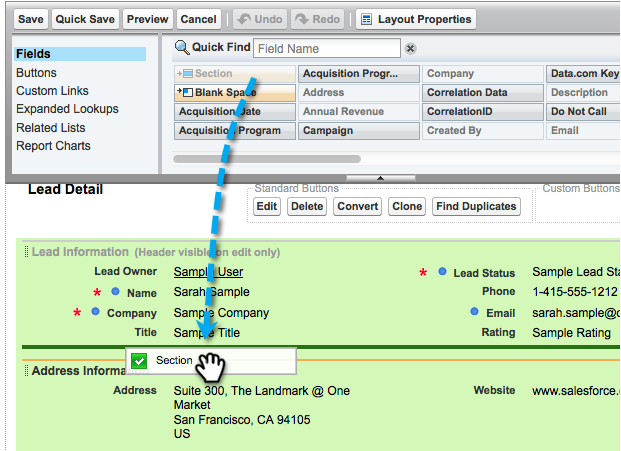

# 手順2/3:Marketo(Professional)用のSalesforceユーザーの作成{#step-of-create-a-salesforce-user-for-marketo-professional}

>[!NOTE]
>
>これらの手順は、Salesforce管理者が実行する必要があります

>[!PREREQUISITES]
>
>[手順1/3:Salesforce追加に対するマーケティング担当者のフィールド(Professional)](/help/marketo/product-docs/crm-sync/salesforce-sync/setup/professional-edition/step-1-of-3-add-marketo-fields-to-salesforce-professional.md)

この記事では、Salesforceページレイアウトでフィールド権限をカスタマイズし、Marketor-Salesforce同期ユーザーを作成します。

## ページレイアウトの設定{#set-page-layouts}

Salesforce Professionalは、Salesforce Enterprise/Unlimitedのプロファイルに対して、ページレイアウトを使用したフィールドレベルのアクセシビリティを設定します。 次の手順に従って、マーケティング担当者がカスタムフィールドを同期できるようにします。

1. ナビゲーション検索バーに&#x200B;**ページレイアウト**&#x200B;と入力し、**Enter**&#x200B;キーを押さずに入力し、**リード**&#x200B;の下の&#x200B;**ページレイアウト**&#x200B;をクリックします。

   

1. 「Lead Layout」の横の「**Edit**」をクリックします。

   

1. 新しい&#x200B;**セクション**&#x200B;をクリックし、ページレイアウトにドラッグします。

   

1. 「**セクション名**」に「Marketo」と入力し、「**OK**」をクリックします。

   

1. フィールド&#x200B;**獲得日**&#x200B;をクリックし、**マーケティング先**&#x200B;セクションにドラッグします。

   

1. 次のフィールドに対して、上記の手順を繰り返します。

   * 獲得プログラム
   * 獲得プログラムID
   * 電子メオプトアウトール
   * 推定都市
   * 推定会社
   * 推定国
   * 推定都市圏
   * 推定電話番号市外局番
   * 推定郵便番号
   * 推定状態領域
   * リードスコア
   * 元の転送者
   * オリジナル検索エンジン
   * オリジナルの検索フレーズ
   * 元のソース情報
   * 元のソースの種類

   >[!NOTE]
   >
   >これらのフィールドは、マーケティング担当者が読み取り/書き込みを行えるように、ページレイアウト上に配置する必要があります。

   >[!TIP]
   >
   >ページの右側に下方向にドラッグして、フィールドに2つの列を作成します。 フィールドを左右に移動して、列の長さのバランスをとることができます。

1. フィールドの追加が終了したら、「**保存**」をクリックします。

   

1. Salesforce **連絡先ページのレイアウト**&#x200B;に対して、上記の手順をすべて繰り返します。

   

1. **連絡先ページのレイアウト**&#x200B;を終了したら、「**保存**」をクリックします。

   

   >[!NOTE]
   >
   >**終日のイベント**&#x200B;フィールドが&#x200B;**イベントページレイアウト**&#x200B;に追加されていることを確認します。

## 同期ユーザーの作成{#create-sync-user}

Marketorは、Salesforceにアクセスするために資格情報が必要です。 これは、次の手順で作成した専用のユーザーを使用して行うのが最適です。

>[!NOTE]
>
>組織に追加のSalesforceライセンスがない場合は、既存の&#x200B;**マーケティングユーザー**&#x200B;と&#x200B;**システム管理者**&#x200B;プロファイルを使用できます。

1. ナビゲーション検索バーに「users」と入力し、「**ユーザーを管理**」の下の「**ユーザー**」をクリックします。

   

1. 「**新しいユーザー**」をクリックします。

   

1. 必須フィールドに入力し、**ユーザーライセンスを選択します。Salesforce**、**プロファイルを設定します。システム管理者**、「**マーケティングユーザー**」をオンにし、「**保存**」をクリックします。

   

   >[!TIP]
   >
   >入力した電子メールアドレスが有効であることを確認します。 パスワードをリセットするには、同期ユーザーとしてログインする必要があります。

素晴らしい！ これで、MarketoがSalesforceに接続する際に使用できるアカウントが作成されました。 やろう。

>[!MORELIKETHIS]
>
>[手順3/3:MarketoとSalesforce(Professional)の連携](/help/marketo/product-docs/crm-sync/salesforce-sync/setup/professional-edition/step-3-of-3-connect-marketo-and-salesforce-professional.md)
