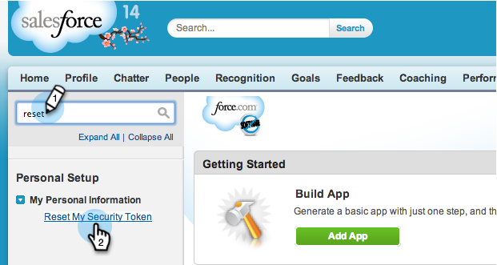

# 手順3/3:MarketoとSalesforce(Professional)の接続 {#step-of-connect-marketo-and-salesforce-professional}

この記事では、Marketoを設定済みのSalesforceインスタンスと同期するように設定します。

>[!PREREQUISITES]
>
>* [手順1/3:MarketoフィールドのSalesforce(Professional)への追加](/help/marketo/product-docs/crm-sync/salesforce-sync/setup/professional-edition/step-1-of-3-add-marketo-fields-to-salesforce-professional.md)
>* [手順2 / 3:Marketo(Professional)用Salesforceユーザーの作成](/help/marketo/product-docs/crm-sync/salesforce-sync/setup/professional-edition/step-2-of-3-create-a-salesforce-user-for-marketo-professional.md)

## 同期ユーザーセキュリティトークンの取得 {#retrieve-sync-user-security-token}

>[!TIP]
>
>既にセキュリティトークンを持っている場合は、Set Sync User Credentials and Kudosに直接進んで準備します。

1. Marketo Sync UserでSalesforceにログインし、同期ユーザーの名前をクリックしてから、**My Settings**&#x200B;をクリックします。

   

1. ナビゲーション検索バーに「reset」と入力し、「**Reset My Security Token**」をクリックします。

   

1. 「**セキュリティトークンをリセット**」をクリックします。

   

   セキュリティトークンは電子メールで送信されます。

## ユーザーの資格情報の同期の設定 {#set-sync-user-credentials}

1. Marketoで、「**管理**」に移動し、「**CRM**」を選択して、「**[Salesforce.com](https://Salesforce.com)**&#x200B;と同期」をクリックします。

   

   >[!NOTE]
   >
   >**「フィールドを同期**」をクリックする前に、Marketoで不要な](/help/marketo/product-docs/crm-sync/salesforce-sync/sfdc-sync-details/hide-a-salesforce-field-from-the-marketo-sync.md)フィールドをすべて同期ユーザーから非表示にしてください。 [「フィールドを同期」をクリックすると、ユーザーに表示されるすべてのフィールドがMarketoに完全に作成され、削除できなくなります。

1. Salesforce設定のパート2で作成したSalesforce Syncユーザーの資格情報([Professional](/help/marketo/product-docs/crm-sync/salesforce-sync/setup/professional-edition/step-2-of-3-create-a-salesforce-user-for-marketo-professional.md)、[Enterprise](/help/marketo/product-docs/crm-sync/salesforce-sync/setup/enterprise-unlimited-edition/step-2-of-3-create-a-salesforce-user-for-marketo-enterprise-unlimited.md))を入力し、「**フィールドを同期**」をクリックします。

   

   >[!NOTE]
   >
   >MarketoサンドボックスをSalesforceサンドボックスに同期する場合は、**Sandbox**&#x200B;をオンにします。

1. 警告を読み、「**資格情報を確認**」をクリックします。

   

   >[!CAUTION]
   >
   >[マッピングを調べてカスタマイズしたい場合は](/help/marketo/product-docs/crm-sync/salesforce-sync/setup/optional-steps/edit-initial-field-mappings.md)、これが唯一のチャンスです。 「Salesforce同期を開始」をクリックすると、完了です。

## Salesforce 同期の開始 {#start-salesforce-sync}

1. 「**Salesforce同期を開始**」をクリックして、永続的なMarketo-Salesforce同期を開始します。

   

   >[!CAUTION]
   >
   >Marketoは、Salesforceの同期や、リードを手動で入力した場合、自動的に重複排除をおこないません。

1. 「**同期を開始**」をクリックします。

   

   >[!NOTE]
   >
   >初期同期が完了するまでの時間は、データベースのサイズと複雑さによって異なります。

## 同期の検証 {#verify-sync}

Marketoの「管理」領域に、Salesforce同期のステータスメッセージが表示されます。 次の手順に従うことで、同期が正しく機能していることを確認できます。

1. Marketoで、「**管理者**」をクリックし、「**Salesforce**」をクリックします。

   

1. 同期ステータスは右上隅に表示されます。 次の3つのメッセージのいずれかが表示されます。**最後に同期された**、**処理中の同期**、または&#x200B;**失敗**。

   

   

   

Marketoの最も強力な機能の1つの設定が完了しました。

>[!MORELIKETHIS]
>
>* [Marketo Sales InsightパッケージのSalesforceAppExchange](/help/marketo/product-docs/marketo-sales-insight/msi-for-salesforce/installation/install-marketo-sales-insight-package-in-salesforce-appexchange.md)
>* [Salesforce Professional EditionでのMarketo Sales Insightの設定](/help/marketo/product-docs/marketo-sales-insight/msi-for-salesforce/configuration/configure-marketo-sales-insight-in-salesforce-professional-edition.md)

