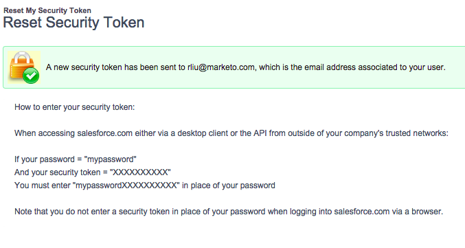
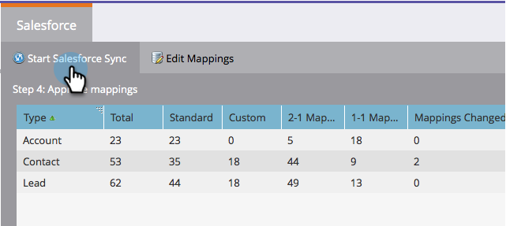

# 手順3/3:MarketoとSalesforce(Professional)を接続{#step-of-connect-marketo-and-salesforce-professional}

この記事では、設定したSalesforceインスタンスと同期するようにMarketoを設定します。

>[!PREREQUISITES]
>
>* [手順1/3:Salesforce追加に対するマーケティング担当者のフィールド(Professional)](step-1-of-3-add-marketo-fields-to-salesforce-professional.md)
>* [手順2/3:Marketor用のSalesforceユーザーの作成(Professional)](step-2-of-3-create-a-salesforce-user-for-marketo-professional.md)

>

## 同期ユーザーセキュリティトークンの取得{#retrieve-sync-user-security-token}

>[!TIP]
>
>既にセキュリティトークンをお持ちの場合は、準備のために「同期ユーザー資格情報とKDを設定」に直接進みます。

1. Marketo Syncユーザーを使用してSalesforceにログインし、同期ユーザーの名前をクリックして、**マイ設定**&#x200B;をクリックします。

   

1. ナビゲーション検索バーで「reset」と入力し、「**Reset My Security Token**」をクリックします。

   

1. 「**セキュリティトークンをリセット**」をクリックします。

   

   セキュリティトークンは電子メールで送信されます。

## 同期ユーザー資格情報の設定{#set-sync-user-credentials}

1. Marketoで、**管理者**&#x200B;に移動し、**CRM**&#x200B;を選択して、**Salesforce.com](http://Salesforce.com)**&#x200B;と同期をクリックします。[

   

   >[!NOTE]
   >
   >**Reminder**
   >
   >
   >[同期フィールド&#x200B;**をクリックする前に、マーケティングで不要な](../../../../../product-docs/crm-sync/salesforce-sync/sfdc-sync-details/sfdc-sync-field-sync/hide-a-salesforce-field-from-the-marketo-sync.md)フィールドを同期ユーザーから**&#x200B;隠すようにしてください。 「フィールドを同期」をクリックすると、ユーザーに表示されるすべてのフィールドが、Marketorに永久的に作成され、削除できません。

1. Salesforce設定([Professional](https://community.marketo.com/MarketoArticle?id=kA050000000LJ3QCAW)、[Enterprise](https://community.marketo.com/MarketoArticle?id=kA050000000LIwKCAW))のパート2で作成したSalesforce同期ユーザー資格情報を入力し、「**フィールドを同期**」をクリックします。

   

   >[!NOTE]
   >
   >Marketo SandboxをSalesforce Sandboxに同期する場合は、**Sandbox**&#x200B;を確認してください。

1. 警告を読み、「**資格情報を確認**」をクリックします。

   

   >[!CAUTION]
   >
   >[マッピングを調べてカスタマイズ](../../../../../product-docs/crm-sync/salesforce-sync/setup/optional-steps/edit-initial-field-mappings.md)したい場合は、これが唯一の方法です！ 「開始」「Salesforce同期」をクリックすると、同期が完了します。

## 開始Salesforce同期{#start-salesforce-sync}

1. 「**開始Salesforce Sync**」をクリックして、永続的なMarketo-Salesforce同期を開始します。

   

   >[!CAUTION]
   >
   >Marketorは、Salesforceの同期に対して、またはリードを手動で入力した場合に、自動的に重複除外を行いません。

1. **開始同期**&#x200B;をクリックします。

   

   >[!NOTE]
   >
   >初期同期が完了するまでの時間は、データベースのサイズと複雑さに応じて異なります。

## 同期の確認{#verify-sync}

Marketorは、管理領域でSalesforce同期のステータスメッセージを提供します。 次の手順に従って、同期が正しく動作していることを確認できます。

1. Marketoで、「**管理者**」をクリックし、「**Salesforce**」をクリックします。

   

1. 同期ステータスは、右上隅に表示されます。 次の3つのメッセージのいずれかが表示されます。**前回同期**、**同期中**、または&#x200B;**失敗**。

   

   

   

Marketoの最も強力な機能の1つの設定が完了しました。

>[!NOTE]
>
>**関連記事**
>
>* [SalesforceAppExchangeへのMarketo Sales Insightパッケージのインストール](../../../../../product-docs/marketo-sales-insight/msi-for-salesforce/installation/install-marketo-sales-insight-package-in-salesforce-appexchange.md)
>* [Salesforce Professional EditionでのMarketor Sales Insightの設定](../../../../../product-docs/marketo-sales-insight/msi-for-salesforce/configuration/configure-marketo-sales-insight-in-salesforce-professional-edition.md)
>* [オプションの手順](http://docs.marketo.com/display/docs/optional+steps)

>

