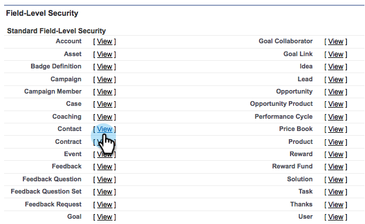

# 既存の Salesforce フィールドの Marketo 同期への追加 {#add-an-existing-salesforce-field-to-the-marketo-sync}

>[!NOTE]
>
>**管理者権限が必要**

通常、Salesforce の新しいカスタムフィールドは Marketo に自動的に同期されます。そうでない場合、Marketo 同期ユーザーにはフィールドが表示されない場合があります。この問題の修正方法を次に示します。

1. 名前をクリックし、「**設定**」を選択します。

   

1. 左の検索バーで「**プロファイル**」と入力し、「**ユーザーを管理**」の下の「**プロファイル**」をクリックします。

   

1. 同期ユーザーのプロファイルをクリックします。

   

1. **フィールドレベルのセキュリティ**&#x200B;セクションで、フィールドを含むオブジェクトの横にある「**表示**」をクリックします。

   

1. 「**編集**」をクリックします。

   

1. 同期に追加するフィールドの「**表示**」のチェックをオンにし、「**保存**」をクリックします。

   

   できましたね。次の同期サイクルで、Marketo はフィールドを表示し、マジックを開めます。

   >[!NOTE]
   >
   > フィールドに既に Salesforce の値が含まれている場合、これらの値は次のレコードがアップデートされるまで Marketo に同期されません。
