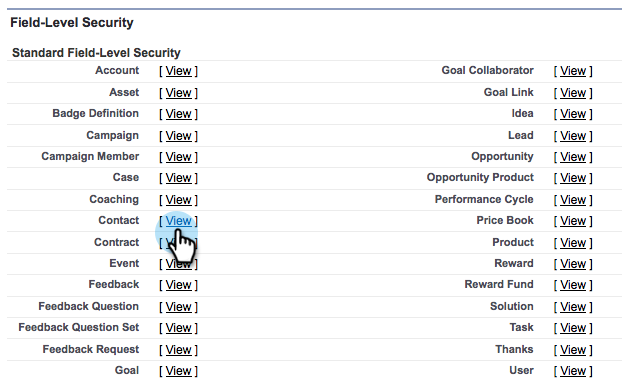
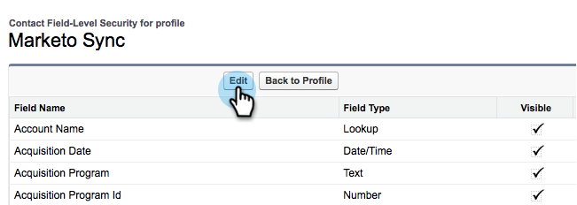
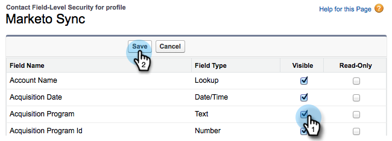

# 既存の [!DNL Salesforce] フィールドの Marketo 同期への追加 {#add-an-existing-salesforce-field-to-the-marketo-sync}

>[!NOTE]
>
>**管理者権限が必要**

通常、Salesforce の新しいカスタムフィールドは Marketo Engage に自動的に同期されます。 そうでない場合、Marketo 同期ユーザーにはフィールドが表示されない場合があります。 この問題の修正方法を次に示します。

1. 名前をクリックし、「**[!UICONTROL 設定]**」を選択します。

   

1. 左の検索バーで「プロファイル」と入力し、「**[!UICONTROL ユーザを管理]**」の下の「**[!UICONTROL プロファイル]**」をクリックします。

   

1. 同期ユーザーのプロファイルをクリックします。

   

1. **[!UICONTROL フィールドレベルのセキュリティ]**&#x200B;セクションで、フィールドを含むオブジェクトの横にある「**[!UICONTROL 表示]**」をクリックします。

   

1. 「**[!UICONTROL 編集]**」をクリックします。

   

1. 同期に追加するフィールドの「**[!UICONTROL 表示]**」のチェックをオンにし、「**[!UICONTROL 保存]**」をクリックします。

   

   次の同期サイクルで、Marketo がそのフィールドを認識し、同期処理が開始されます。

   >[!NOTE]
   >
   > [!DNL Salesforce] でフィールドに既に値が含まれている場合、これらの値は次のレコードが更新されるまで Marketo に同期されません。
