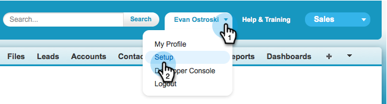
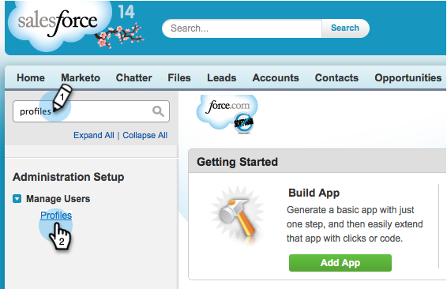

# Marketo 同期に対する [!DNL Salesforce] フィールドの非表示 {#hide-a-salesforce-field-from-the-marketo-sync}

>[!NOTE]
>
>**管理者権限が必要**

Salesforce のすべてのフィールドがマーケティングに役立つわけではありません。 必要なフィールドのみを含めることで、同期のパフォーマンスを最適化できます。 Marketo でフィールドを非表示にする方法を次に示します。

1. 名前メニューをクリックし、「**[!UICONTROL 設定]**」を選択します。

   

1. 検索バーで「プロファイル」と入力し、「**[!UICONTROL ユーザを管理]**」で「**[!UICONTROL プロファイル]**」をクリックします。

   

1. 同期ユーザのプロファイルをクリックします。

   

1. **[!UICONTROL フィールドレベルのセキュリティ]**&#x200B;セクションで、ターゲットフィールドを含むオブジェクトの横にある「**[!UICONTROL 表示]**」をクリックします。

   

1. 「**[!UICONTROL 編集]**」をクリックします。

   

1. 非表示にするフィールドの横にある「**[!UICONTROL 表示]**」のチェックをオフにします。 「**[!UICONTROL 保存]**」をクリックします。

   

   >[!NOTE]
   >
   >[!DNL Salesforce] で非表示にしたフィールドが既に Marketo と同期されている場合は、Marketo でも非表示にする必要があります。

   次の同期が終了すると、このフィールドはMarketoに表示されなくなります。

   >[!MORELIKETHIS]
   >
   >[フィールドの表示／非表示](/help/marketo/product-docs/administration/field-management/hide-and-unhide-a-field.md){target="_blank"}
