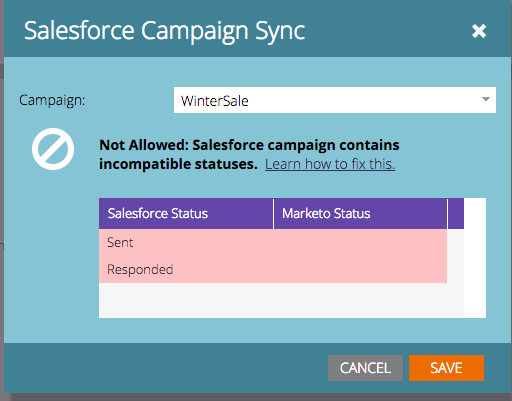

# 同期前のプログラムステータスと [!DNL Salesforce] キャンペーンステータスの照合方法 {#how-to-match-program-statuses-and-salesforce-campaign-statuses-prior-to-sync}

この記事では、Marketo プログラムと [!DNL Salesforce] キャンペーンを同期する前に、互換性のないステータスエラーを修正し、ステータスをマッピングする方法について説明します。

## エラーメッセージが表示された場合の対処方法 {#what-do-you-do-if-you-received-an-error-message}

リードを含む既存の [!DNL Salesforce] キャンペーンの同期を試みた際にキャンペーンに 1 つ以上の互換性のないステータスが含まれていると、エラーメッセージが表示されます。 ステータスが完全に一致しない場合、Marketo プログラムと [!DNL Salesforce] キャンペーンは同期&#x200B;*されません*。

このエラーメッセージから、次ができます。

1. 同期先となる別のキャンペーンをドロップダウンメニューから選択する、または
1. キャンセルしてステータスエラーを修正し、エラーが修正された後に同期を試みる。 ステータスエラーを修正するには、次のいずれかの操作を行います。

   * Salesforce にログインし、互換性のないキャンペーンメンバーステータスを削除または名前変更して、Marketo プログラムに関連付けられたチャネルタイプに使用される Marketo プログラムステータスにマッピングする。
   * Marketo のプログラムステータスを変更して、Salesforce キャンペーンメンバーステータスにマッピングする。 これは Marketo 管理機能です。 詳しくは、[プログラムチャネルの作成](/help/marketo/product-docs/administration/tags/create-a-program-channel.md){target="_blank"}を参照してください。
