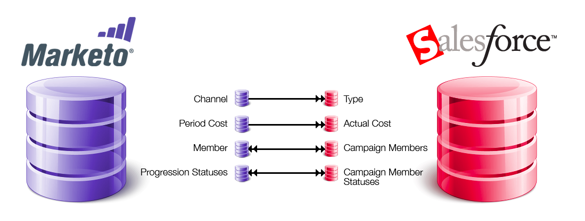

# SFDC同期：キャンペーンの同期 {#sfdc-sync-campaign-sync}

Marketoプログラムは、Salesforceキャンペーンと同期できます。 この仕組みの概要を次に示します。

## MarketoプログラムをSalesforceキャンペーンと同期する必要があるのはなぜですか。 {#why-should-i-sync-marketo-programs-with-salesforce-campaigns}

* Marketoプログラムの強力な機能を使用します。
* MarketoプログラムとSalesforceキャンペーンの間で、メンバーとそのステータスを同期させます。
* MarketoとSalesforceのレポート機能をタップします。

## MarketoプログラムとSalesforceキャンペーンはどのように同期されますか？ {#how-is-a-marketo-program-and-a-salesforce-campaign-synced}

Marketoでは、プログラムとSalesforceキャンペーンの間の1対1のマッピングを作成できます。

MarketoとSalesforceの同期における&#x200B;**[チャネル](/help/marketo/product-docs/administration/tags/create-a-program-channel.md)**&#x200B;と&#x200B;**[期間のコスト](/help/marketo/product-docs/core-marketo-concepts/programs/working-with-programs/understanding-period-costs.md)**&#x200B;は、**キャンペーンタイプ**&#x200B;と&#x200B;**実際のコスト**&#x200B;として計算されます。 この同期は、MarketoからSalesforceへの&#x200B;**1方向**&#x200B;です。

Marketoの&#x200B;**プログラムメンバー**&#x200B;と&#x200B;**[進行状況](/help/marketo/product-docs/core-marketo-concepts/programs/creating-programs/understanding-program-membership.md)**&#x200B;は、**Salesforceキャンペーンメンバー**&#x200B;および&#x200B;**キャンペーンメンバーの像**&#x200B;と同期されます。 これは&#x200B;**双方向の同期**&#x200B;なので、MarketoまたはSalesforceで行われた変更は両方のシステムに反映されます。

>[!NOTE]
>
>MarketoプログラムにSalesforceに存在しないメンバーがいる場合、MarketoはそれらのメンバーをSalesforceのリードとして作成します。

## キャンペーンに関連するトリガー/フィルターは何ですか？ {#what-are-the-triggers-filters-related-to-campaigns}

トリガー:

* SFDC キャンペーンに追加
* SFDC キャンペーンから削除
* SFDC キャンペーンでのステータス変更

フィルター:

* SFDC キャンペーンのメンバー

## SFDCキャンペーンにMarketo Peopleを追加できますか。 {#can-i-add-marketo-people-to-my-sfdc-campaign}

はい、[SFDCキャンペーンフローに追加](/help/marketo/product-docs/core-marketo-concepts/smart-campaigns/salesforce-flow-actions/add-to-sfdc-campaign.md)を使用します。 このユーザーがSalesforceに存在しない場合、MarketoはSalesforceで作成し、キャンペーンに追加します。

## Marketoを使用してSFDCキャンペーンからメンバーを削除できますか。 {#can-i-remove-members-from-my-sfdc-campaign-using-marketo}

はい、[SFDCキャンペーンフローから削除](/help/marketo/product-docs/core-marketo-concepts/smart-campaigns/salesforce-flow-actions/remove-from-sfdc-campaign.md)を使用します。

## Marketoを使用してキャンペーンメンバーのステータスを変更できますか？ {#can-i-change-campaign-member-status-using-marketo}

はい、SFDCキャンペーンのフローアクションで[ステータスの変更](/help/marketo/product-docs/core-marketo-concepts/smart-campaigns/salesforce-flow-actions/change-status-in-sfdc-campaign.md)を使用します。

## Salesforceのキャンペーンが表示されないのはなぜですか。 {#why-cant-i-see-any-of-my-salesforce-campaigns}

次の点を確認できます。

1. [キャンペーンの同期が有効](/help/marketo/product-docs/crm-sync/salesforce-sync/setup/optional-steps/enable-disable-campaign-sync.md)になっていることを確認します。
1. [Marketo 同期ユーザー](/help/marketo/product-docs/crm-sync/salesforce-sync/setup/enterprise-unlimited-edition/step-2-of-3-create-a-salesforce-user-for-marketo-enterprise-unlimited.md)が、Salesforce で[マーケティングユーザー](/help/marketo/product-docs/crm-sync/salesforce-sync/setup/optional-steps/enable-disable-campaign-sync/make-marketo-sync-user-a-marketing-user.md)になっていることを確認します。

>[!NOTE]
>
>SalesforceキャンペーンとマッピングされたMarketoプログラムに互換性のないプログラムステータスがある場合、エラーメッセージが表示される場合があります。 同期](/help/marketo/product-docs/crm-sync/salesforce-sync/sfdc-sync-details/how-to-match-program-statuses-and-salesforce-campaign-statuses-prior-to-sync.md)の前に、プログラムのステータスを[一致させることをお勧めします。

>[!MORELIKETHIS]
>
>* [SFDC キャンペーンとプログラムの同期](/help/marketo/product-docs/core-marketo-concepts/programs/working-with-programs/sync-an-sfdc-campaign-with-a-program.md)
>* [プログラムメンバーシップについて](/help/marketo/product-docs/core-marketo-concepts/programs/creating-programs/understanding-program-membership.md)
>* [キャンペーン同期の有効化/無効化](/help/marketo/product-docs/crm-sync/salesforce-sync/setup/optional-steps/enable-disable-campaign-sync.md)
>* [Marketo Syncユーザーをマーケティングユーザーにする](/help/marketo/product-docs/crm-sync/salesforce-sync/setup/optional-steps/enable-disable-campaign-sync/make-marketo-sync-user-a-marketing-user.md)

