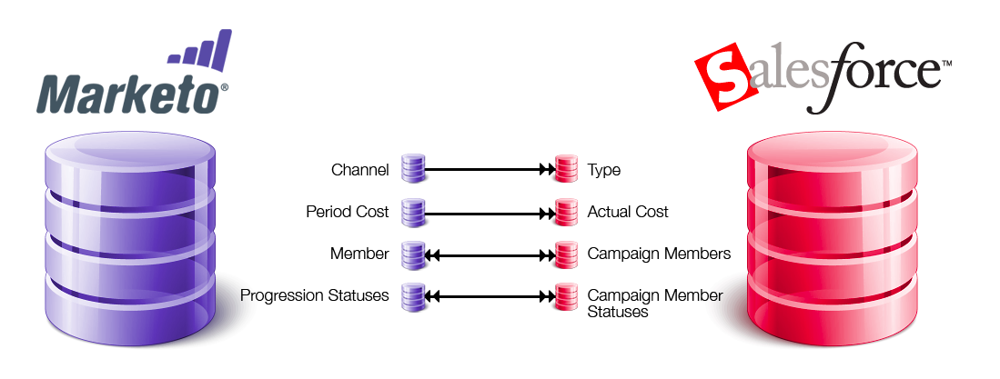

# SFDC 同期：キャンペーンの同期 {#sfdc-sync-campaign-sync}

Marketo プログラムは、[!DNL Salesforce] キャンペーンと同期できます。 この仕組みの概要を次に示します。

## Marketo プログラムを [!DNL Salesforce] キャンペーンと同期する理由 {#why-should-i-sync-marketo-programs-with-salesforce-campaigns}

* Marketo プログラムの強力な機能を使用できます。
* Marketo プログラムと [!DNL Salesforce] キャンペーンの間で、メンバーとステータスの同期を維持できる。
* Marketo と [!DNL Salesforce] のレポート機能を使用できる。

## Marketo プログラムと [!DNL Salesforce] キャンペーンが同期される方法 {#how-is-a-marketo-program-and-a-salesforce-campaign-synced}

Marketo では、プログラムと [!DNL Salesforce] キャンペーンの間に 1 対 1 のマッピングを作成するオプションがあります。

Marketo の&#x200B;**[チャネル](/help/marketo/product-docs/administration/tags/create-a-program-channel.md)**&#x200B;と&#x200B;**[期間原価](/help/marketo/product-docs/core-marketo-concepts/programs/working-with-programs/understanding-period-costs.md)**&#x200B;は [!DNL Salesforce] の&#x200B;**キャンペーンタイプ**&#x200B;と&#x200B;**実費**&#x200B;に同期されます。 この同期は、Marketo から [!DNL Salesforce] への&#x200B;**一方向**&#x200B;です。

Marketo の&#x200B;**プログラムメンバー**&#x200B;と&#x200B;**[進行状況のステータス](/help/marketo/product-docs/core-marketo-concepts/programs/creating-programs/understanding-program-membership.md)**&#x200B;は、**[!DNL Salesforce]キャンペーンメンバー**&#x200B;と&#x200B;**キャンペーンメンバーステータス**&#x200B;に同期されます。 これは、**双方向同期**&#x200B;であるため、Marketo または [!DNL Salesforce] で行われた変更は両方のシステムに反映されます。

>[!NOTE]
>
>Marketo プログラムに [!DNL Salesforce] に存在しないメンバーがいる場合、Marketo はそれらのメンバーを [!DNL Salesforce] 内のリードとして作成します。

## キャンペーンに関連するトリガー／フィルターは何ですか。 {#what-are-the-triggers-filters-related-to-campaigns}

トリガー：

* SFDC キャンペーンに追加
* SFDC キャンペーンから削除
* SFDC キャンペーンでステータスが変更された

フィルター：

* SFDC キャンペーンのメンバー

## SFDC キャンペーンに Marketo の人物レコードを追加できますか？ {#can-i-add-marketo-people-to-my-sfdc-campaign}

はい。[SFDC キャンペーンに追加](/help/marketo/product-docs/core-marketo-concepts/smart-campaigns/salesforce-flow-actions/add-to-sfdc-campaign.md)フローアクションを使用します。 この人物が [!DNL Salesforce] に存在しない場合、Marketo は [!DNL Salesforce] で作成し、キャンペーンに追加します。

## Marketo を使用して SFDC キャンペーンからメンバーを削除できますか？ {#can-i-remove-members-from-my-sfdc-campaign-using-marketo}

はい。[SFDC キャンペーンから削除](/help/marketo/product-docs/core-marketo-concepts/smart-campaigns/salesforce-flow-actions/remove-from-sfdc-campaign.md){target="_blank"}フローアクションを使用します。

## Marketo を使用してキャンペーンメンバーのステータスを変更できますか？ {#can-i-change-campaign-member-status-using-marketo}

はい。[SFDC キャンペーンのステータス変更](/help/marketo/product-docs/core-marketo-concepts/smart-campaigns/salesforce-flow-actions/change-status-in-sfdc-campaign.md){target="_blank"}フローアクションを使用します。

## [!DNL Salesforce] キャンペーンが表示されないのはなぜですか？ {#why-cant-i-see-any-of-my-salesforce-campaigns}

次の点を確認してください。

1. [キャンペーンの同期が有効](/help/marketo/product-docs/crm-sync/salesforce-sync/setup/optional-steps/enable-disable-campaign-sync.md)になっていることを確認します。
1. [Marketo 同期ユーザー](/help/marketo/product-docs/crm-sync/salesforce-sync/setup/enterprise-unlimited-edition/step-2-of-3-create-a-salesforce-user-for-marketo-enterprise-unlimited.md)が、[!DNL Salesforce] で[マーケティングユーザー](/help/marketo/product-docs/crm-sync/salesforce-sync/setup/optional-steps/enable-disable-campaign-sync/make-marketo-sync-user-a-marketing-user.md)になっていることを確認します。

>[!NOTE]
>
>[!DNL Salesforce] キャンペーンとマッピングされた Marketo プログラムに互換性のないプログラムステータスがある場合、エラーメッセージが表示されることがあります。 [同期前にプログラムステータスを一致させる](/help/marketo/product-docs/crm-sync/salesforce-sync/sfdc-sync-details/how-to-match-program-statuses-and-salesforce-campaign-statuses-prior-to-sync.md)ことがお勧めです。

>[!MORELIKETHIS]
>
>* [SFDC キャンペーンとプログラムの同期](/help/marketo/product-docs/core-marketo-concepts/programs/working-with-programs/sync-an-sfdc-campaign-with-a-program.md){target="_blank"}
>* [プログラムメンバーシップについて](/help/marketo/product-docs/core-marketo-concepts/programs/creating-programs/understanding-program-membership.md){target="_blank"}
>* [キャンペーン同期の有効化／無効化](/help/marketo/product-docs/crm-sync/salesforce-sync/setup/optional-steps/enable-disable-campaign-sync.md){target="_blank"}
>* [Marketo 同期ユーザーをマーケティングユーザーにする](/help/marketo/product-docs/crm-sync/salesforce-sync/setup/optional-steps/enable-disable-campaign-sync/make-marketo-sync-user-a-marketing-user.md){target="_blank"}
