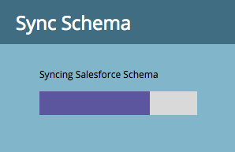

# SFDC同期：カスタムオブジェクト同期{#sfdc-sync-custom-object-sync}

Salesforceインスタンスで作成されたカスタムオブジェクトは、Marketoの一部にすることもできます。  設定方法を次に示します。

>[!NOTE]
>
>**必要な管理者権限**

>[!PREREQUISITES]
>
>カスタムオブジェクトを使用するには、Salesforceの[リード](/help/marketo/product-docs/crm-sync/salesforce-sync/sfdc-sync-details/sfdc-sync-field-sync.md)、[連絡先](/help/marketo/product-docs/crm-sync/salesforce-sync/sfdc-sync-details/sfdc-sync-contact-sync.md)、または[アカウント](/help/marketo/product-docs/crm-sync/salesforce-sync/sfdc-sync-details/sfdc-sync-account-sync.md)オブジェクトに関連付ける必要があります。

## カスタムオブジェクトを有効にする{#enable-custom-object}

1. 「**管理者**」をクリックし、「**Salesforceオブジェクト同期**」リンクをクリックします。

   .

1. これが最初のカスタムオブジェクトの場合は、[**スキーマを同期**]をクリックします。

   

1. 「**グローバル同期を無効にする**」をクリックします。

   

   >[!NOTE]
   >
   >Salesforceカスタムオブジェクトスキーマの初期同期には、数分かかる場合があります。

   

1. 同期するカスタムオブジェクトをキャンバスにドラッグします。

   

   >[!NOTE]
   >
   >カスタムオブジェクトには、一意の名前を付ける必要があります。 Marketorは、同じ名前を持つ2つの異なるカスタムオブジェクトをサポートしていません。

1. 「**同期を有効にする**」をクリックします。

   

1. 「**同期を有効にする**」を再度クリックします。

   

   >[!NOTE]
   >
   >グローバル同期を再度有効にするのを忘れないでください。

1. **Salesforce**&#x200B;タブに戻ります。

   

1. 「**同期を有効にする**」をクリックします。

   

1. すべてのSalesforceカスタムオブジェクトを表示するには、**管理者**&#x200B;をクリックし、**Salesforceオブジェクト同期**&#x200B;リンク（上記の手順1と同じ）をクリックします。

   

   >[!NOTE]
   >
   >マーケティング担当者は、1 ～ 2レベルの深さの標準エンティティにリンクされたカスタムエンティティのみをサポートしています。

### 次の作業：{#whats-next}

[スマートリスト/トリガー制約としての追加カスタムオブジェクトフィールドの削除](/help/marketo/product-docs/crm-sync/salesforce-sync/setup/optional-steps/add-remove-custom-object-field-as-smart-list-trigger-constraints.md)

素晴らしい！ このカスタムオブジェクトのデータをスマートキャンペーンおよびスマートリストで使用できるようになりました。
