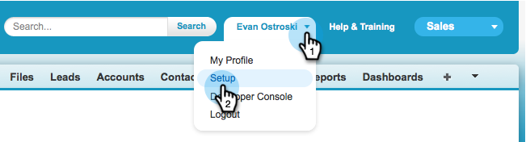

# Marketo SyncにSalesforceフィールドを表示しない{#hide-a-salesforce-field-from-the-marketo-sync}

>[!NOTE]
>
>**必要な管理者権限**

Salesforceのすべてのフィールドがマーケティングに役立つわけではありません。 必要なフィールドのみを含めることで、同期のパフォーマンスを最適化できます。 次に、Marketoからフィールドを非表示にする方法を示します。

1. 名前メニューをクリックし、「**セットアップ**」を選択します。

   

1. 検索バーに&#x200B;**プロファイル**&#x200B;と入力し、「**ユーザーの管理**」の下の「**プロファイル**」をクリックします。

   

1. 同期ユーザーのプロファイルをクリックします。

   

1. 「**フィールドレベルのセキュリティ**」セクションで、ターゲットフィールドを含むオブジェクトの横の「**表示**」をクリックします。

   

1. 「**編集**」をクリックします。

   

1. 非表示にするフィールドの横にある「**表示**」チェックボックスをオフにします。 「**保存**」をクリックします。

   

   >[!NOTE]
   >
   >Salesforceで非表示にしたフィールドが既にMarketoと同期済みの場合は、使用しない場合は、Marketoでも非表示にする必要があります。

   それだ！ 次の同期が終了すると、Marketoでこのフィールドは表示されなくなります。

   >[!MORELIKETHIS]
   >
   >[フィールドの非表示と再表示](/help/marketo/product-docs/administration/field-management/hide-and-unhide-a-field.md)
