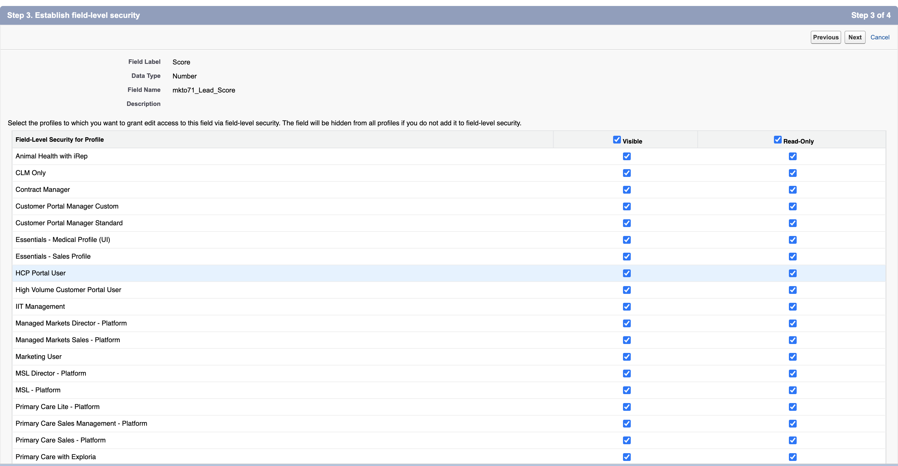

# 手順 1 / 3：Marketo フィールドを Veeva CRM に追加 {#step-1-of-3-add-marketo-fields-to-veeva-crm}

>[!PREREQUISITES]
>
>Veeva CRM インスタンスが Salesforce API にアクセスして、Marketo Engage と Veeva CRM の間でデータを同期する必要があります。

Marketo Engage は、一連のフィールドを使用して、特定の種類のマーケティング関連情報を取り込みます。Veeva CRM でこのデータを使用する場合は、以下の手順に従ってください。

`1.` 取引先責任者オブジェクト上の Veeva CRM にカスタムフィールド「スコア」を作成します。

`2.`必要に応じて、追加のフィールドを作成できます（以下の表を参照）。

これらのカスタムフィールドはすべてオプションで、Marketo Engage と Veeva CRM を同期するのに必須ではありません。

## Marketo フィールドを Veeva CRM に追加 {#add-marketo-fields-to-veeva-crm}

上記の Veeva CRM で、リードおよび取引先責任者オブジェクトにカスタムフィールドを追加します。さらに追加する場合は、この節の最後にある使用可能フィールドのテーブルを参照してください。

「スコア」フィールドに対して、次の手順を実行してフィールドを追加します。

1. Veeva CRM にログインし、「**設定**」をクリックします。

   

1. 「オブジェクト」と「フィールド」をクリックし、「オブジェクトマネージャー」を選択します。

   

1. 検索バーで、「取引先責任者」を検索します。

   

1. 取引先責任者オブジェクトをクリックします。

1. 「フィールドと関係」を選択します。

1. 「**新規**」をクリックします。

   

1. 適切なフィールドタイプを選択します（スコアの場合は数値）。

   

1. 「**次へ**」をクリックします。

   

1. 次の表に示すように、フィールドの「フィールドラベル」、「長さ」、「フィールド名」を入力します。

<table>
 <tbody>
  <tr>
   <th>フィールドラベル
   <th>フィールド名
   <th>データタイプ
   <th>フィールド属性
  </tr>
  <tr>
   <td>スコア</td>
   <td>mkto71_Lead_Score</td>
   <td>数字</td>
   <td>長さ 10  小数点以下桁数 0</td>
  </tr>
 </tbody>
</table>

>[!NOTE]
>
>Veeva CRM では、フィールド名を使用して API 名を作成するときに、フィールド名に __c を追加します。

>[!NOTE]
>
>テキストフィールドと数値フィールドには長さが必要ですが、日付／時間フィールドには必要ありません。説明はオプションです。

1. 「**次へ**」をクリックします。

   

1. アクセス設定を指定し、「**次へ**」をクリックします。

1. すべてのロールを表示および読み取り専用に設定します。

1. 同期ユーザのプロファイルの読み取り専用のチェックをオフにします。

* 同期ユーザとしてシステム管理者のプロファイルを持つユーザがいる場合は、システム管理者プロファイルの読み取り専用のチェックをオフにします（以下を参照）。
* 同期ユーザにカスタムプロファイルを作成した場合は、そのカスタムプロファイルの読み取り専用のチェックをオフにします。

   

1. フィールドを表示するページレイアウトを選択します。

1. 「**保存して新規作成**」をクリックして戻り、他の 2 つのカスタムフィールドのそれぞれを作成します。

1. 3 つとも完成したら、「**保存**」をクリックします。

   

>[!NOTE]
>
>フィールドを取引先責任者オブジェクトに追加することで、個人取引先オブジェクトにも追加されます。

オプション：このテーブルの追加のカスタムフィールドに対して上記の手順を実行します。

<table>
 <tbody>
  <tr>
   <th>フィールドラベル
   <th>フィールド名
   <th>データタイプ
   <th>フィールド属性
  </tr>
  <tr>
   <td>推測される市区町村</td>
   <td>mkto71_Inferred_City</td>
   <td>テキスト</td>
   <td>長さ 255</td>
  </tr>
  <tr>
   <td>推測される企業</td>
   <td>mkto71_Inferred_Company</td>
   <td>テキスト</td>
   <td>長さ 255</td>
  </tr>
  <tr>
   <td>推測される国</td>
   <td>mkto71_Inferred_Country</td>
   <td>テキスト</td>
   <td>長さ 255</td>
  </tr>
  <tr>
   <td>推測される都市圏</td>
   <td>mkto71_Inferred_Metropolitan_Area</td>
   <td>テキスト</td>
   <td>長さ 255</td>
  </tr>
  <tr>
   <td>推測される市外局番</td>
   <td>mkto71_Inferred_Phone_Area_Code</td>
   <td>テキスト</td>
   <td>長さ 255</td>
  </tr>
  <tr>
   <td>推測される郵便番号</td>
   <td>mkto71_Inferred_Postal_Code</td>
   <td>テキスト</td>
   <td>長さ 255</td>
  </tr>
  <tr>
   <td>推測される都道府県／地域</td>
   <td>mkto71_Inferred_State_Region</td>
   <td>テキスト</td>
   <td>長さ 255</td>
  </tr>
 </tbody>
</table>

>[!NOTE]
>
>Marketo によって自動的に割り当てられたフィールドの値は、新しいフィールドが作成されたときに Veeva CRM ですぐに使用できるわけではありません。Marketo は、次のアップデート時にいずれかのシステム上のレコードに対して Veeva CRM とデータを同期します（つまり、Marketo と Veeva CRM の間で同期されているフィールドのアップデート）。
