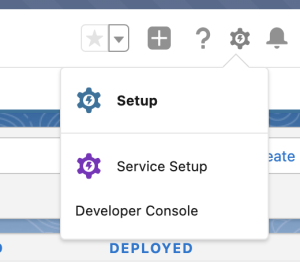
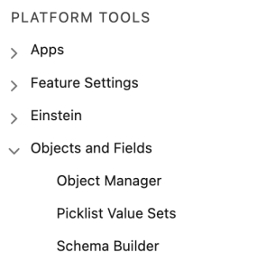
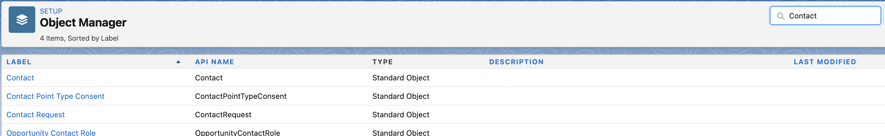
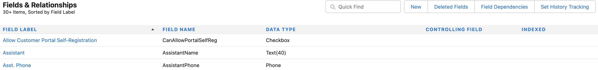
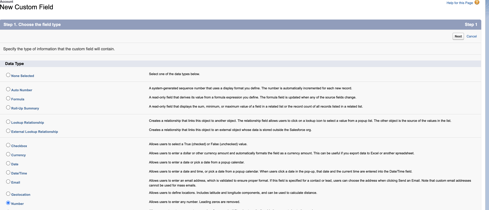
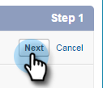
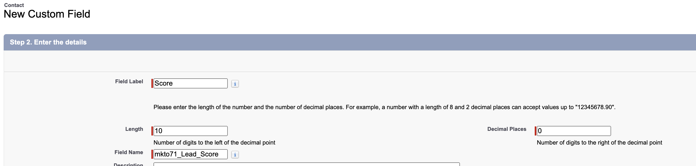
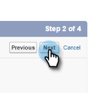
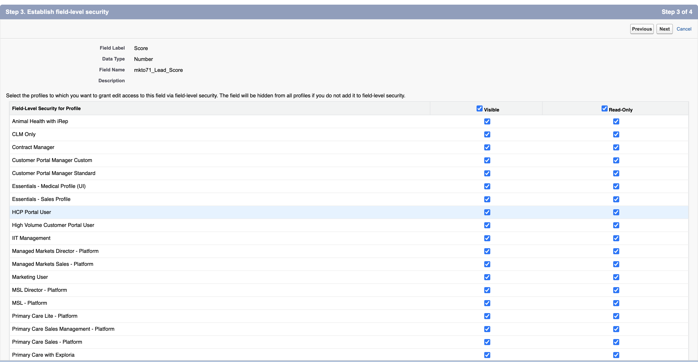
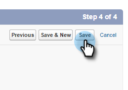

# 手順 1／3：Marketo フィールドの [!DNL Veeva] CRM への追加 {#step-1-of-3-add-marketo-fields-to-veeva-crm}

>[!PREREQUISITES]
>
>[!DNL Veeva] CRM インスタンスが Salesforce API にアクセスして、Marketo Engage と [!DNL Veeva] CRM の間でデータを同期する必要があります。

Marketo Engage は、一連のフィールドを使用して、特定の種類のマーケティング関連情報を取り込みます。 このデータを[!DNL Veeva] CRMに保存する場合は、次の手順に従ってください。

1. 取引先責任者オブジェクトの[!DNL Veeva] CRMにカスタムフィールドを作成します：スコア
1. 必要に応じて、追加のフィールドを作成できます（以下の表を参照）。

これらのカスタムフィールドはすべてオプションで、Marketo Engage と [!DNL Veeva] CRM を同期するのに必須ではありません。

## Marketo フィールドを [!DNL Veeva] CRM に追加 {#add-marketo-fields-to-veeva-crm}

上記の [!DNL Veeva] CRM で、リードおよび取引先責任者オブジェクトにカスタムフィールドを追加します。 さらに追加する場合は、このセクションの最後にある使用可能フィールドのテーブルを参照してください。

「スコア」フィールドに対して、次の手順を実行してフィールドを追加します。

1. [!DNL Veeva] CRM にログインし、「**[!UICONTROL 設定]**」をクリックします。

   

1. 「**[!UICONTROL オブジェクトとフィールド]**」をクリックし、「**[!UICONTROL オブジェクトマネージャー]**」を選択します。

   

1. 検索バーで、「取引先責任者」を検索します。

   

1. **[!UICONTROL 取引先責任者]**&#x200B;オブジェクトをクリックします。

1. 「**[!UICONTROL フィールドと関係]**」を選択します。

1. 「**[!UICONTROL 新規]**」をクリックします。

   

1. 適切なフィールドタイプを選択します（スコアの場合は数値）。

   

1. 「**[!UICONTROL 次へ]**」をクリックします。

   

1. 次の表に示すように、フィールドの「**[!UICONTROL フィールドラベル]**」、「**[!UICONTROL 長さ]**」、「**[!UICONTROL フィールド名]**」を入力します。

<table>
 <tbody>
  <tr>
   <th>フィールドラベル
   <th>フィールド名
   <th>データタイプ
   <th>フィールド属性
  </tr>
  <tr>
   <td>スコア</td>
   <td>mkto71_Lead_Score</td>
   <td>数字</td>
   <td>長さ10 
小数点以下桁0</td>
  </tr>
 </tbody>
</table>

>[!NOTE]
>
>[!DNL Veeva] CRM では、フィールド名を使用して API 名を作成するときに、フィールド名に __c を追加します。

>[!NOTE]
>
>テキストフィールドと数値フィールドには長さが必要ですが、日付/時刻フィールドには必要ありません。 説明はオプションです。

1. 「**[!UICONTROL 次へ]**」をクリックします。

   

1. アクセス設定を指定し、「**[!UICONTROL 次へ]**」をクリックします。

1. すべてのロールを&#x200B;**[!UICONTROL 表示]**&#x200B;および&#x200B;**[!UICONTROL 読み取り専用]**&#x200B;に設定します。

1. 同期ユーザーのプロファイルの&#x200B;**[!UICONTROL 読み取り専用]**&#x200B;のチェックをオフにします。

* 同期ユーザーとしてシステム管理者のプロファイルを持つユーザーがいる場合は、システム管理者プロファイルの[!UICONTROL 読み取り専用]のチェックをオフにします（以下を参照）。
* 同期ユーザーにカスタムプロファイルを作成した場合は、そのカスタムプロファイルの[!UICONTROL 読み取り専用]のチェックをオフにします。

  

1. フィールドを表示するページレイアウトを選択します。

1. 「**[!UICONTROL 保存して新規作成]**」をクリックして戻り、他の 2 つのカスタムフィールドのそれぞれを作成します。

1. 3つの操作が完了したら、**[!UICONTROL 保存]**&#x200B;をクリックします。

   

>[!NOTE]
>
>フィールドを取引先責任者オブジェクトに追加することで、人物アカウントオブジェクトにも追加されます。

任意：以下のテーブルにある追加のカスタムフィールドに対して、上記の手順を実行します。

<table>
 <tbody>
  <tr>
   <th>フィールドラベル
   <th>フィールド名
   <th>データタイプ
   <th>フィールド属性
  </tr>
  <tr>
   <td>推測される市区町村</td>
   <td>mkto71_Inferred_City</td>
   <td>テキスト</td>
   <td>長さ 255</td>
  </tr>
  <tr>
   <td>推測される企業</td>
   <td>mkto71_Inferred_Company</td>
   <td>テキスト</td>
   <td>長さ 255</td>
  </tr>
  <tr>
   <td>推測される国</td>
   <td>mkto71_Inferred_Country</td>
   <td>テキスト</td>
   <td>長さ 255</td>
  </tr>
  <tr>
   <td>推測される都市圏</td>
   <td>mkto71_Inferred_Metropolitan_Area</td>
   <td>テキスト</td>
   <td>長さ 255</td>
  </tr>
  <tr>
   <td>推測される市外局番</td>
   <td>mkto71_Inferred_Phone_Area_Code</td>
   <td>テキスト</td>
   <td>長さ 255</td>
  </tr>
  <tr>
   <td>推測される郵便番号</td>
   <td>mkto71_Inferred_Postal_Code</td>
   <td>テキスト</td>
   <td>長さ 255</td>
  </tr>
  <tr>
   <td>推測される都道府県／地域</td>
   <td>mkto71_Inferred_State_Region</td>
   <td>テキスト</td>
   <td>長さ 255</td>
  </tr>
 </tbody>
</table>

>[!NOTE]
>
>Marketo によって自動的に割り当てられたフィールドの値は、新しいフィールドが作成されたときに [!DNL Veeva] CRM ですぐに使用できるわけではありません。 Marketo は、次のアップデート時にいずれかのシステム上のレコードに対して [!DNL Veeva] CRM とデータを同期します（つまり、Marketo と [!DNL Veeva] CRM の間で同期されているフィールドのアップデート）。
