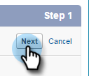

# 手順 1/3:Marketoフィールドを Veeva CRM に追加 {#step-1-of-3-add-marketo-fields-to-veeva-crm}

>[!PREREQUISITES]
>
>Veeva CRM インスタンスが Salesforce API にアクセスして、Marketo Engageと Veeva CRM の間でデータを同期する必要があります。

Marketo Engageは、一連のフィールドを使用して、特定の種類のマーケティング関連情報を取り込みます。 Veeva CRM でこのデータを使用したい場合は、以下の手順に従ってください。

`1.` 連絡先オブジェクト上の Veeva CRM にカスタムフィールドを作成します。スコア

`2.` 必要に応じて、追加のフィールドを作成できます（以下の表を参照）。

これらのカスタムフィールドはすべてオプションで、Marketo Engageと Veeva CRM を同期するのに必須ではありません。

## Marketoフィールドを Veeva CRM に追加 {#add-marketo-fields-to-veeva-crm}

上記の Veeva CRM で、リードおよび連絡先オブジェクトに 3 つのカスタムフィールドを追加します。 さらに追加する場合は、この節の最後にある使用可能フィールドのテーブルを参照してください。

「スコア」フィールドで次の手順を実行して、フィールドを追加します。

1. Veeva CRM にログインし、 **設定**.

   

1. 「オブジェクト」(Objects) と「フィールド」(Fields) をクリックし、「オブジェクトマネージャ」(Object Manager) を選択します。

   

1. 検索バーで、「連絡先」を検索します。

   

1. [ 連絡先 ] オブジェクトをクリックします。

1. [ フィールドと関係 ] を選択します。

1. 「**新規**」をクリックします。

   

1. 適切なフィールドタイプを選択します（「スコア — 数値」の場合）。

   

1. 「**次へ**」をクリックします。

   

1. 次の表に示すように、フィールドの「フィールドラベル」、「長さ」、「フィールド名」を入力します。

<table>
 <tbody>
  <tr>
   <th>フィールドラベル
   <th>フィールド名
   <th>データタイプ
   <th>フィールド属性
  </tr>
  <tr>
   <td>スコア</td>
   <td>mkto71_Lead_Score</td>
   <td>数字</td>
   <td>長さ 10  小数点以下桁数 0</td>
  </tr>
 </tbody>
</table>

>[!NOTE]
>
>Veeva CRM は、API 名の作成に使用する際に__c をフィールド名に追加します。

>[!NOTE]
>
>テキストフィールドと数値フィールドには長さが必要ですが、日付/時間フィールドには必要ありません。説明はオプションです。

1. 「**次へ**」をクリックします。

   

1. アクセス設定を指定し、 **次へ**.

1. すべてのロールを「表示」および「読み取り専用」に設定します。

1. 同期ユーザーのプロファイルの読み取り専用のチェックをオフにします。

* システム管理者のプロファイルを同期ユーザーとして持つユーザーがいる場合は、次に示すように、システム管理者プロファイルの [ 読み取り専用 ] チェックボックスをオフにします。
* 同期ユーザーのカスタムプロファイルを作成した場合は、そのカスタムプロファイルの「読み取り専用」チェックボックスをオフにします。

   

1. フィールドを表示するページレイアウトを選択します。

1. 「**保存して新規作成**」をクリックして戻り、他の 2 つのカスタムフィールドのそれぞれを作成します。

1. クリック **保存** 3 つ全てが終わった時

   

>[!NOTE]
>
>このフィールドを連絡先オブジェクトに追加することで、担当者アカウントにも追加されます。

オプション：以下の表の追加のカスタムフィールドに対して、上記の手順を実行します。

<table>
 <tbody>
  <tr>
   <th>フィールドラベル
   <th>フィールド名
   <th>データタイプ
   <th>フィールド属性
  </tr>
  <tr>
   <td>推測される市区町村</td>
   <td>mkto71_Inferred_City</td>
   <td>テキスト</td>
   <td>長さ 255</td>
  </tr>
  <tr>
   <td>推測される企業</td>
   <td>mkto71_Inferred_Company</td>
   <td>テキスト</td>
   <td>長さ 255</td>
  </tr>
  <tr>
   <td>推測される国</td>
   <td>mkto71_Inferred_Country</td>
   <td>テキスト</td>
   <td>長さ 255</td>
  </tr>
  <tr>
   <td>推測される都市圏</td>
   <td>mkto71_Inferred_Metropolitan_Area</td>
   <td>テキスト</td>
   <td>長さ 255</td>
  </tr>
  <tr>
   <td>推測される市外局番</td>
   <td>mkto71_Inferred_Phone_Area_Code</td>
   <td>テキスト</td>
   <td>長さ 255</td>
  </tr>
  <tr>
   <td>推測される郵便番号</td>
   <td>mkto71_Inferred_Postal_Code</td>
   <td>テキスト</td>
   <td>長さ 255</td>
  </tr>
  <tr>
   <td>推測される都道府県／地域</td>
   <td>mkto71_Inferred_State_Region</td>
   <td>テキスト</td>
   <td>長さ 255</td>
  </tr>
 </tbody>
</table>

>[!NOTE]
>
>Marketoによって自動的に割り当てられるフィールド内の値は、新しいフィールドが作成されたときに Veeva CRM ですぐに使用できるわけではありません。 Marketoは、次にいずれかのシステムのレコードを更新すると ( つまり、Marketoと Veeva CRM の間で同期されているフィールドのいずれかを更新する )、データを Veeva CRM に同期します。
