# 手順 2／3：Marketo Engage 用の [!DNL Veeva] CRM ユーザの作成 {#step-2-of-3-create-a-veeva-crm-user-for-marketo-engage}

>[!NOTE]
>
>この記事の手順は、[!DNL Veeva] CRM 管理者が完了する必要があります。

>[!PREREQUISITES]
>
>[手順 1／3：「Marketo」フィールドの  [!DNL Salesforce]  への追加（Professional）](/help/marketo/product-docs/crm-sync/veeva-crm-sync/setup/step-1-of-3-add-marketo-fields-to-veeva-crm.md){target="_blank"}

この記事では、[!DNL Veeva] CRM ページレイアウトを使用してフィールド権限をカスタマイズし、[!DNL Marketo-Veeva] CRM 同期ユーザを作成します。

## ページレイアウトの設定 {#set-page-layouts}

これらの手順に従うと、Marketo 同期ユーザはカスタムフィールドをアップデートできます。

1. ナビゲーション検索バーで、Enter キーを押さずに&#x200B;**[!UICONTROL アカウント]**（個人取引先）ページレイアウトをクリックし、「[!UICONTROL 取引先責任者]」で「**[!UICONTROL ページレイアウト]**」をクリックします。

   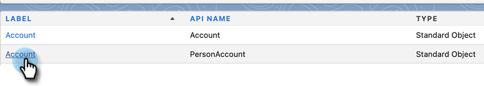

1. 「**[!UICONTROL ページレイアウト]**」をクリックします。

   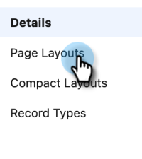

1. 「**[!UICONTROL HCP - プロフェッショナル]**」をクリックします。

   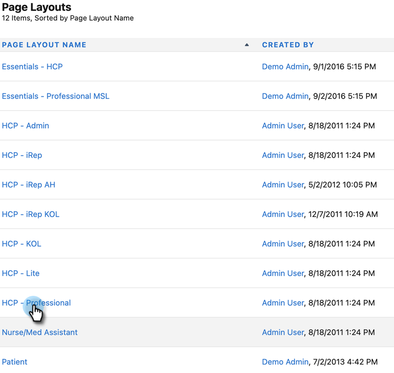

1. 新しい&#x200B;**[!UICONTROL セクション]**&#x200B;をページレイアウトに追加します。

1. 「**[!UICONTROL セクション名]**」に「Marketo」と入力し、「**[!UICONTROL OK]**」をクリックします。

   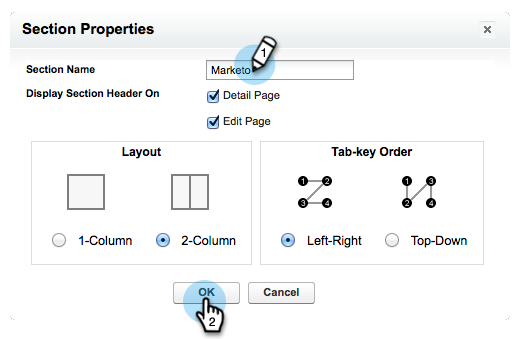

1. 「**[!UICONTROL スコア]**」フィールドをクリックし、「Marketo」セクションにドラッグします。

   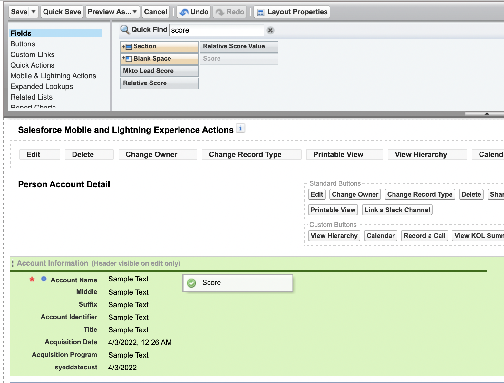

1. 次のフィールドに対して、上記の手順を繰り返します。

   * 推測される市区町村
   * 推測される企業
   * 推測される国
   * 推測される都市圏
   * 推測される市外局番
   * 推測される郵便番号
   * 推測される都道府県／地域

   >[!NOTE]
   >
   >Marketo が読み取り／書き込みできるように、これらのフィールドをページレイアウト上に配置する必要があります。

   >[!TIP]
   >
   >ページの右側に下にドラッグして、フィールドの列を 2 つ作成します。列の長さのバランスを取るために、フィールドを片側から他方に移動できます。

1. [!UICONTROL HCP-Professional] レイアウトが完了したら、「**[!UICONTROL 保存]**」をクリックします。

   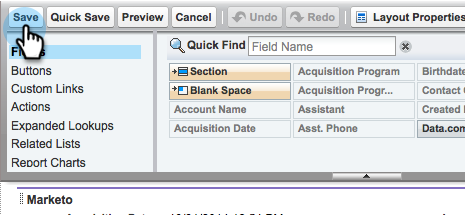

>[!NOTE]
>
>他の[!UICONTROL アカウント]ページレイアウトに対して、これを繰り返します。

## プロファイルの作成 {#create-a-profile}

1. 「**[!UICONTROL 設定]**」をクリックします。

   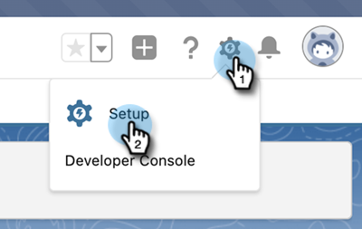

1. ナビゲーション検索バーに「プロファイル」と入力し、**[!UICONTROL プロファイル]**&#x200B;リンクをクリックします。

   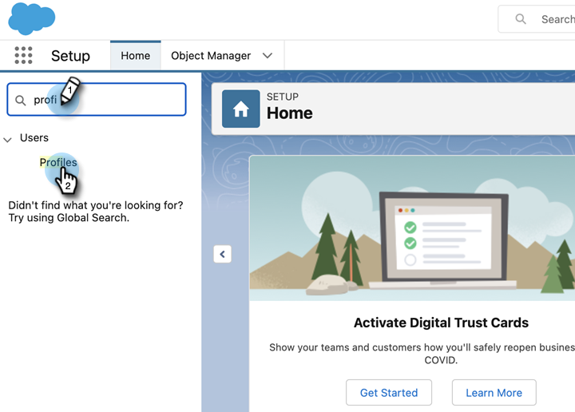

1. 「**[!UICONTROL 新規]**」をクリックします。

   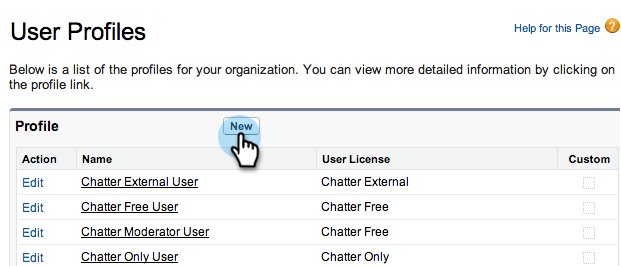

1. 「**[!UICONTROL 標準ユーザ]**」を選択して、プロファイルに「[!UICONTROL Marketo-Salesforce 同期]」という名前を付け、「**[!UICONTROL 保存]**」をクリックします。

   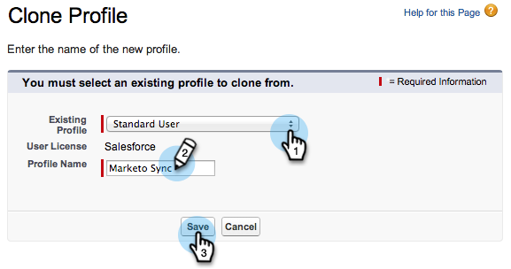

## プロファイル権限の設定 {#set-profile-permissions}

1. 「**[!UICONTROL 編集]**」をクリックしてセキュリティ権限を設定します。

   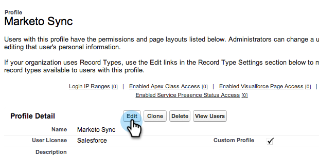

1. 「[!UICONTROL 管理権限]」セクションで、「[!UICONTROL API 有効]」が選択されていることを確認します。

   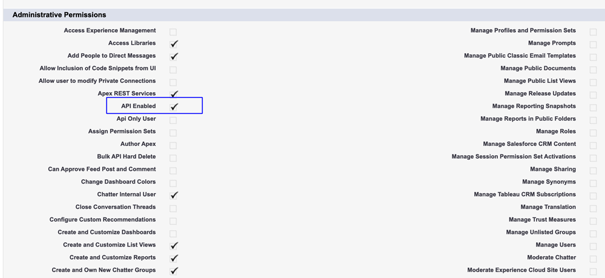

   >[!TIP]
   >
   >「[!UICONTROL パスワードの有効期限なし]」ボックスのチェックは必ずオンにしてください。

1. 「[!UICONTROL 一般ユーザ権限]」セクションで、「[!UICONTROL イベントを編集]」と「[!UICONTROL タスクを編集]」が選択されていることを確認します。

   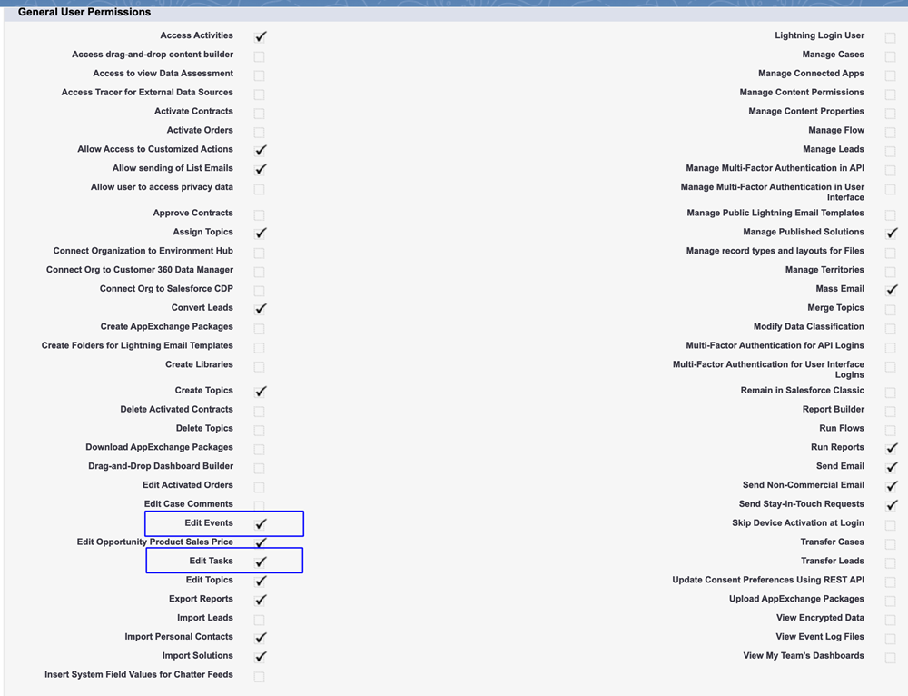

1. 「[!UICONTROL 標準オブジェクト権限]」セクションで、[!UICONTROL 読み取り]、[!UICONTROL 作成]、[!UICONTROL 編集]、[!UICONTROL 削除]の権限が、[!UICONTROL アカウント]と[!UICONTROL 取引先責任者]に対してオンになっていることを確認します。

   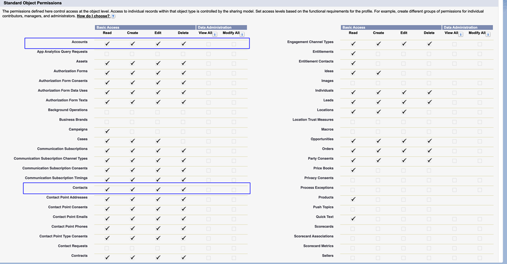

1. 「[!UICONTROL カスタムオブジェクト権限]」セクションで、[!UICONTROL 呼び出し]、[!UICONTROL 呼び出しキーメッセージ]、その他の目的のカスタムオブジェクトに対して[!UICONTROL 読み取り]権限がオンになっていることを確認します。

   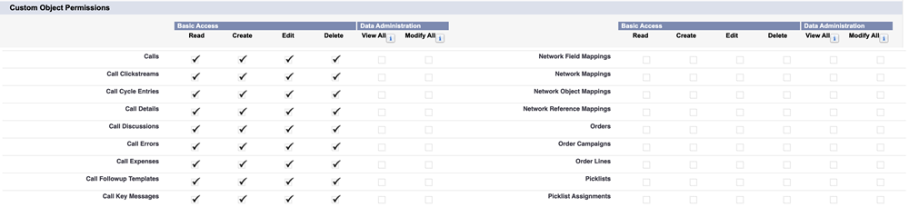

1. 終了したら、ページの下部にある「**[!UICONTROL 保存]**」をクリックします。

   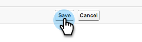

## フィールド権限の設定 {#set-field-permissions}

1. 同期に必要なカスタムフィールドをマーケターと話し合います。

   >[!NOTE]
   >
   >この手順を実行すると、Marketo に表示する必要のないフィールドが防止され、混乱が軽減され、同期が高速化されます。

1. [!UICONTROL プロファイルの詳細]ページで、「**[!UICONTROL フィールドレベルのセキュリティ]**」セクションに移動します。「**[!UICONTROL 表示]**」をクリックして、[!UICONTROL 取引先責任者]オブジェクトと[!UICONTROL アカウント]オブジェクトのアクセシビリティを編集します。

   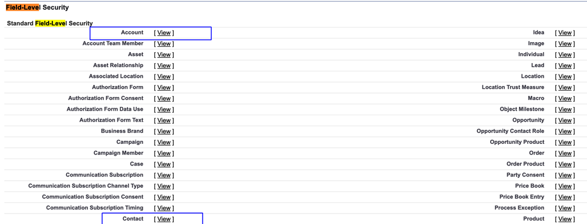

   >[!TIP]
   >
   >組織のニーズに応じて、他のオブジェクトを設定できます。

1. 各オブジェクトに対して、「**[!UICONTROL 編集]**」をクリックします。

   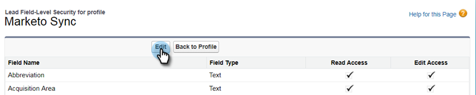

不要なフィールドを見つけ、[!UICONTROL 読み取りアクセス]と[!UICONTROL 編集アクセス]が&#x200B;**オフ**&#x200B;になっていることを確認します。終了したら「**[!UICONTROL 保存]**」をクリックします。

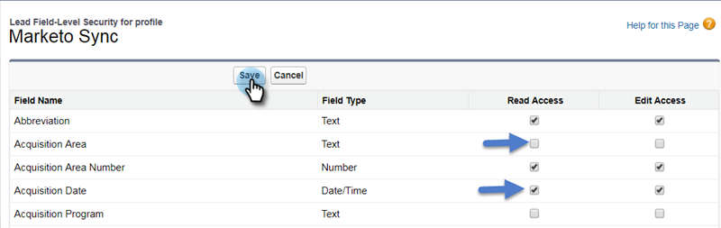

>[!NOTE]
>
>カスタムフィールドのアクセシビリティのみを編集します。

1. 不要なフィールドをすべて無効にした後で、次のオブジェクトフィールドの[!UICONTROL 読み取りアクセス]と[!UICONTROL 編集アクセス]のチェックをオンにします。終了したら「**[!UICONTROL 保存]**」をクリックします。

<table>
 <tbody>
  <tr>
   <th>オブジェクト
   <th>フィールド
  </tr>
  <tr>
   <td>アカウント</td>
   <td>タイプフィールド</td>
  </tr>
  <tr>
   <td>イベント</td>
   <td>すべてのフィールド</td>
  </tr>
  <tr>
   <td>タスク</td>
   <td>すべてのフィールド</td>
  </tr>
 </tbody>
</table>

## 同期ユーザを作成 {#create-sync-user}

Marketo では、[!DNL Veeva] CRM にアクセスするための資格情報が必要です。これは、次の手順で作成した専用ユーザで行うのが最適です。

>[!NOTE]
>
>組織に追加の [!DNL Veeva] CRM ライセンスがない場合は、システム管理者プロファイルを持つ既存のマーケティングユーザを使用できます。

1. ナビゲーション検索バーに「ユーザ」と入力し、「[!UICONTROL ユーザを管理]」で「**[!UICONTROL ユーザ]**」をクリックします。

   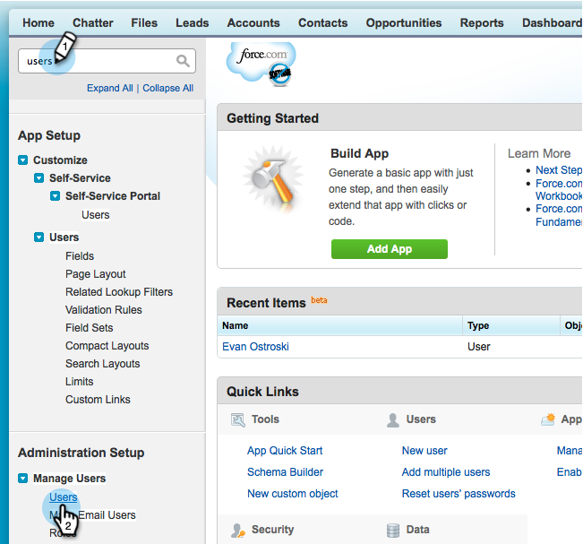

1. 「**[!UICONTROL 新規ユーザ]**」をクリックします。

   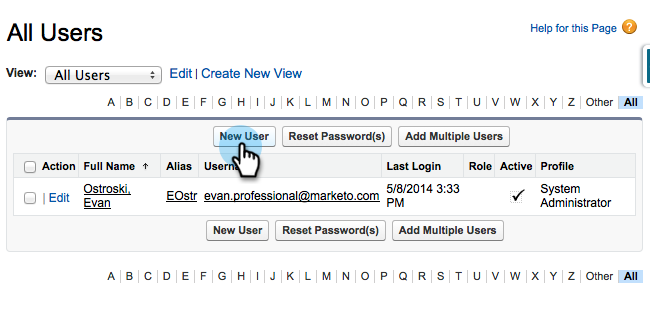

1. 必須フィールドに入力し、「**[!UICONTROL ユーザライセンス]**：**[!UICONTROL Salesforce]**」を選択し、「**[!UICONTROL プロファイル]**：**[!UICONTROL Marketo 同期]**」ユーザを設定して、「**[!UICONTROL 保存]**」をクリックします。

   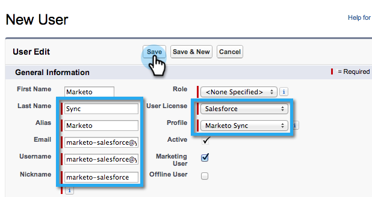

>[!TIP]
>
>入力した電子メールアドレスが有効であることを確認します。パスワードをリセットするには、同期ユーザとしてログインする必要があります。

これで完了です。Marketo Engage が [!DNL Veeva] CRM に接続するために使用できるアカウントが作成されました。早速実行してみましょう。

>[!MORELIKETHIS]
>
>[手順 3／3：Marketo と  [!DNL Veeva]  CRM の接続](/help/marketo/product-docs/crm-sync/veeva-crm-sync/setup/step-3-of-3-connect-marketo-engage-and-veeva-crm.md){target="_blank"}
