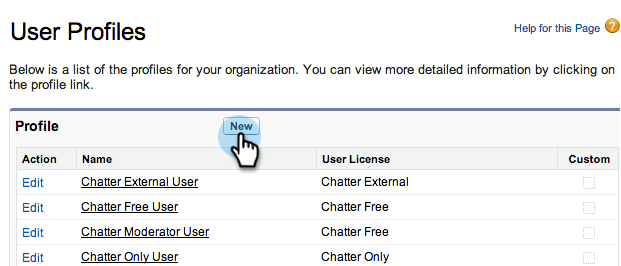
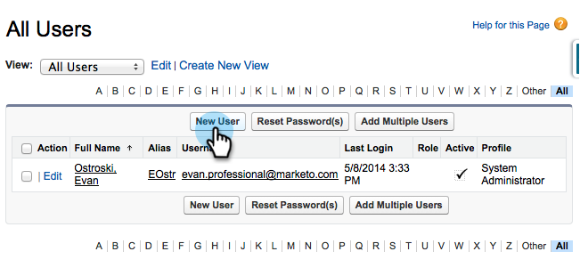

# 手順 2/3:Marketo Engage用の [!DNL Veeva] CRM ユーザーを作成する {#step-2-of-3-create-a-veeva-crm-user-for-marketo-engage}

>[!NOTE]
>
>この記事の手順は、[!DNL Veeva] CRM 管理者が実行する必要があります。

>[!PREREQUISITES]
>
>[ 手順 1/3:Marketo フィールドの追加  [!DNL Salesforce]  （Professional） ](/help/marketo/product-docs/crm-sync/veeva-crm-sync/setup/step-1-of-3-add-marketo-fields-to-veeva-crm.md){target="_blank"}

この記事では、[!DNL Veeva] CRM ページレイアウトでフィールドの権限をカスタマイズし、[!DNL Marketo-Veeva] CRM 同期ユーザーを作成します。

## ページレイアウトの設定 {#set-page-layouts}

これらの手順に従うと、Marketo 同期ユーザはカスタムフィールドをアップデートできます。

1. Enter キーを押さずにナビゲーション検索バーの **[!UICONTROL アカウント]** （個人アカウント）ページレイアウトをクリックし、**[!UICONTROL 連絡先]** の [!UICONTROL  ページレイアウト ] をクリックします。

   

1. 「**[!UICONTROL ページレイアウト]**」をクリックします。

   

1. 「**[!UICONTROL HCP - プロフェッショナル]**」をクリックします。

   

1. 新しい&#x200B;**[!UICONTROL セクション]**&#x200B;をページレイアウトに追加します。

1. **[!UICONTROL セクション名]** に「Marketo」と入力し、「OK **[!UICONTROL をクリックし]** す。

   

1. 「**[!UICONTROL スコア]** フィールドをクリックして、「Marketo」セクションにドラッグします。

   

1. 次のフィールドに対して、上記の手順を繰り返します。

   * 推測される市区町村
   * 推測される企業
   * 推測される国
   * 推測される都市圏
   * 推測される市外局番
   * 推測される郵便番号
   * 推測される都道府県／地域

   >[!NOTE]
   >
   >Marketo が読み取り／書き込みできるように、これらのフィールドをページレイアウト上に配置する必要があります。

   >[!TIP]
   >
   >ページの右側に下にドラッグして、フィールドの列を 2 つ作成します。列の長さのバランスを取るために、フィールドを片側から他方に移動できます。

1. [!UICONTROL HCP-Professional] レイアウトが完了したら、[**[!UICONTROL 保存]**] をクリックします。

   

>[!NOTE]
>
>他の [!UICONTROL  アカウント ] ページレイアウトに対してこの手順を繰り返します。

## プロファイルの作成 {#create-a-profile}

1. 「**[!UICONTROL 設定]**」をクリックします。

   

1. ナビゲーション検索バーに「プロファイル」と入力し、**[!UICONTROL プロファイル]**&#x200B;リンクをクリックします。

   

1. 「**[!UICONTROL 新規]**」をクリックします。

   

1. **[!UICONTROL 標準ユーザー]** を選択し、プロファイルに「[!UICONTROL Marketo - Salesforce同期 ]」という名前を付けて、**[!UICONTROL 保存]** をクリックします。

   

## プロファイル権限の設定 {#set-profile-permissions}

1. 「**[!UICONTROL 編集]**」をクリックしてセキュリティ権限を設定します。

   

1. 「[!UICONTROL  管理者権限 ]」セクションで、「[!UICONTROL API が有効 ]」が選択されていることを確認します。

   

   >[!TIP]
   >
   >[!UICONTROL パスワードの有効期限なし]ボックスのチェックは必ずオンにしてください。

1. 「[!UICONTROL  一般ユーザー権限 ]」セクションで、[!UICONTROL  イベントを編集 ] および [!UICONTROL  タスクを編集 ] が選択されていることを確認します。

   

1. [[!UICONTROL  標準オブジェクトのアクセス許可 ]] セクションで、[[!UICONTROL  アカウント ]]、[[!UICONTROL  連絡先 ]] に対して [[!UICONTROL  読み取り ]]、[[!UICONTROL  作成 ]]、[[!UICONTROL  編集 ]]、[[!UICONTROL  削除 ]] のアクセス許可がオンになっていることを確認します。

   

1. 「[!UICONTROL  カスタムオブジェクトの権限 ]」セクションで、[!UICONTROL  呼び出し ]、[!UICONTROL  呼び出しキーメッセージ ] およびその他の目的のカスタムオブジェクトに対して [!UICONTROL  読み取り ] 権限がオンになっていることを確認します。

   

1. 終了したら、ページの下部にある「**[!UICONTROL 保存]**」をクリックします。

   

## フィールド権限の設定 {#set-field-permissions}

1. 同期に必要なカスタムフィールドをマーケターと話し合います。

   >[!NOTE]
   >
   >この手順を実行すると、Marketo に表示する必要のないフィールドが防止され、混乱が軽減され、同期が高速化されます。

1. [!UICONTROL  プロファイルの詳細 ] ページで、「**[!UICONTROL フィールドレベルのセキュリティ]**」セクションに移動します。 **[!UICONTROL 表示]** をクリックして、[!UICONTROL  連絡先 ] および [!UICONTROL  アカウント ] オブジェクトのアクセシビリティを編集します。

   

   >[!TIP]
   >
   >組織のニーズに応じて、他のオブジェクトを設定できます。

1. 各オブジェクトに対して、「**[!UICONTROL 編集]**」をクリックします。

   

不要なフィールドを探し、[!UICONTROL  読み取りアクセス ] と [!UICONTROL  編集アクセス ] のチェックが **ン** 解除されていることを確認します。 終了したら「**[!UICONTROL 保存]**」をクリックします。

>[!NOTE]
>
>カスタムフィールドのアクセシビリティのみを編集します。

1. 不要なフィールドをすべて無効にした後、次のオブジェクトフィールドの [!UICONTROL  読み取りアクセス ] および [!UICONTROL  編集アクセス ] を確認します。 終了したら「**[!UICONTROL 保存]**」をクリックします。

<table>
 <tbody>
  <tr>
   <th>オブジェクト
   <th>フィールド
  </tr>
  <tr>
   <td>アカウント</td>
   <td>タイプフィールド</td>
  </tr>
  <tr>
   <td>イベント</td>
   <td>すべてのフィールド</td>
  </tr>
  <tr>
   <td>タスク</td>
   <td>すべてのフィールド</td>
  </tr>
 </tbody>
</table>

## 同期ユーザを作成 {#create-sync-user}

Marketoが CRM にアクセスするには資格情報 [!DNL Veeva] 必要です。 これは、次の手順で作成した専用ユーザで行うのが最適です。

>[!NOTE]
>
>組織に追加の [!DNL Veeva] CRM ライセンスがない場合は、システム管理者プロファイルで既存のマーケティングユーザーを使用できます。

1. ナビゲーション検索バーに「ユーザー」と入力し、「ユーザーを管理 **[!UICONTROL の下の]** ユーザー [!UICONTROL  をクリック ] ます。

   

1. 「**[!UICONTROL 新規ユーザ]**」をクリックします。

   

1. 必須フィールドに入力し、「**[!UICONTROL ユーザーライセンス]**: **[!UICONTROL Salesforce]**」を選択し、「**[!UICONTROL プロファイル]**: **[!UICONTROL Marketo同期]** ユーザー」を設定して、「**[!UICONTROL 保存]**」をクリックします。

   

>[!TIP]
>
>入力した電子メールアドレスが有効であることを確認します。パスワードをリセットするには、同期ユーザとしてログインする必要があります。

これで完了です。これで、Marketo Engageが CRM に接続するために使用できるアカウント [!DNL Veeva] 作成されました。 早速実行してみましょう。

>[!MORELIKETHIS]
>
>[ 手順 3/3:Marketoと  [!DNL Veeva] CRM の接続 ](/help/marketo/product-docs/crm-sync/veeva-crm-sync/setup/step-3-of-3-connect-marketo-engage-and-veeva-crm.md){target="_blank"}
