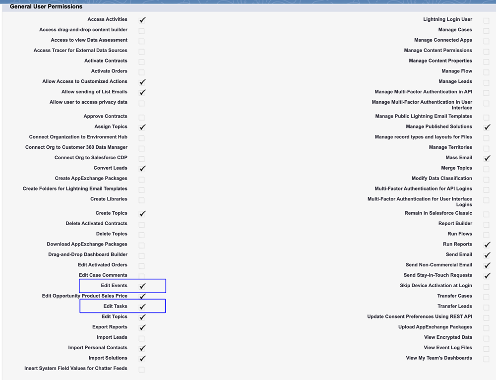

# 手順 2 / 3:Marketo Engage用の Veeva CRM ユーザーの作成 {#step-2-of-3-create-a-veeva-crm-user-for-marketo-engage}

>[!NOTE]
>
>この記事の手順は、Veeva CRM 管理者が実行する必要があります。

>[!PREREQUISITES]
>
>[手順 1/3:Marketoフィールドを Salesforce(Professional) に追加](/help/marketo/product-docs/crm-sync/veeva-crm-sync/setup/step-1-of-3-add-marketo-fields-to-veeva-crm.md){target=&quot;_blank&quot;}

この記事では、Veeva CRM ページレイアウトを使用してフィールド権限をカスタマイズし、Marketo-Veeva CRM 同期ユーザーを作成します。

## ページレイアウトの設定 {#set-page-layouts}

これらの手順に従うと、Marketo 同期ユーザーはカスタムフィールドをアップデートできます。

1. ナビゲーション検索バーで、Enter キーを押さずにアカウント（担当者アカウント）ページレイアウトをクリックし、「連絡先」の下の「ページレイアウト」をクリックします。

   

1. 「**ページレイアウト**」をクリックします。

   

1. クリック **HCP — プロフェッショナル**.

   

1. 新しい&#x200B;**セクション**&#x200B;をページレイアウトに追加します。

1. セクション名に&quot;Marketo&quot;と入力し、 **OK**.

   

1. 「スコア」フィールドをクリックし、「 Marketo 」セクションにドラッグします。

   

1. 次のフィールドに対して、上記の手順を繰り返します。

   * 推測される都市
   * 推測される企業
   * 推測される国
   * 推測される都市圏
   * 推測される市外局番
   * 推測される郵便番号
   * 推測される都道府県／地域

   >[!NOTE]
   >
   >Marketo が読み取り／書き込みできるように、これらのフィールドをページレイアウト上に配置する必要があります。

   >[!TIP]
   >
   >ページの右側に下にドラッグして、フィールドの列を 2 つ作成します。列の長さのバランスを取るために、フィールドを片側から他方に移動できます。

1. HCP-Professional レイアウトが完了したら、 **保存**.

   

>[!NOTE]
>
>他のアカウントページレイアウトに対して、これを繰り返します。

## プロファイルの作成 {#create-a-profile}

1. 「**設定**」をクリックします。

   

1. ナビゲーション検索バーに「プロファイル」と入力し、 **プロファイル** リンク。

   

1. 「**新規**」をクリックします。

   

1. 「標準ユーザー」を選択して、プロファイルに「Marketo-Salesforce 同期」という名前を付け、「**保存**」をクリックします。

   

## プロファイル権限の設定 {#set-profile-permissions}

1. 「**編集**」をクリックしてセキュリティ権限を設定します。

   

1. 「管理権限」セクションで、「 API が有効になっています」が選択されていることを確認します。

   

   >[!TIP]
   >
   >パスワードの有効期限なしボックスのチェックは必ずオンにしてください。

1. 「一般ユーザー権限」セクションで、「イベントを編集」と「タスクを編集」が選択されていることを確認します。

   

1. [ 標準オブジェクトの権限 ] セクションで、[ アカウント ] と [ 連絡先 ] に対して [ 読み取り、作成、編集、削除 ] の権限がオンになっていることを確認します。

   

1. 「カスタムオブジェクト権限」セクションで、呼び出し、呼び出しキーメッセージ、およびその他の目的のカスタムオブジェクトに対して読み取り権限が有効になっていることを確認します。

   

1. 終了したら、ページの下部にある「**保存**」をクリックします。

   

## フィールド権限の設定 {#set-field-permissions}

1. 同期に必要なカスタムフィールドをマーケターと話し合います。

>[!NOTE]
>
>この手順を実行すると、Marketoに表示する必要のないフィールドが防止され、混乱が軽減され、同期が高速化されます。

1. プロファイルの詳細ページで、フィールドレベルのセキュリティセクションに移動します。「表示」をクリックして、連絡先オブジェクトとアカウントオブジェクトのアクセシビリティを編集します。

   

>[!TIP]
>
>組織のニーズに応じて、他のオブジェクトを設定できます。

1. 各オブジェクトに対して、「**編集**」をクリックします。

   

不要なフィールドを見つけ、「読み取りアクセス」と「編集アクセス」が **un**&#x200B;オンにしました。 終了したら「**保存**」をクリックします。

>[!NOTE]
>
>カスタムフィールドのアクセシビリティのみを編集します。

1. 不要なフィールドの無効化が完了したら、次のオブジェクトフィールドの「アクセスを読み取り」と「アクセスを編集」をオンにします。 終了したら「保存」をクリックします。

<table>
 <tbody>
  <tr>
   <th>オブジェクト
   <th>フィールド
  </tr>
  <tr>
   <td>アカウント</td>
   <td>Type フィールド</td>
  </tr>
  <tr>
   <td>イベント</td>
   <td>すべてのフィールド</td>
  </tr>
  <tr>
   <td>タスク</td>
   <td>すべてのフィールド</td>
  </tr>
 </tbody>
</table>

## 同期ユーザを作成 {#create-sync-user}

Marketoは、Veeva CRM にアクセスするための資格情報が必要です。 これは、次の手順で作成した専用ユーザーでおこなうのが最適です。

>[!NOTE]
>
>追加の Veeva CRM ライセンスがない場合は、システム管理者プロファイルで既存のマーケティングユーザーを使用できます。

1. ナビゲーション検索バーに「users」と入力し、 **ユーザー** 「ユーザーを管理」の下で、

   

1. 「**新規ユーザー**」をクリックします。

   

1. 必須フィールドに入力し、「ユーザーライセンス」を選択します。Salesforce、プロファイルを設定：Marketo Sync User をクリックし、 **保存**.

   

>[!TIP]
>
>入力した電子メールアドレスが有効であることを確認します。パスワードをリセットするには、同期ユーザーとしてログインする必要があります。

これで完了です。これで、Marketo Engageが Veeva CRM に接続するために使用できるアカウントが作成されました。 やろう。

>[!MORELIKETHIS]
>
>[手順 3 / 3:Marketoと Veeva CRM の接続](/help/marketo/product-docs/crm-sync/veeva-crm-sync/setup/step-3-of-3-connect-marketo-engage-and-veeva-crm.md){target=&quot;_blank&quot;}
