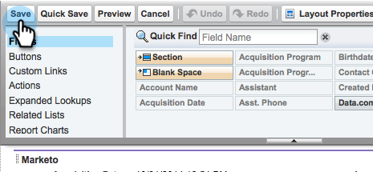

# 手順 2 / 3：Marketo Engage 用の Veeva CRM ユーザの作成 {#step-2-of-3-create-a-veeva-crm-user-for-marketo-engage}

>[!NOTE]
>
>この記事の手順は、Veeva CRM 管理者が実行する必要があります。

>[!PREREQUISITES]
>
>[手順 1 / 3：Marketo フィールドの Salesforce への追加（Professional）](/help/marketo/product-docs/crm-sync/veeva-crm-sync/setup/step-1-of-3-add-marketo-fields-to-veeva-crm.md){target=&quot;_blank&quot;}

この記事では、Veeva CRM ページレイアウトを使用してフィールド権限をカスタマイズし、Marketo と Veeva CRM 間の同期ユーザを作成します。

## ページレイアウトの設定 {#set-page-layouts}

これらの手順に従うと、Marketo 同期ユーザはカスタムフィールドをアップデートできます。

1. ナビゲーション検索バーで、Enter キーを押さずにアカウント（個人取引先）ページレイアウトをクリックし、「取引先責任者」の下の「ページレイアウト」をクリックします。

   

1. 「**ページレイアウト**」をクリックします。

   

1. 「**HCP - プロフェッショナル**」をクリックします。

   

1. 新しい&#x200B;**セクション**&#x200B;をページレイアウトに追加します。

1. 「セクション名」に「Marketo」と入力し、「**OK**」をクリックします。

   

1. 「スコア」フィールドをクリックし、「Marketo」セクションにドラッグします。

   

1. 次のフィールドに対して、上記の手順を繰り返します。

   * 推測される市区町村
   * 推測される企業
   * 推測される国
   * 推測される都市圏
   * 推測される市外局番
   * 推測される郵便番号
   * 推測される都道府県／地域

   >[!NOTE]
   >
   >Marketo が読み取り／書き込みできるように、これらのフィールドをページレイアウト上に配置する必要があります。

   >[!TIP]
   >
   >ページの右側に下にドラッグして、フィールドの列を 2 つ作成します。列の長さのバランスを取るために、フィールドを片側から他方に移動できます。

1. HCP-Professional レイアウトが完了したら、「**保存**」をクリックします。

   

>[!NOTE]
>
>他のアカウントページレイアウトに対して、これを繰り返します。

## プロファイルの作成 {#create-a-profile}

1. 「**設定**」をクリックします。

   

1. ナビゲーション検索バーに「プロファイル」と入力し、**プロファイル**&#x200B;リンクをクリックします。

   

1. 「**新規**」をクリックします。

   

1. 「標準ユーザ」を選択して、プロファイルに「Marketo-Salesforce 同期」という名前を付け、「**保存**」をクリックします。

   

## プロファイル権限の設定 {#set-profile-permissions}

1. 「**編集**」をクリックしてセキュリティ権限を設定します。

   

1. 「管理権限」セクションで、「API 有効」が選択されていることを確認します。

   

   >[!TIP]
   >
   >パスワードの有効期限なしボックスのチェックは必ずオンにしてください。

1. 「一般ユーザ権限」セクションで、「イベントを編集」と「タスクを編集」が選択されていることを確認します。

   

1. 標準オブジェクト権限セクションで、読み取り、作成、編集、削除の権限が、アカウントと取引先責任者に対して有効になっていることを確認します。

   

1. 「カスタムオブジェクト権限」セクションで、呼び出し、呼び出しキーメッセージ、その他の目的のカスタムオブジェクトに対して読み取り権限が有効になっていることを確認します。

   

1. 終了したら、ページの下部にある「**保存**」をクリックします。

   

## フィールド権限の設定 {#set-field-permissions}

1. 同期に必要なカスタムフィールドをマーケターと話し合います。

>[!NOTE]
>
>この手順を実行すると、Marketo に表示する必要のないフィールドが防止され、混乱が軽減され、同期が高速化されます。

1. プロファイルの詳細ページで、フィールドレベルのセキュリティセクションに移動します。「表示」をクリックして、取引先責任者オブジェクトとアカウントオブジェクトのアクセシビリティを編集します。

   

>[!TIP]
>
>組織のニーズに応じて、他のオブジェクトを設定できます。

1. 各オブジェクトに対して、「**編集**」をクリックします。

   

不要なフィールドを見つけ、読み取りアクセスと編集アクセスが&#x200B;**オフ**&#x200B;になっていることを確認します。終了したら「**保存**」をクリックします。

>[!NOTE]
>
>カスタムフィールドのアクセシビリティのみを編集します。

1. 不要なフィールドをすべて無効にした後で、次のオブジェクトフィールドの読み取りアクセスと編集アクセスのチェックをオンにします。終了したら「保存」をクリックします。

<table>
 <tbody>
  <tr>
   <th>オブジェクト
   <th>フィールド
  </tr>
  <tr>
   <td>アカウント</td>
   <td>タイプフィールド</td>
  </tr>
  <tr>
   <td>イベント</td>
   <td>すべてのフィールド</td>
  </tr>
  <tr>
   <td>タスク</td>
   <td>すべてのフィールド</td>
  </tr>
 </tbody>
</table>

## 同期ユーザを作成 {#create-sync-user}

Marketo は、Veeva CRM にアクセスするための資格情報が必要です。これは、次の手順で作成した専用ユーザで行うのが最適です。

>[!NOTE]
>
>組織に追加の Veeva CRM ライセンスがない場合は、システム管理者プロファイルを持つ既存のマーケティングユーザを使用できます。

1. ナビゲーション検索バーに「ユーザ」と入力し、「**ユーザを管理**」の下の「ユーザ」をクリックします。

   

1. 「**新規ユーザ**」をクリックします。

   

1. 必須フィールドに入力し、「ユーザライセンス：Salesforce」を選択、「プロファイル：Marketo 同期ユーザ」を設定して、「**保存**」をクリックします。

   

>[!TIP]
>
>入力した電子メールアドレスが有効であることを確認します。パスワードをリセットするには、同期ユーザとしてログインする必要があります。

これで完了です。Marketo が Veeva CRM に接続するために使用できるアカウントが作成されました。早速実行してみましょう。

>[!MORELIKETHIS]
>
>[手順 3 / 3：Marketo と Veeva CRM の接続](/help/marketo/product-docs/crm-sync/veeva-crm-sync/setup/step-3-of-3-connect-marketo-engage-and-veeva-crm.md){target=&quot;_blank&quot;}
