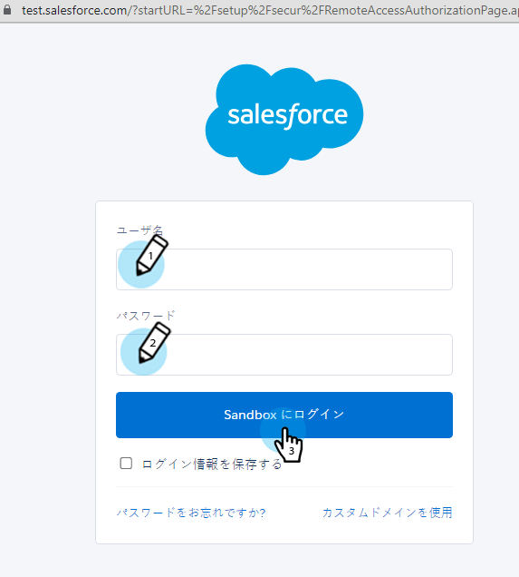

# 手順 3/3：Marketo Engage と Veeva CRM の接続 {#step-3-of-3-connect-marketo-engage-and-veeva-crm}

この記事では、設定済みの Veeva CRM インスタンスと同期するように Marketo を設定します。Veeva CRM は Salesforce プラットフォーム上に構築されているので、**ポップアップに Salesforce が表示されます**。

>[!PREREQUISITES]
>
>* [手順 1 / 3:Marketo フィールドを Veeva に追加](/help/marketo/product-docs/crm-sync/veeva-crm-sync/setup/step-1-of-3-add-marketo-fields-to-veeva-crm.md){target=&quot;_blank&quot;}
>* [手順 2 / 3:Marketo 用に Veeva ユーザを作成](/help/marketo/product-docs/crm-sync/veeva-crm-sync/setup/step-2-of-3-create-a-veeva-crm-user-for-marketo-engage.md){target=&quot;_blank&quot;}

>[!IMPORTANT]
>
>一度に Veeva CRM インスタンスに接続できる Marketo インスタンスは 1 つだけです。

## OAuth を使用して Veeva CRM に接続 {#connect-to-veeva-crm-using-oauth}

1. Marketo で、「**管理者**」をクリックします。「**CRM**」を選択し、「**Veeva と同期**」をクリックします。

   

   >[!NOTE]
   >
   >同期ユーザから Marketo で[不要なフィールドをすべて非表示](/help/marketo/product-docs/crm-sync/salesforce-sync/sfdc-sync-details/hide-a-salesforce-field-from-the-marketo-sync.md){target=&quot;_blank&quot;}にした後で、「同期フィールド」をクリックするようにしてください。「同期フィールド」をクリックすると、ユーザが表示できるすべてのフィールドが Marketo に作成され、削除できなくなります。

1. 「**Veeva でログイン**」をクリックします。

   

   >[!NOTE]
   >
   >Marketo サンドボックスを Veeva CRM サンドボックスに同期する場合は、「サンドボックス」をオンにします。

1. 「**認証情報を確認**」をクリックします。

   

1. Salesforce ログインページのポップアップが表示されます。「Marketo 同期ユーザ」資格情報を入力し、「**ログイン**」をクリックします。

   

1. 受け取った検証コード（Salesforce から送信）を入力し、**検証**&#x200B;をクリックします。

   

1. 検証が成功すると、アクセスをリクエストするアクセスページが表示されいます。「**許可**」をクリックします。

   

1. 数分後に、Marketo Engage にポップアップが表示されます。「**認証情報を確認**」をクリックします。

   

## Veeva 同期を開始 {#start-veeva-sync}

1. 「**Veeva 同期を開始**」をクリックして、Marketo と Veeva CRM 間の永続的な同期を開始します。

   

   >[!CAUTION]
   >
   >Marketo は、Veeva CRM の同期や、リードを手動で入力した場合には、自動的に重複排除を行いません。

1. 「**同期の開始**」をクリックします。

   

>[!NOTE]
>
>最初の同期が完了するまでの時間は、データベースのサイズと複雑さによって異なります。

## 同期の検証 {#verify-sync}

Marketo の「管理」領域に、Veeva CRM 同期に関するステータスメッセージが表示されます。次の手順に従うことで、同期が正しく機能していることを確認できます。

1. Marketo で、「**管理**」をクリックして、「**Veeva**」をクリックします。

   

1. 同期ステータスは、右上隅に表示されます。最終同期、同期が進行しています、失敗のいずれかのメッセージが表示されます。

>[!MORELIKETHIS]
>
>[カスタムオブジェクトの設定](/help/marketo/product-docs/crm-sync/veeva-crm-sync/sync-details/custom-object-sync.md){target=&quot;_blank&quot;}
