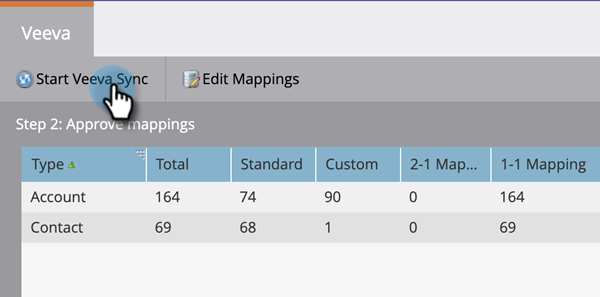

# 手順 3 / 3:Marketo Engageと Veeva CRM の接続 {#step-3-of-3-connect-marketo-engage-and-veeva-crm}

この記事では、設定した Veeva CRM インスタンスとMarketo Engageを同期するように設定します。 **ポップアップに Salesforce が表示されます** Veeva CRM は Salesforce プラットフォーム上に構築されているので、

>[!PREREQUISITES]
>
>* [手順 1/3:Veeva へのMarketoフィールドの追加](/help/marketo/product-docs/crm-sync/veeva-crm-sync/setup/step-1-of-3-add-marketo-fields-to-veeva-crm.md){target=&quot;_blank&quot;}
>* [手順 2 / 3:Marketo用 Veeva ユーザーの作成](/help/marketo/product-docs/crm-sync/veeva-crm-sync/setup/step-2-of-3-create-a-veeva-crm-user-for-marketo-engage.md){target=&quot;_blank&quot;}

>[!IMPORTANT]
>
>一度に 1 つのMarketo CRM インスタンスに接続できる Veeva CRM インスタンスは 1 つだけです。

## OAuth を使用して Veeva CRM に接続 {#connect-to-veeva-crm-using-oauth}

1. Marketoで、 **管理者**. 選択 **CRM** をクリックし、 **Veeva と同期**.

   

   >[!NOTE]
   >
   >必ず [不要なフィールドをすべて非表示にする](/help/marketo/product-docs/crm-sync/salesforce-sync/sfdc-sync-details/hide-a-salesforce-field-from-the-marketo-sync.md)「フィールドを同期」をクリックする前に、同期ユーザーからMarketoで {target=&quot;_blank&quot;}。 「同期フィールド」をクリックすると、ユーザーが表示できるすべてのフィールドが Marketo に作成され、削除できなくなります。

1. クリック **Veeva でログイン**.

   

   >[!NOTE]
   >
   >Marketo Sandbox を Veeva CRM Sandbox に同期する場合は、「サンドボックス」をオンにします。

1. 「**認証情報を確認**」をクリックします。

   

1. Salesforce ログインページのポップアップが表示されます。 「Marketo Sync User」資格情報を入力し、 **ログイン**.

   

1. 受け取った検証コード（Salesforce から送信）を入力し、**検証**&#x200B;をクリックします。

   

1. 検証が成功すると、アクセスをリクエストするアクセスページが表示されいます。「**許可**」をクリックします。

   

1. 数分後に、Marketo Engage にポップアップが表示されます。 「**認証情報を確認**」をクリックします。

   

## Veeva 同期を開始 {#start-veeva-sync}

1. クリック **Veeva 同期を開始** 永続的なMarketo-Veeva CRM 同期を開始します。

   

   >[!CAUTION]
   >
   >Marketoは、Veeva CRM 同期に対して自動的に重複を排除しません。また、リードを手動で入力する場合も同様です。

1. 「**同期の開始**」をクリックします。

   

>[!NOTE]
>
>最初の同期が完了するまでの時間は、データベースのサイズと複雑さによって異なります。

## 同期の検証 {#verify-sync}

Marketoの「管理」領域に、Veeva CRM 同期のステータスメッセージが表示されます。 次の手順に従うことで、同期が正しく機能していることを確認できます。

1. Marketoで、 **管理者**&#x200B;を、 **Veeva**.

   

1. 同期ステータスは、右上隅に表示されます。最終同期、同期が進行しています、失敗のいずれかのメッセージが表示されます。

>[!MORELIKETHIS]
>
>[カスタムオブジェクトの設定](/help/marketo/product-docs/crm-sync/veeva-crm-sync/sync-details/custom-object-sync.md){target=&quot;_blank&quot;}
