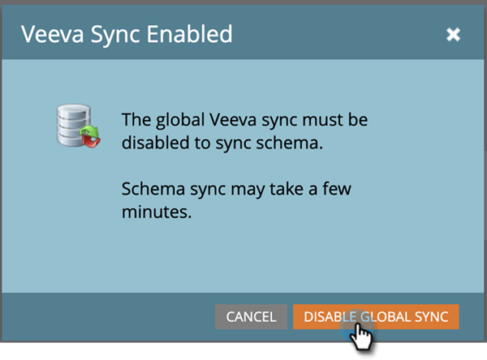

# スマートリスト／トリガー制約としてのカスタムオブジェクトフィールドの追加／の削除 {#add-remove-custom-object-field-as-smart-list-trigger-constraints}

Marketo Engage は、Veeva カスタムオブジェクト同期を特定の方法で制御できます。これにより、カスタムオブジェクトフィルターで制約として使用できるフィールドを選択し、スマートキャンペーンでトリガーとして使用できます。

>[!NOTE]
>
>**管理者権限が必要**

1. 「**[!UICONTROL 管理者]**」をクリックして、「**[!UICONTROL Veeva オブジェクト同期]**」をクリックします。

   

1. 変更するオブジェクトを選択します。

   

1. 「**[!UICONTROL 表示可能なフィールドを編集]**」をクリックします。

   

   >[!TIP]
   >
   >「表示フィールドを編集」ボタンがグレー表示されている場合は、そのオブジェクトは現在、スマートリストまたはスマートキャンペーンで使用されています。 続行するには、すべての関連付けを削除します。

1. グローバル同期が有効な場合は、「**[!UICONTROL グローバル同期を無効にする]**」をクリックします。

   

1. 必要なフィルター／トリガー制約の横にあるチェックボックスをオンにし、「**[!UICONTROL 保存]**」をクリックします。

   

   >[!NOTE]
   >
   >すべてのフィールドは、フィルターの制約としてデフォルトで選択されます。

1. 「**[!UICONTROL フィールド]**」タブをクリックして、変更を確定します。

   

>[!IMPORTANT]
>
>忘れずにグローバル同期を再度有効にしてください。

これで、スマートリストとスマートキャンペーンがより強力になります。

>[!MORELIKETHIS]
>
>[カスタムオブジェクト同期の有効化／無効化](/help/marketo/product-docs/crm-sync/veeva-crm-sync/sync-details/enable-disable-custom-object-sync.md){target="_blank"}
