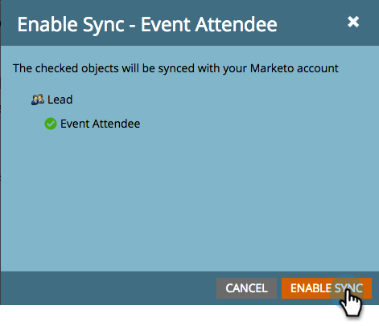

# カスタムオブジェクト同期 {#custom-object-sync}

[!DNL Veeva] CRM インスタンスで作成されたカスタムオブジェクトも、Marketo Engage の一部にすることができます。 その設定方法を説明しましょう。

>[!NOTE]
>
>**管理者権限が必要**

>[!PREREQUISITES]
>
>カスタムオブジェクトを使用するには、[!DNL Veeva] CRM で取引先責任者またはアカウントオブジェクトに関連付けられている必要があります。

## カスタムオブジェクトの有効化 {#enable-custom-object}

1. Marketo で、「**[!UICONTROL 管理者]**」をクリックして、「**[!UICONTROL Veeva オブジェクト同期]**」をクリックします。

   

1. これが最初のカスタムオブジェクトの場合は、「**[!UICONTROL スキーマを同期]**」をクリックします。

   

1. 「**[!UICONTROL グローバル同期を無効にする]**」をクリックします。

   

   >[!NOTE]
   >
   >[!DNL Veeva] カスタムオブジェクトスキーマの初期同期には、数分かかる場合があります。

1. 同期するカスタムオブジェクトをキャンバスにドラッグします。

   

   >[!NOTE]
   >
   >カスタムオブジェクトには一意の名前が必要です。 Marketo では、同名の 2 つの異なるカスタムオブジェクトはサポートされていません。

1. 「**[!UICONTROL 同期を有効にする]**」をクリックします。

   

1. 「**[!UICONTROL 同期を有効にする]**」をもう一度クリックします。

   

1. 「**[!UICONTROL Veeva]**」タブに戻ります。

   

1. 「**[!UICONTROL 同期を有効にする]**」をクリックします。

   

1. すべての [!DNL Veeva] カスタムオブジェクトを表示するには、「**[!UICONTROL 管理者]**」をクリックし、「**[!UICONTROL Veeva オブジェクト同期]**」をクリックします。

   

   >[!NOTE]
   >
   >Marketo では、1 レベルから 2 レベルの深さの標準エンティティにリンクされたカスタムエンティティのみがサポートされています。

これで完了です。 カスタムオブジェクトのデータをスマートキャンペーンとスマートリストで使用できるようになりました。

>[!MORELIKETHIS]
>
>* [通話と通話の主要メッセージの同期](/help/marketo/product-docs/crm-sync/veeva-crm-sync/sync-details/syncing-call-and-call-key-messages.md){target="_blank"}
>* [スマートリスト／トリガー制約としてのカスタムオブジェクトフィールドの追加／削除](/help/marketo/product-docs/crm-sync/veeva-crm-sync/sync-details/add-remove-custom-object-field-as-smart-list-trigger-constraints.md){target="_blank"}
