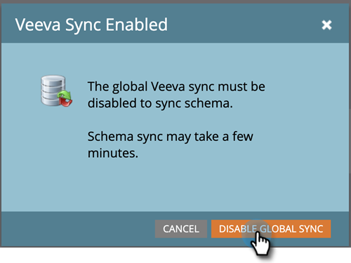

# カスタムオブジェクト同期 {#custom-object-sync}

Veeva CRM インスタンスで作成されたカスタムオブジェクトも、Marketo Engage の一部にすることができます。その設定方法を説明しましょう。

>[!NOTE]
>
>**管理者権限が必要**

>[!PREREQUISITES]
>
>カスタムオブジェクトを使用するには、Veeva CRM で取引先責任者またはアカウントオブジェクトに関連付けられている必要があります。

## カスタムオブジェクトの有効化 {#enable-custom-object}

1. Marketo で、「**管理者**」をクリックして、「**Veeva オブジェクト同期**」をクリックします。

   

1. これが最初のカスタムオブジェクトの場合は、「**スキーマを同期**」をクリックします。

   

1. 「**グローバル同期を無効にする**」をクリックします。

   

   >[!NOTE]
   >
   >Veeva カスタムオブジェクトスキーマの初回同期には、数分かかる場合があります。

1. 同期するカスタムオブジェクトをキャンバスにドラッグします。

   

   >[!NOTE]
   >
   >カスタムオブジェクトには一意の名前が必要です。Marketo では、同名の 2 つの異なるカスタムオブジェクトはサポートされていません。

1. 「**同期を有効にする**」をクリックします。

   

1. 「**同期を有効にする**」を再度クリックします。

   

1. 「**Veeva**」タブに戻ります。

   

1. 「**同期を有効にする**」をクリックします。

   

1. すべての Veeva カスタムオブジェクトを表示するには、「管理者」をクリックし、「Veeva オブジェクト同期」をクリックします。

   

   >[!NOTE]
   >
   >Marketo では、1 レベルから 2 レベルの深さの標準エンティティにリンクされたカスタムエンティティのみがサポートされています。

これで完了です。カスタムオブジェクトのデータをスマートキャンペーンとスマートリストで使用できるようになりました。

>[!MORELIKETHIS]
>
>* [通話と通話の主要メッセージの同期](/help/marketo/product-docs/crm-sync/veeva-crm-sync/sync-details/syncing-call-and-call-key-messages.md){target=&quot;_blank&quot;}
>* [スマートリスト／トリガー制約としてのカスタムオブジェクトフィールドの追加／の削除](/help/marketo/product-docs/crm-sync/veeva-crm-sync/sync-details/add-remove-custom-object-field-as-smart-list-trigger-constraints.md){target=&quot;_blank&quot;}

