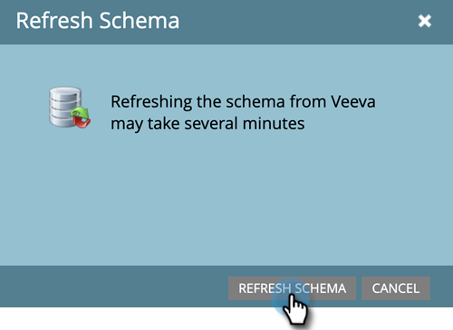
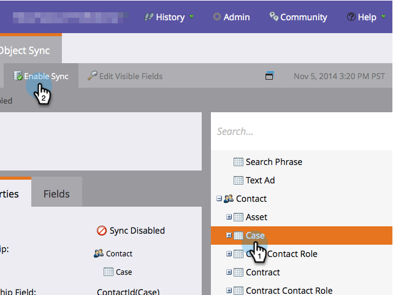
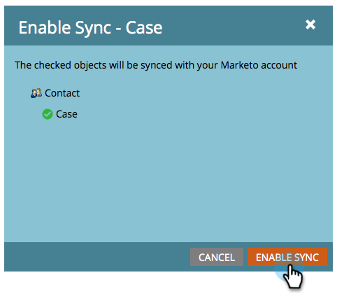
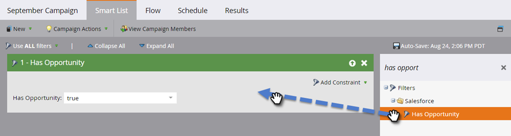
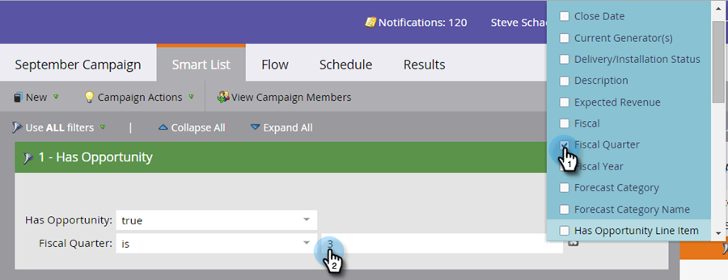

# カスタムオブジェクト同期の有効化／無効化 {#enable-disable-custom-object-sync}

[!DNL Veeva] CRM インスタンスで作成されたカスタムオブジェクトも、Marketo Engage の一部にすることができます。 その設定方法を説明しましょう。

## カスタムオブジェクト同期の有効化／無効化 {#enable-or-disable-the-custom-object-sync}

>[!NOTE]
>
>**管理者権限が必要**

1. Marketo で、「**[!UICONTROL 管理者]**」をクリックして、「**[!UICONTROL Veeva オブジェクト同期]**」をクリックします。

   

1. これが最初のカスタムオブジェクトの場合は、「**[!UICONTROL スキーマを同期]**」をクリックします。 それ以外の場合は、「**[!UICONTROL スキーマを更新]**」をクリックして最新の情報を取得します。

   

1. グローバル同期が実行中の場合は、「**[!UICONTROL グローバル同期を無効にする]**」をクリックして無効化します。

   

   >[!NOTE]
   >
   >[!DNL Veeva] カスタムオブジェクトスキーマの同期には、数分かかる場合があります。

1. 「**[!UICONTROL スキーマを更新]**」をクリックします。

   

同期するオブジェクトを選択し、「**[!UICONTROL 同期を有効にする]**」をクリックします。

>[!TIP]
>
>Marketo では、[!DNL Veeva] CRM の取引先責任者またはアカウントオブジェクトのいずれかと直接の関係がある場合にのみ、カスタムオブジェクトを同期できます。

1. 「**[!UICONTROL 同期を有効にする]**」をもう一度クリックします。

   

1. 「[!UICONTROL Veeva]」タブに戻って、「**[!UICONTROL 同期を有効にする]**」をクリックします。

   

## カスタムオブジェクトの使用 {#using-your-custom-objects}

>[!NOTE]
>
>スマートキャンペーンでは、カスタムオブジェクトをトリガーと共に使用することはできません。

1. [!UICONTROL スマートリスト]で、「**[!UICONTROL 商談あり]**」フィルターをドラッグして、**[!UICONTROL True]** に設定します。

   

1. オプションで、フィルター制約を使用してフォーカスを絞り込みます。

   

このカスタムオブジェクトのデータを[!UICONTROL スマートキャンペーン]と[!UICONTROL スマートリスト]で使用できるようになりました。

>[!MORELIKETHIS]
>
>[スマートリスト／トリガー制約としてのカスタムオブジェクトフィールドの追加／削除](/help/marketo/product-docs/crm-sync/veeva-crm-sync/sync-details/add-remove-custom-object-field-as-smart-list-trigger-constraints.md){target="_blank"}
