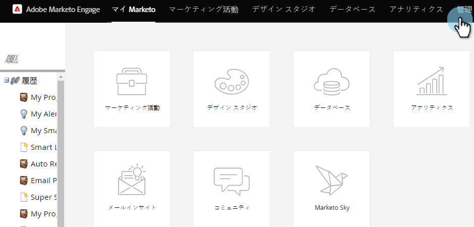
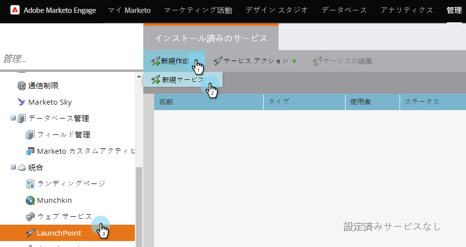
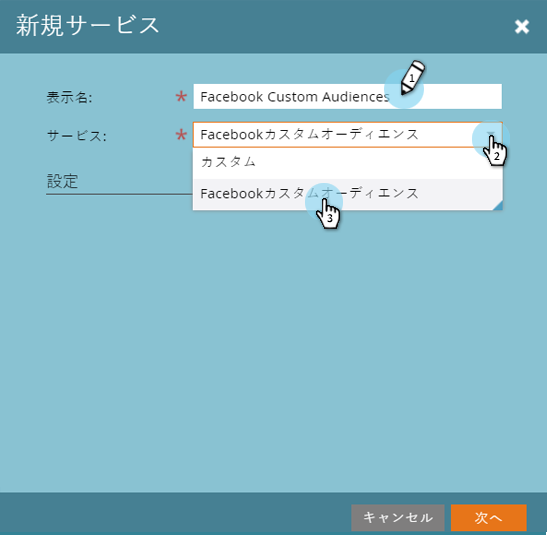
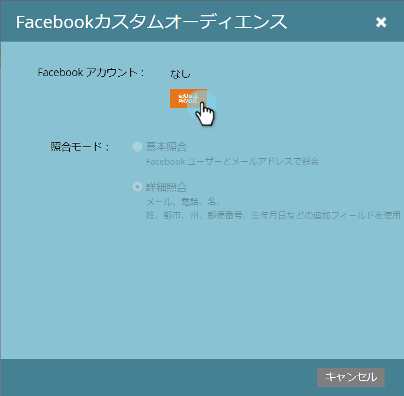
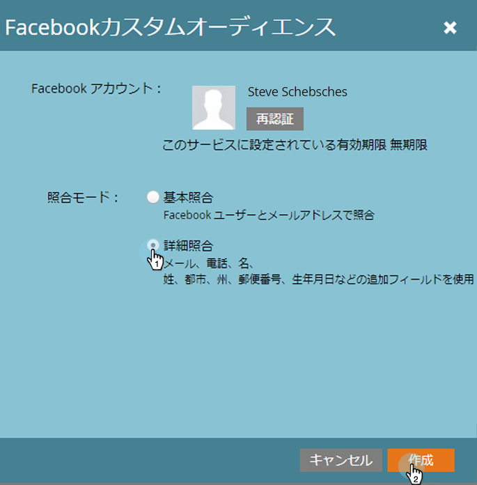

# LaunchPointサービスとしての追加Facebookカスタムオーディエンス {#add-facebook-custom-audiences-as-a-launchpoint-service}

>[!NOTE]
>
>**必要な管理者権限**

この統合により、Markettoの静的でスマートなリストからFacebookにオーディエンスデータを送信し、Facebook広告キャンペーンのカスタムオーディエンスとして使用できます。 設定方法を次に示します。

1. 「マーケティング **管理者**」に移動します。

   

1. 「LaunchPoint」に移動し、「 **New**」をクリックし、「 **New Service******」を選択します。

   

1. サービスの **表示名** ( **Display Name** )を入力し、「サービス **** 」ドロップダウンから「Facebookカスタムオーディエンス」サービスを選択します。

   

1. 同じブラウザーで新しいタブを開き、www.facebook.comに移動し [ます。](http://www.facebook.com./) 統合に使用するアカウントを使用してFacebookにログインします。

   >[!CAUTION]
   >
   >Marketingが複数の広告マネージャーアカウントでオーディエンスを送信するには、次の手順で承認するFacebookユーザーが *すべての* 「アカウント」にアクセスできる必要があります。

   

1. Facebookにログインした後、Marketoに戻ります。 「 **認証**」をクリックします。

   

   >[!NOTE]
   >
   >カスタムオーディエンスの統合を機能させるには ** 、Facebookビジネスマネージャーアカウントを使用する必要があります。 Business Managerアカウントの設定方法については、 [Facebookのヘルプを参照してください](https://www.facebook.com/business/help/1710077379203657)。

1. 指示に従って「**OK **」をクリックし、FacebookへのMarketoアプリケーションのインストールを受け入れます。

   

1. 認証されました！ 一致するモードを選択し、「 **作成**」をクリックします。

   >[!NOTE]
   >
   >**「基本一致」では、電子メールアドレスのみが**&#x200B;使用されます。**「高度な一致** 」では、7つの追加のフィールドを使用して、一致率を上げ、コンバージョンを増やします。 ただし、会社のプライバシーポリシーで追加のフィールドの共有が許可されていない場合や、フィールドが含まれていない場合は、「基本一致」を選択します。

   

   素晴らしい仕事！ Marketorの静的またはスマートリストに移動して、オーディエンスデータをFacebookに送信できるようになりました。

   >[!CAUTION]
   >
   >ああ、行く前に、Facebookアカウント内で必ずFacebookのカスタムオーディエンス条件に [同意してください](https://www.facebook.com/ads/manage/customaudiences/tos.php) 。 これを行わないと、オーディエンスの更新は失敗します。

>[!MORELIKETHIS]
>
>* [Facebookでのカスタムオーディエンスの作成](../../../product-docs/demand-generation/facebook/create-a-custom-audience-in-facebook.md)
   >
   >
* [Facebookリード広告の設定](../../../product-docs/demand-generation/facebook/set-up-facebook-lead-ads.md)

>

