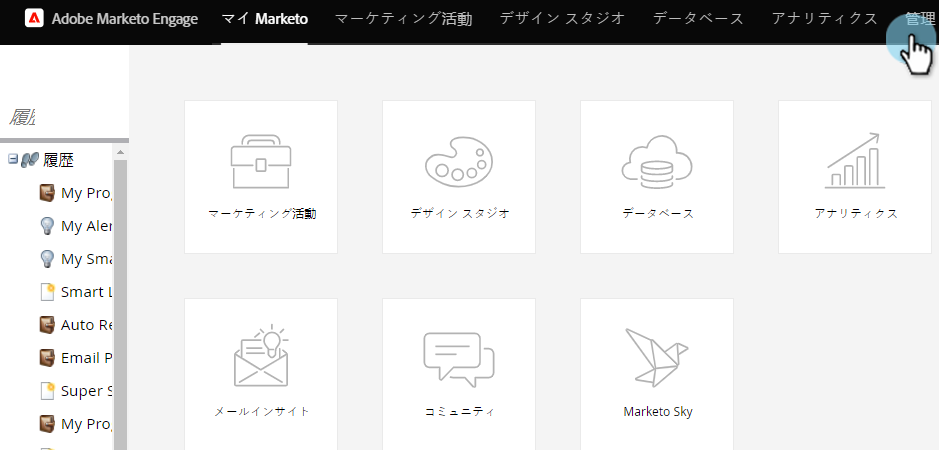
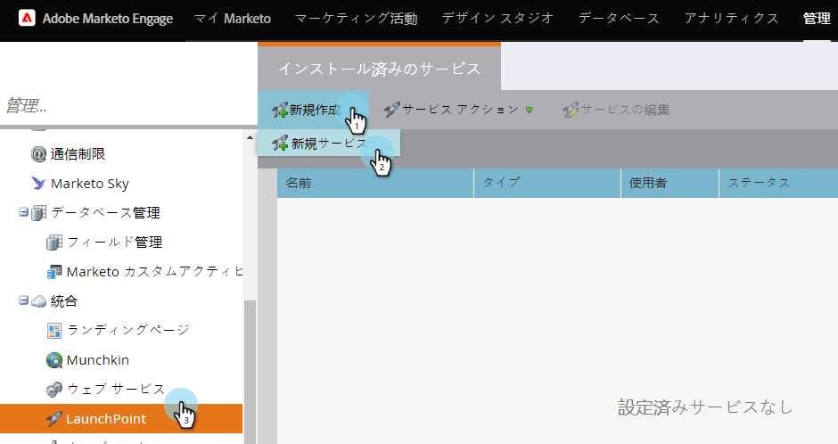
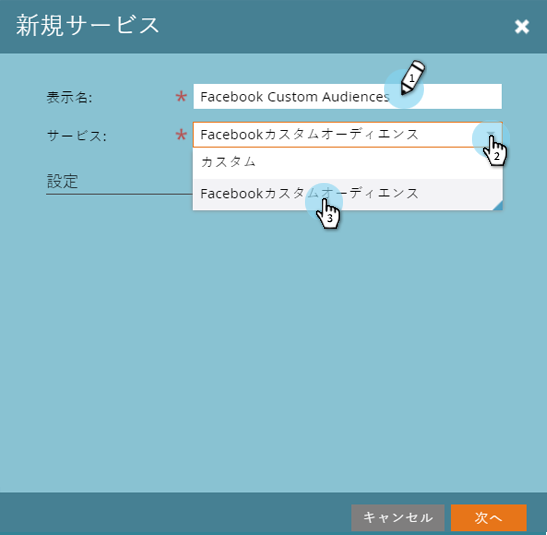
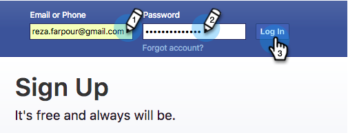
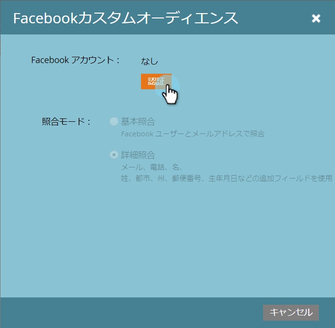
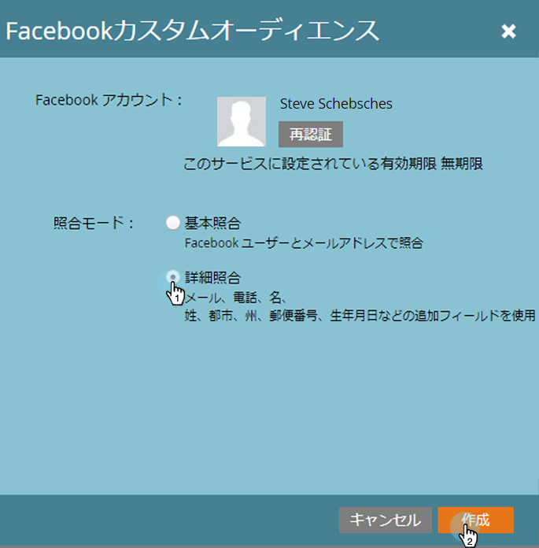

# [!DNL Facebook] カスタムオーディエンスを [!DNL LaunchPoint] サービスとして追加 {#add-facebook-custom-audiences-as-a-launchpoint-service}

>[!NOTE]
>
>**管理者権限が必要**

この統合により、Marketo の静的リストおよびスマートリストから [!DNL Facebook] にオーディエンスデータを送信し、[!DNL Facebook] 広告キャンペーンでカスタムオーディエンスとして使用できます。 その設定方法を説明します。

1. Marketo の「**[!UICONTROL 管理]**」に移動します。

   

1. **[!UICONTROL LaunchPoint]** に移動して、「**[!UICONTROL 新規]**」をクリックし、「**[!UICONTROL 新規サービス]**」を選択します。

   

1. サービスの&#x200B;**[!UICONTROL 表示名]**&#x200B;を入力します。ドロップダウンから「**[!UICONTROL Facebook カスタムオーディエンス]**」サービスを選択し、「**[!UICONTROL 作成]**」をします。

   

1. 同じブラウザーで新しいタブを開き、[facebook.com](https://www.facebook.com/).に移動します。 統合に使用するアカウントを使用して [!DNL Facebook] にログインします。

   >[!CAUTION]
   >
   >Marketo が複数の Ad Manager アカウント間でオーディエンスを送信するには、次の手順で承認した [!DNL Facebook] ユーザが、これらのアカウントの&#x200B;*すべて*&#x200B;にアクセスできる必要があります。

   

1. [!DNL Facebook]にログインしたら、Marketoに戻ります。 「**[!UICONTROL 許可]**」をクリックします。

   

   >[!NOTE]
   >
   >カスタムオーディエンスの統合を機能させるには、[!DNL Facebook] Business Manager アカウントを使用する&#x200B;*必要があります*。 Business Manager アカウントの設定方法について詳しくは、[[!DNL Facebook]  ヘルプ](https://www.facebook.com/business/help/1710077379203657)を参照してください。

1. プロンプトが表示されたら、「**[!UICONTROL OK]**」をクリックして、[!DNL Facebook] への Marketo アプリケーションのインストールを受け入れます。

   

1. これで承認されました。 一致モードを選択し、「**[!UICONTROL 作成]**」をクリックします。

   >[!NOTE]
   >
   >「**[!UICONTROL 基本照合]**」では電子メールアドレスのみが使用されます。 **[!UICONTROL 詳細照合]**&#x200B;では、7 つの追加フィールドが使用されて、一致率を高め、コンバージョンを増やします。 ただし、貴社のプライバシーポリシーで追加フィールドの共有が許可されていない場合や、追加フィールドがデータに含まれていない場合は、「[!UICONTROL 基本照合]」を選択してください。

   

   これで完了です。 Marketo の任意の静的リストまたはスマートリストに移動してオーディエンスデータを [!DNL Facebook] に送信できるようになりました。

   >[!CAUTION]
   >
   >最後に、[!DNL Facebook] アカウント内で [&#x200B; [!DNL Facebook] のカスタムオーディエンスの条件に同意する](https://www.facebook.com/ads/manage/customaudiences/tos.php)ことを確認します。 同意をしない場合、オーディエンスの更新が失敗します。

>[!MORELIKETHIS]
>
>* [&#x200B; [!DNL Facebook]](/help/marketo/product-docs/demand-generation/facebook/create-a-custom-audience-in-facebook.md) でのカスタムオーディエンスの作成
>
>* [&#x200B; [!DNL Facebook]  リード広告の設定](/help/marketo/product-docs/demand-generation/facebook/set-up-facebook-lead-ads.md)
