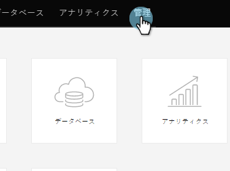

# Google カスタマーマッチを [!DNL LaunchPoint] サービスとして追加 {#add-google-customer-match-as-a-launchpoint-service}

この統合により、Marketo のオーディエンスを Google に送信して [!DNL Google AdWords] を使用してターゲットにしたり、YouTube、検索、[!DNL Gmail] を通じてオーディエンスをリターゲティングしたりすることができます。

>[!NOTE]
>
>**管理者権限が必要**

1. 「**[!UICONTROL 管理者]**」に移動します。

   

1. **[!UICONTROL LaunchPoint]**.をクリックします。

   

1. 「**[!UICONTROL 新規]**」と「**[!UICONTROL 新規サービス]**」を選択します。

   

1. **[!UICONTROL 表示名]**&#x200B;を入力して&#x200B;**[!UICONTROL サービス]**&#x200B;ドロップダウンから「**[!UICONTROL Google カスタマーマッチ]**」を選択します。「**[!UICONTROL 作成]**」をクリックします。

   

1. [!DNL Google AdWords] アカウントに接続するには、「**[!UICONTROL 認証]**」をクリックします。

   

1. Google が新しいタブで開きます。ここから、[!DNL Google AdWords] アカウントにログインします。

   >[!CAUTION]
   >
   >Marketo が複数の [!DNL AdWords] アカウント間でオーディエンスを送信するには、次の手順で認証する Google ユーザが、これらのアカウントの&#x200B;_すべて_&#x200B;にアクセスできる必要があります。

   

1. 要求された権限を確認し、「**[!UICONTROL 許可]**」をクリックします。

   

1. これで、[!DNL Google AdWords] アカウントが Marketo に接続されました。「**[!UICONTROL 作成]**」をクリックします。

   

   これで完了です。これで、「インストール済みのサービス」タブに [!DNL LaunchPoint] サービスとして「Google と一致するオーディエンス」が表示されます。

>[!NOTE]
>
>Google カスタマーマッチの統合には、1 つのマネージャーアカウントと、そのマネージャーアカウント内のサブアカウントすべてに対応できます。複数のマネージャーアカウントはサポートされていません。
