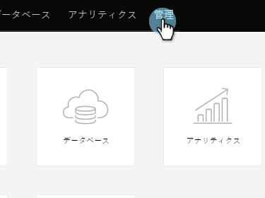
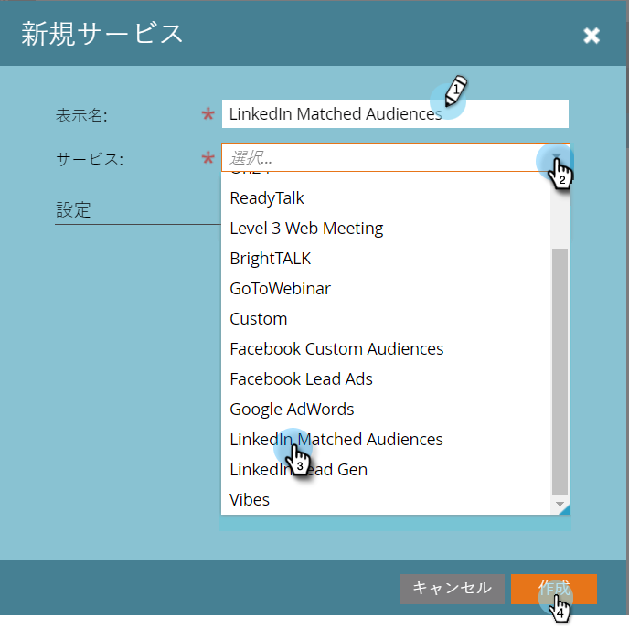

# LinkedIn と一致したオーディエンスを LaunchPoint サービスとして追加する {#add-linkedin-matched-audiences-as-a-launchpoint-service}

>[!NOTE]
>
>**管理者権限が必要**

Marketo アカウントを LinkedIn 一致オーディエンスに接続し、Marketo の静的リストまたはスマートリストを LinkedIn オーディエンスセグメントとして使用します。

1. **管理**&#x200B;セクションに移動します。

   

1. 「**Launchpoint**」を選択します。

   

1. 「**新しい**」と「**新しいサービス**」を選択します。

   

1. **表示名**&#x200B;を入力し、「**LinkedIn と一致したオーディエンス**」を選択します。「**作成**」をクリックします。

   

1. LinkedIn アカウントに接続するには、「****&#x200B;を許可」をクリックします。

   

   >[!CAUTION]
   >
   >Marketo が複数の LinkedIn 広告アカウント間でオーディエンスを送信するには、次の手順で承認した LinkedIn ユーザーが、Campaign Manager でこれらの広告アカウントの&#x200B;*すべて*&#x200B;にアクセスできる必要があります。

1. linkedIn が新しいタブで開きます。ここから、LinkedIn アカウントにログインします。

   

1. 要求された権限を確認し、「**許可**」をクリックします。

   

1. これで、LinkedIn アカウントが Marketo に接続されました。「**作成**」をクリックします。

   

   これで完了です。これで、「インストール済みのサービス」タブに LaunchPoint サービスとして「LinkedIn 一致したオーディエンス」が表示されます。

   

>[!MORELIKETHIS]
>
>[LinkedIn のオーディエンスセグメントとして Marketo リストまたはスマートリストを使用する。](/help/marketo/product-docs/demand-generation/social/social-functions/use-a-marketo-list-or-smart-list-as-a-linkedin-audience-segment.md)
