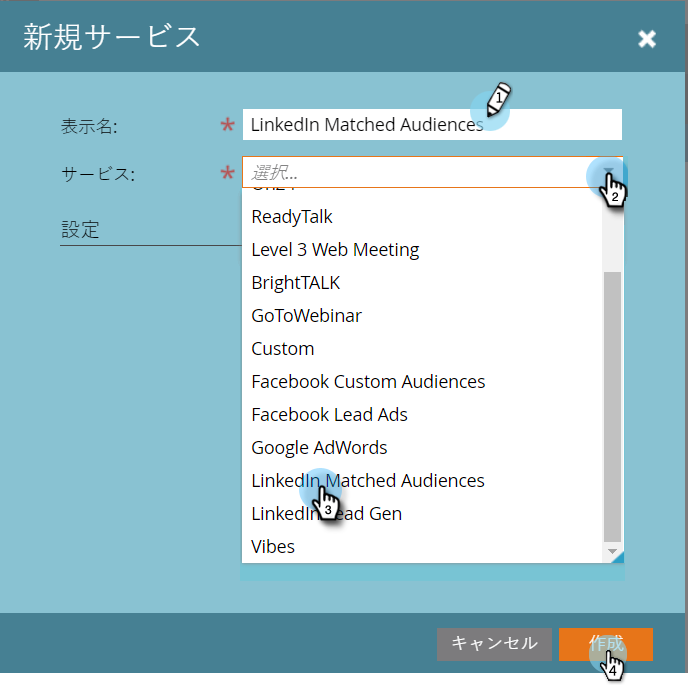
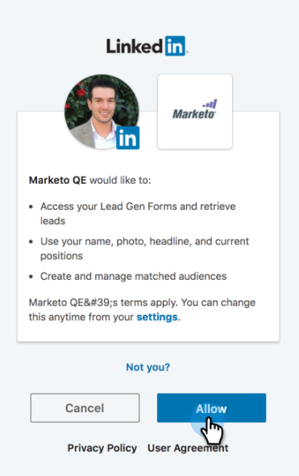

# [!DNL LinkedIn] の一致するオーディエンスを [!DNL LaunchPoint] サービスとして追加 {#add-linkedin-matched-audiences-as-a-launchpoint-service}

>[!IMPORTANT]
>
>LinkedIn では、Marketo Engage LinkedIn 統合で使用されるマーケティング API をアップグレードしています。この変更により、サービスの中断を避けるために、2024年6月7日（PT）から 12月15日（PT）までの間、**管理**／**LaunchPoint** メニューですべての LinkedIn LaunchPoint サービスの再認証が必須になります。詳しくは、[移行に関する FAQ](https://nation.marketo.com/t5/employee-blogs/linkedin-re-authentication-required/ba-p/347794){target="_blank"} を参照してください。

>[!NOTE]
>
>**管理者権限が必要**

Marketo アカウントを [!DNL LinkedIn] の一致するオーディエンスに接続し、Marketo の静的リストまたはスマートリストを [!DNL LinkedIn] オーディエンスセグメントとして使用します。

1. 「**[!UICONTROL 管理者]**」セクションに移動します。

   

1. 「**[!UICONTROL LaunchPoint]**」を選択します。

   

1. 「**[!UICONTROL 新規]**」と「**[!UICONTROL 新規サービス]**」を選択します。

   

1. **[!UICONTROL 表示名]**&#x200B;を入力し、「**[!UICONTROL LinkedIn と一致したオーディエンス]**」を選択します。「**[!UICONTROL 作成]**」をクリックします。

   

1. [!DNL LinkedIn] アカウントに接続するには、「**[!UICONTROL 許可]**」をクリックします。

   

   >[!CAUTION]
   >
   >Marketo が複数の [!DNL LinkedIn] 広告アカウント間でオーディエンスを送信するには、次の手順で承認した [!DNL LinkedIn] ユーザが、Campaign Manager でこれらの広告アカウントの&#x200B;*すべて*&#x200B;にアクセスできる必要があります。

1. [!DNL LinkedIn] が新しいタブで開きます。ここから、[!DNL LinkedIn] アカウントにログインします。

   

1. 要求された権限を確認し、「**[!UICONTROL 許可]**」をクリックします。

   

1. これで、[!DNL LinkedIn] アカウントが Marketo に接続されました。「**[!UICONTROL 作成]**」をクリックします。

   

   これで完了です。これで、「インストール済みのサービス」タブに [!DNL LaunchPoint] サービスとして[!DNL LinkedIn] の一致するオーディエンスが表示されます。

   

>[!MORELIKETHIS]
>
>[&#x200B; [!DNL LinkedIn]  のオーディエンスセグメント](/help/marketo/product-docs/demand-generation/social/social-functions/use-a-marketo-list-or-smart-list-as-a-linkedin-audience-segment.md)として Marketo リストまたはスマートリストを使用
