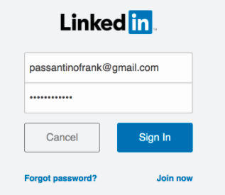
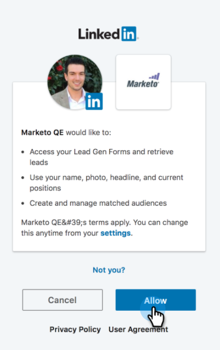

# LaunchPointサ追加ービスとしての一致したオーディエンスのLinkedIn {#add-linkedin-matched-audiences-as-a-launchpoint-service}

>[!NOTE]
>
>**必要な管理者権限**

Marketoの静的なリストまたはスマートリストをLinkedInのオーディエンスセグメントとして使用するには、MarketoのアカウントをLinkedInの一致するオーディエンスと接続します。

1. 「 **管理者** 」セクションに移動します。

   

1. 「 **Launchpoint**」を選択します。

   

1. 「 **New** and **New Service**」を選択します。

   

1. 「 **表示名」を入力**&#x200B;し、「一致したオーディエンス&#x200B;**」を選択します**。 「 **作成**」をクリックします。

   

1. LinkedInアカウントに接続するには、「 **認証**」をクリックします。

   

   >[!CAUTION]
   >
   >Marketorが複数のLinkedIn広告アカウントでオーディエンスを送信するためには、次の手順で承認するLinkedInユーザーは、キャンペーンマネージャーでこれらの *すべての広告アカウントにアクセスする必要があります* 。

1. LinkedInが新しいタブで開きます。 ここから、LinkedInアカウントにログインします。

   

1. 必要な権限を確認し、「 **許可**」をクリックします。

   

1. LinkedInアカウントがMarketoに接続されました。 「 **作成**」をクリックします。

   

   すごい！ 「インストール済みのサービス」タブに、LinkedInの一致したオーディエンスがLaunchPointサービスとして表示されるようになりました。

   

>[!MORELIKETHIS]
>
>* [LinkedInオーディエンスセグメントとしてのマーケティングリストまたはスマートリストの使用](../../../product-docs/demand-generation/social/social-functions/use-a-marketo-list-or-smart-list-as-a-linkedin-audience-segment.md)

>

