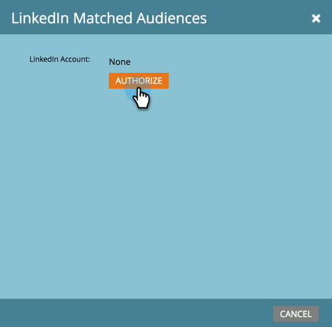

# LinkedIn追加がLaunchPointサービス{#add-linkedin-matched-audiences-as-a-launchpoint-service}としてオーディエンスに一致しました

>[!NOTE]
>
>**必要な管理者権限**

LinkedIn一致オーディエンスにMarketoアカウントを接続し、Marketoの静的リストまたはスマートリストをLinkedInオーディエンスセグメントとして使用します。

1. **管理者**&#x200B;セクションに移動します。

   

1. 「**起動ポイント**」を選択します。

   

1. 「**新規**」と「**新しいサービス**」を選択します。

   

1. **表示名**&#x200B;を入力し、**LinkedIn一致オーディエンス**&#x200B;を選択します。 「**作成**」をクリックします。

   

1. LinkedInアカウントを接続するには、[**許可**]をクリックします。

   

   >[!CAUTION]
   >
   >Marketoが複数のLinkedIn広告アカウントでオーディエンスを送信するには、次の手順で承認するLinkedInのユーザーは、キャンペーンマネージャーでこれらの広告アカウントの&#x200B;*すべて*&#x200B;にアクセスする必要があります。

1. linkedInが新しいタブで開きます。 ここから、LinkedInアカウントにログインします。

   

1. 要求された権限を確認し、「**許可**」をクリックします。

   

1. LinkedInアカウントがMarketoに接続されました。 「**作成**」をクリックします。

   

   やりましたね！「インストール済みのサービス」タブで、LaunchPointサービスとして「LinkedIn一致オーディエンス」が表示されます。

   

>[!MORELIKETHIS]
>
>[MarketoリストまたはスマートリストをLinkedInオーディエンスセグメントとして使用する](/help/marketo/product-docs/demand-generation/social/social-functions/use-a-marketo-list-or-smart-list-as-a-linkedin-audience-segment.md)
