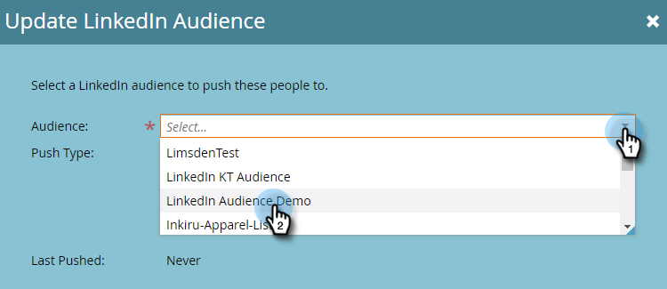
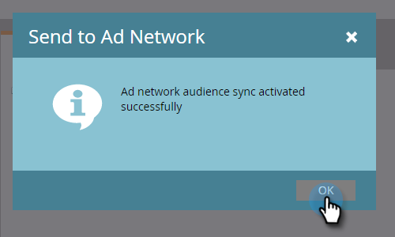

# 広告ネットワークへのリストの送信 {#send-a-list-to-an-ad-network}

静的リストを [!DNL LinkedIn]、[!DNL Facebook]、Google に送信する方法について説明します。

## リストの送信方法 {#how-to-send-a-list}

1. Marketo で、リストを選択して、**[!UICONTROL リストアクション]**&#x200B;ドロップダウンをクリックして、「**[!UICONTROL 広告ネットワークに送信]**」を選択します。

   

1. [!DNL LinkedIn]、[!DNL Facebook]、Google のいずれかを選択します（現時点では、その他のオプションは使用できません）。 この例では、**[!DNL LinkedIn]** を選択しています。 「**[!UICONTROL 次へ]**」をクリックします。

   

1. **[!UICONTROL オーディエンス]**&#x200B;ドロップダウンをクリックし、目的のオーディエンスを選択します。

   

   >[!TIP]
   >
   >確認する必要がある場合は、「ステータス」タブで、リストが同期されている宛先オーディエンスを確認できます。

1. 目的の[!UICONTROL プッシュタイプ]を選択し、「**[!UICONTROL 更新]**」をクリックします。

   

   >[!NOTE]
   >
   >「[!UICONTROL 継続的なオーディエンスの同期を有効にする]」を選択した場合、Marketo インスタンスでリストが変更されるので、Marketo は選択された広告ネットワークでリストを最新の状態に保ちます。 静的リストに追加または削除されたユーザーを&#x200B;**および**&#x200B;個オーディエンスから削除します。

1. 「**[!UICONTROL OK]**」をクリックして終了します。

   

## よくある質問 {#faq}

**単一の静的リストを複数の広告オーディエンスと同期できますか？**

いいえ。リストは 1 つの宛先オーディエンスにのみ同期できます。

**既存の広告オーディエンスへの継続的な同期を有効にした場合、既存のオーディエンスは置き換えられますか。**

いいえ、既存のオーディエンスに追加されますが、置き換えられません。
