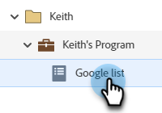

# Google へのリストの送信 {#send-a-list-to-google}

Google Customer Matchを使用している場合は、次の手順に従って、Marketo Engageの静的リストをGoogle アカウントに送信します。

1. Marketo Engageで、目的のリストを検索して選択します。

   

1. 「**アクションを一覧表示**」ドロップダウンをクリックし、**広告ネットワークに送信**&#x200B;を選択します。

   

1. Googleを選択し、**次へ**&#x200B;をクリックします。

   

1. 目的の広告アカウントを選択します。 既存のオーディエンスを選択するか、新しいオーディエンスを作成できます。 この例では、新しいオブジェクトを作成しています。 新しいオーディエンスに名前を付けます。

   

1. オプションの選択を行います。

   

   >[!NOTE]
   >
   >* 「**オーディエンスメンバーシップを同期する**」を選択すると、インスタンス内で変更される際に、リストが最新の状態に保たれます。 オーディエンスメンバーシップは、オーディエンスが静的リストに追加または削除されたときに更新されます。
   >
   >* 下部のチェックボックスをオンにすると、広告および広告のパーソナライズ目的でGoogle Adsに送信されたユーザーデータに対して、付与された同意ステータスが送信されます。 チェックを外したままにすると、同意ステータスが未指定のまま送信されます。 欧州経済領域（EEA）のユーザー向けのデータをアップロードする予定のユーザーについては、Googleでは、[FAQ](https://support.google.com/google-ads/answer/14310715){target="_blank"}のリストと、[EU ユーザー同意ポリシー](https://www.google.com/about/company/user-consent-policy/){target="_blank"}の概要を示す詳細をまとめました。

1. 「**更新**」をクリックします。

   

1. 「**OK**」をクリックして終了します。

   
