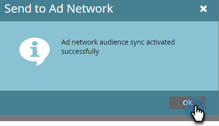

# Googleへのリストの送信 {#send-a-list-to-google}

以下の手順に従って、静的リストをGoogle アカウントに送信します。

1. Marketo Engageで、目的のリストを見つけて選択します。

   

1. 「」をクリックします **リストアクション** ドロップダウンして選択 **広告ネットワークに送信**.

   

1. 「Google」を選択し、 **次**.

   

1. 目的の広告アカウントを選択します。 既存のオーディエンスを選択することも、新しいオーディエンスを作成することもできます。 この例では、新しいタグを作成します。 新しいオーディエンスに名前を付けます。

   

1. オプションで選択します。

   

   >[!NOTE]
   >
   >* 選択 **オーディエンスメンバーシップの同期** インスタンスで変更されたリストを最新の状態に保ちます。 静的リストに追加されたユーザーや静的リストから削除されたユーザーをオーディエンスに追加またはオーディエンスから削除します。
   >
   >* 下部にあるチェックボックスをオンにすると、広告および広告パーソナライゼーションの目的でGoogle Ads に送信されるユーザーデータに対して、同意ステータスが許可済みとして送信されます。 オフのままにすると、同意ステータスは未指定として送信されます。

1. 「**更新**」をクリックします。

   

1. 「**OK**」をクリックして終了します。

   
