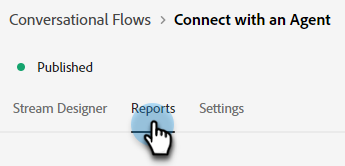

# 対話型フローの概要 {#conversational-flow-overview}

特定のアクションに基づいて、対話フローを設計し、訪問者にトリガーします（例：コールトゥアクションボタンのクリック、ページ読み込み時、ページでの滞在時間など）。

## ダイアログと対話フロー {#dialogues-vs-conversational-flows}

ダイアログと対話フローにはいくつかの類似点がありますが、2 つの異なる機能です。

<table> 
 <tbody> 
  <tr> 
   <th style="width:50%">ダイアログ</th> 
   <th style="width:50%">対話型フロー</th>
  </tr> 
  <tr> 
   <td>ダイアログがターゲットになる — 実装したパラメーターに基づいて、特定のページとオーディエンスに対する会話を設計します。</td> 
   <td>対話型フローがトリガーされる — フォームへの入力、リンクのクリックなど、訪問者のアクションに基づいてトリガーされる会話をデザインします。</td>
  </tr>
   <tr> 
   <td>Chatbot インターフェイスでのみサポートされています。</td> 
   <td>現在、ポップアップインターフェイスでサポートされており、より多くのインターフェイスが予定されています。</td>
  </tr>
  </tr>
   <tr> 
   <td>リードの同じセグメントに対して複数のダイアログを優先順に作成できるので、引き続き各訪問者が操作する際に、優先順にダイアログを順番に表示できます。</td> 
   <td>対話型フローには優先順位がなく、決定されたコールトゥアクションに基づいて、同じリードで任意の回数トリガーできます。</td>
  </tr>
  <tr>
   <td>Chatbot の会話は、Dialogs を活用します。</td>
   <td><a href="/help/marketo/product-docs/demand-generation/dynamic-chat-two/automated-chat/conversational-flow-settings-for-marketo-engage-forms.md" target="_blank">対話型のForms</a> のMarketo Engageは、対話型のフローを活用しています。</td>
  </tr>
 </tbody> 
</table>

## 「ストリームデザイナー」タブ {#stream-designer-tab}

対話型フローのストリームデザイナーは、ダイアログのストリームデザイナーとほとんど同じです。 [こちらですべてを学ぶ](/help/marketo/product-docs/demand-generation/dynamic-chat-two/automated-chat/stream-designer.md){target="_blank"}.

## 「レポート」タブ {#reports-tab}

「レポート」タブでは、対話型フローの効果に関する指標を確認できます。

エンゲージメント率、コンバージョン率、既知の訪問者や不明な訪問者によるフィルターなどを表示します。

## 「設定」タブ {#settings-tab}

[ 設定 ] タブの上半分で、会話フローの名前を更新し、オプションの説明を追加し、言語を変更できます。

>[!NOTE]
>
>別の言語を選択すると、システムテキストの言語のみが変更されます。 コンテンツの翻訳は、お客様がおこないます。

### 会話 SDK {#conversations-sdk}

[ 設定 ] タブの下半分で、[ 会話 ]トリガー（[ 会話 SDK] とも呼ばれる）をカスタマイズします。 訪問者がリンクをクリックしたときに会話が Web サイト上でトリガーされるか、ページの読み込み時に会話がトリガーされるかを決定できます。

>[!TIP]
>
>詳しくは、 [会話 SDK](https://experienceleague.adobe.com/tools/marketo-dynamic-chatbot/conversations-sdk/){target="_blank"} 動作中

>[!MORELIKETHIS]
>
>[対話フローの作成](/help/marketo/product-docs/demand-generation/dynamic-chat-two/automated-chat/create-a-conversational-flow.md){target="_blank"}
