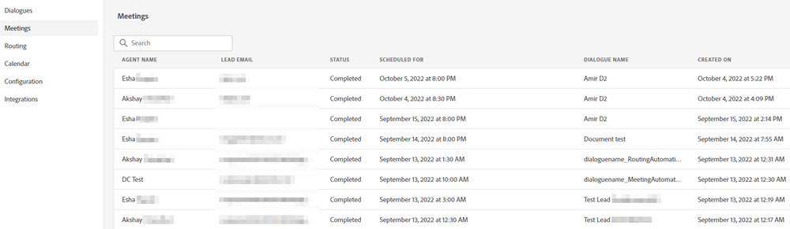

# 会議リスト {#meeting-list}

Web サイトの訪問者が様々なダイアログを使用してスケジュールしたすべての予定が表示されます。ここには、予約者のメールアドレス、予約したエージェント、予約の日時、予定した会議時間が過ぎたかどうかが表示されます。

>[!NOTE]
>
>エージェントのカレンダーに会議が予約されると、エージェントは、訪問者の動的チャットのエンゲージメントに関する詳細情報を含む、予約に関するメール通知を受け取ります。
