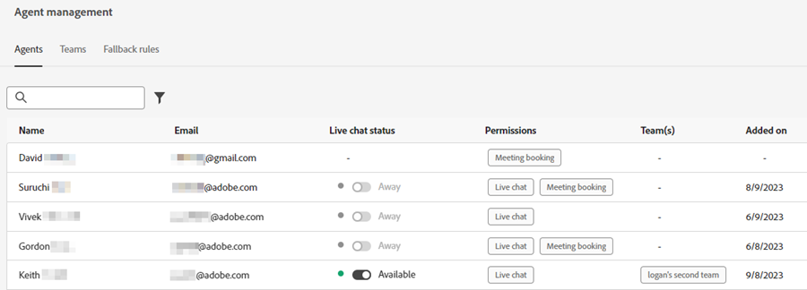

# エージェント管理 {#agent-management}

エージェント管理で、Dynamic Chatインスタンス内のエージェントのリストを表示し、チームを管理し、フォールバックルールを設定します。

## エージェント {#agents}

このタブには、Dynamic Chatインスタンス内のすべてのエージェントが一覧表示され、名前、電子メールアドレス、ライブチャットのステータスなどの情報が含まれます。

## チーム {#teams}

管理者は、特定のセールスエージェントグループに簡単にルーティングできるように、エージェントのチームを作成できます。

### チームの作成 {#create-a-team}

1. クリック **+チームの作成**.

   

1. チームに名前を付けます。

   

1. 次をクリック： **エージェントを追加** 」ドロップダウンリストから、目的のエージェントを選択します。

   

1. 「**作成**」をクリックします。

   

## フォールバックルール {#fallback-rules}

### 会議のフォールバック {#meeting-fallback}

標準（システム）メッセージを選択するか、会議の予約が利用できない場合に訪問者に表示するカスタムメッセージを作成します。

### Live Chat フォールバック {#live-chat-fallback}

標準（システム）メッセージを選択するか、ライブチャットが利用できない場合に訪問者に表示するカスタムメッセージを作成します。

>[!NOTE]
>
>の選択 **会議予約オプションを含める** チェックボックスを選択すると、ライブチャットで使用できるエージェントがない場合に、チャット訪問者が会議を予約するオプションが提供されます。

>[!TIP]
>
>カスタムメッセージを作成する際に、フォントのスタイル設定、リンクの使用、絵文字の挿入をおこなうことができます。 `:)`
