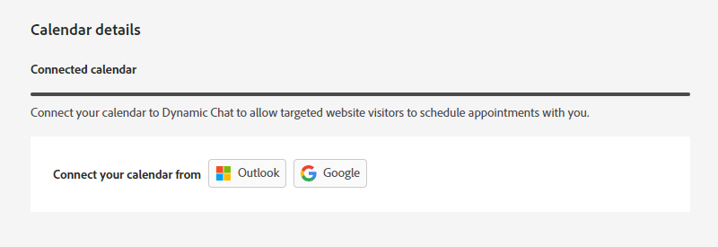

# エージェント設定 {#agent-settings}

「カレンダー」タブで、Outlook または Gmail のカレンダーを接続して、チャットボットでの予定スケジュールに使用します。

## カレンダーの接続 {#connect-calendar}

ユーザのカレンダーが動的チャットに接続されると、そのユーザはキューに追加され、web サイトの訪問者が予定をスケジュールする際に使用できるようになります。

>[!NOTE]
>
>1 ユーザにつき 1 つのカレンダーを接続できます。複数のカレンダーで会議を受け取る場合は、複数のユーザを追加し、各ユーザにカレンダーを連携させる必要があります。

また、カレンダーに予定をスケジュールするときに訪問者に送信される、招待の本文をカスタマイズすることもできます。下部のチェックボックスを選択して、「Google Meet」リンクまたは「Microsoft Teams」リンクを含めることもできます（接続されたカレンダーに応じて異なります）。

>[!TIP]
>
>トークンアイコン（波括弧）を使用して、ユーザ属性または会社属性を使用して会議予約確認メールをパーソナライズします。

### 権限 {#permissions}

Outlook での設定では、次の権限をDynamic Chatに付与します。

* カレンダーへのフルアクセス
* ログインしてプロファイルを読む
* アクセス権を付与したデータへのアクセスを維持する
* メールボックス設定を読み取る

Googleでの設定では、次の権限をDynamic Chatに付与します。

* カレンダーの作成、変更、削除
* 個々のカレンダーイベントの更新
* イベントを表示できるユーザーを含め、設定を変更します
* カレンダーの共有先の変更
* 名前、メールアドレス、言語設定、プロフィール画像へのアクセス

## ライブチャットの利用可否設定 {#live-chat-availability-settings}

テキスト

## 会議予約可用性設定 {#meeting-booking-availability-settings}

テキスト

## 会議の長さとバッファー時間 {#meeting-length-and-buffer-time}

テキスト
