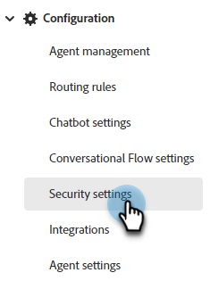

# セキュリティ設定 {#security-settings}

セキュリティ設定では、ブロックまたは許可リストにドメインを追加できます。

## ブロックされたメールドメイン {#blocked-email-domains}

1. を選択します。 **検証を有効にする** スライダーを使用して、「 」をブロックリストに加えるアクティブにします。 最大 50 個のドメインを入力し、 **保存**.

   

## 許可されたドメイン {#allowed-domains}

1. を選択します。 **検証を有効にする** スライダーを使用して、「 」を許可リストに加えるアクティブにします。 許可されるドメインを入力し、「 **保存**.

   
