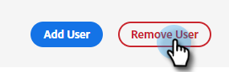

# チャットユーザーの追加または削除 {#add-or-remove-chat-users}

以下の手順に従って、チャットユーザーを追加または削除します。

## チャットユーザーの追加 {#add-a-chat-user}

1. にログインします。 [Adobe Admin Console](https://adminconsole.adobe.com/).

   

1. クリック **ダイナミックチャット**.

   

   >[!NOTE]
   >
   >複数のMarketoサブスクリプションがある場合は、次の手順の前に、目的のサブスクリプションを選択します。

1. 「**ユーザー**」タブをクリックします。

   

1. 「 **ユーザーの追加** ボタンをクリックします。

   

1. 追加するユーザーの名前、ユーザーグループ、または電子メールアドレスを入力します。 姓と名はオプションです。

   

1. 「 **+** アイコンをクリックし、目的の製品プロファイルを選択します。

   

1. 「**保存**」をクリックします。

   

## ダイナミックチャットアクセスをMarketoロールに追加 {#add-dynamic-chat-access-to-marketo-role}

新しく追加したチャットユーザーのMarketoの役割に Dynamic Chat の権限がまだない場合は、それを追加する方法を次に示します。

1. Marketoで、 **管理者** を選択します。 **ユーザーとロール**.

   

1. 「 **役割** タブに移動します。

   

1. リストから、変更するロールを選択し、「 」をクリックします。 **役割の編集**.

   

1. 選択 **ダイナミックチャットにアクセス** をクリックします。 **保存**.

   

## チャットユーザーの削除 {#remove-a-chat-user}

1. にログインします。 [Adobe Admin Console](https://adminconsole.adobe.com/).

   

1. クリック **ダイナミックチャット**.

   

   >[!NOTE]
   >
   >複数のMarketoサブスクリプションがある場合は、次の手順の前に、目的のサブスクリプションを選択します )。

1. 「**ユーザー**」タブをクリックします。

   

1. 削除するユーザーを選択します。

   

1. 「 **ユーザーの削除** ボタン

   

1. クリック **ユーザーの削除** をクリックして確定します。

   

>[!MORELIKETHIS]
>
>* [Adobe Admin Console Users](https://helpx.adobe.com/enterprise/using/users.html)
>* [ユーザーの個別管理](https://helpx.adobe.com/enterprise/using/manage-users-individually.html)

