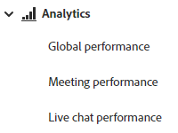

# Analytics {#analytics}

レポートはダイアログレベルで利用できますが、以下の 3 つのダッシュボードを使用して全体的なエンゲージメントを確認してください。

>[!NOTE]
>
>Dynamic Chat からのデータが Marketo Engage インスタンスに反映されるまで、最長で 24 時間かかる場合があります。

以下の各ダッシュボードにアクセスする **Analytics** 左側のナビゲーションで

## グローバルパフォーマンスダッシュボード {#global-performance-dashboard}

エンゲージメントとパフォーマンスの指標（合計および長期）、パフォーマンスの高いページ、パフォーマンスの高いダイアログなど、ダイアログのパフォーマンスがどの程度良いかを確認できます。

ダイアログ、対話フロー、またはすべてを表示します。 既知の訪問者、不明な訪問者、またはその両方で並べ替えます。 プリセットまたはカスタムの日付範囲を選択します。 「 」ボタンをクリックして、結果をエクスポートします。

## 会議パフォーマンスダッシュボード {#meeting-performance-dashboard}

予約されているミーティングの数と、予約されているミーティングの人数を確認します。

ダイアログ、対話フロー、またはすべてを表示します。 プリセットまたはカスタムの日付範囲を選択します。 「 」ボタンをクリックして、結果をエクスポートします。

## Live Chat パフォーマンスダッシュボード {#live-chat-performance-dashboard}

ライブセールスエージェントが持つ会話の数、および最もパフォーマンスの高いチームを表示します。

ダイアログ、対話フロー、またはすべてを表示します。 プリセットまたはカスタムの日付範囲を選択します。 ボタンをクリックして結果をエクスポートします。

## 定義 {#definitions}

<table>
<thead>
<tbody>
  <tr>
    <td style="width:30%"><b>完了</b></td>
    <td>完了イベントは、訪問者が対話の最後のプロンプトに到達した際<i>または</i>訪問者が対話のすべてのコンテンツを使い果たした際に発生します。
 訪問者 1 人あたり、セッションごとに1 つの完了イベント。</td>
  </tr>
  <tr>
    <td style="width:30%"><b>獲得した人物</b></td>
    <td>訪問者がメールアドレスを送信した際に発生します。
     訪問者 1 人あたり、セッションごとに1 つの獲得。</td>
  </tr>
  <tr>
    <td style="width:30%"><b>エンゲージメント率</b></td>
    <td>応答したユーザ数（ユーザによる最初の入力）／トリガー数（チャットボットの表示）。</td>
  </tr>
  <tr>
    <td style="width:30%"><b>コンバージョン率</b></td>
    <td>ユーザ獲得数（新しく取り込まれたメール）／エンゲーしたユーザ数。</td>
  </tr>
</tbody>
</table>
