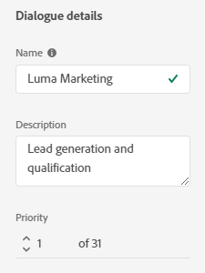
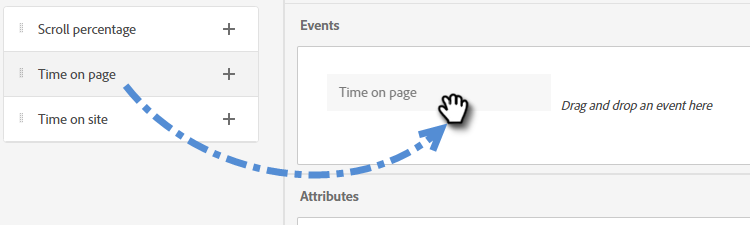
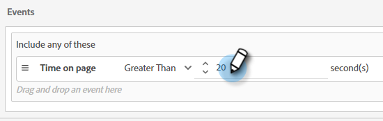
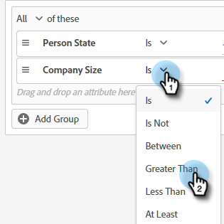
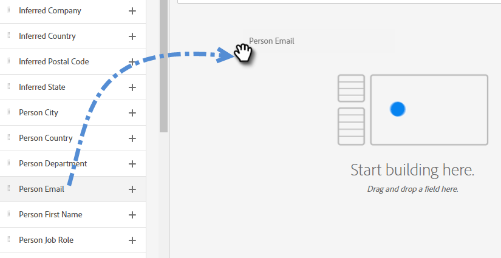
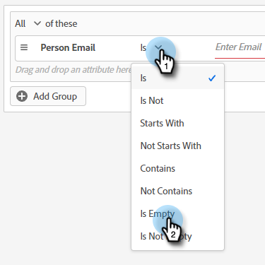
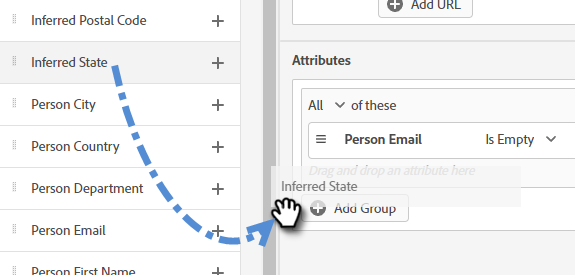
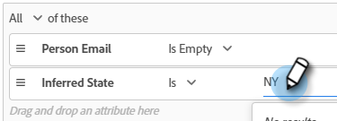
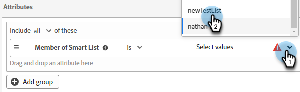
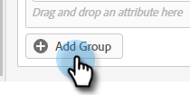

# オーディエンス条件 {#audience-criteria}

Marketo Engage スマートリストと同様に、オーディエンス条件属性を使用すると、ターゲットオーディエンスを定義できます。 推測される人物、人物、会社の属性（またはその組み合わせ）を使用して、既知の人物または不明な人物をターゲットに設定できます。

## 優先度 {#priority}

優先度では、複数該当する場合に、リードが受け取るダイアログを決定します。 これは、最初に[&#x200B; ダイアログを作成](/help/marketo/product-docs/demand-generation/dynamic-chat/automated-chat/create-a-dialogue.md){target="_blank"}したときに確立されます。 既存のダイアログの優先順位を変更するには、そのダイアログを開き、「**[!UICONTROL オーディエンス条件]**」タブのダイアログの詳細を表示します。

## イベント {#events}

イベントを利用すれば、スクロール時間やページやサイトの滞在時間にもとづいて、訪問者をターゲティングできます。 次の例では、設定は、特定のページに20秒以上滞在している訪問者をターゲットにしています。

1. 「**[!UICONTROL ページ滞在時間]**」イベントを選択し、右にドラッグします。

   

1. 「[!UICONTROL 次よりも大きい]」時間を 20 秒に設定します。

   

1. 「[[!UICONTROL ターゲット]](#target)」セクションに、目的のページの URL を入力します。

   

## 属性 {#attributes}

**認識済み人物**

_多数の_&#x200B;属性の組み合わせから選択できます。 以下の例では、設定は、50人以上の従業員を持つ会社で働くカリフォルニアのすべての既知の人々をターゲットにしています。

1. 「**[!UICONTROL 人物の州]**」属性を選択し、右にドラッグします。

   

1. 「_[!UICONTROL 次に該当]_」はデフォルトで設定されています。 「値を選択」フィールドに「CA」と入力します（ドロップダウンをクリックして、リストから選択することもできます）。

   

1. 「**[!UICONTROL 会社の規模]**」属性を選択し、「_ここに属性をドラッグ＆ドロップ_」と書いてある場所にドラッグします。

   

   >[!NOTE]
   >
   >属性の **+** アイコンをクリックして選択することもできます。

1. 演算子のドロップダウンをクリックし、「**[!UICONTROL 指定の値より大きい]**」を選択します。

   

1. 「50」と入力し、画面の別の場所をクリックして保存します。

   

**匿名の人物**

次の例は、まだデータベースに登録されていないユーザーをターゲットにしています。 この例では、設定はニューヨークにある匿名のすべてのユーザーをターゲットにしています。

1. 「**[!UICONTROL 人物のメール]**」属性を選択し、右にドラッグします。

   

1. 演算子のドロップダウンをクリックし、「**[!UICONTROL が空である]**」を選択します。

   

1. 「**[!UICONTROL 推測される州]**」属性を選択し、「_ここに属性をドラッグ＆ドロップ_」と書いてある場所にドラッグします。

   

   >[!NOTE]
   >
   >Web サイトの訪問者には、[Munchkin](/help/marketo/product-docs/administration/additional-integrations/add-munchkin-tracking-code-to-your-website.md){target="_blank"} Cookie が作成され、訪問者はシステムに格納されます。 IP アドレスは、場所やその他の情報を推測するために、特別なデータベースで検索されます。

1. 「_[!UICONTROL 次に該当]_」はデフォルトで設定されています。 「値を選択」フィールドに「NY」と入力します（ドロップダウンをクリックして、リストから選択することもできます）。

   

## メンバーシップ {#membership}

ダイアログのターゲットオーディエンスには、Marketo Engage スマートリストを使用します。

>[!AVAILABILITY]
>
>スマートリストのメンバーまたはリストのメンバーの条件には、Dynamic Chat Prime が必要です。 詳しくは、アドビのアカウントチーム（担当のアカウントマネージャー）にお問い合わせください。

1. メンバーシップの下で、**[!UICONTROL スマートリストのメンバー]**&#x200B;を取得して、キャンバスにドロップします。

   

1. 目的のスマートリストを選択します。

   

## グループを追加 {#add-groups}

すべての特定の属性を別の属性の「すべてまたは任意」と共に持つ場合に備えて、属性をグループ化することもできます。 複数のグループを追加できます。

## ターゲット {#target}

特定のダイアログを表示する URL を入力する場所です。 また、除外を追加することもできます。

使用可能な形式：

* `http://website.com`
* `https://*.website.com`
* `http://website.com/folder/*`
* `https://*.website.com/folder/*`

>[!NOTE]
>
>* アスタリスクを使用すると包括的なワイルドカードとして機能します。 `https://*.website.com` はサブドメイン（例：`support.website.com`）を含み、ダイアログをサイトのすべてのページに配置します。 また、`https://website.com/folder/*` は後続のフォルダー内のすべての HTML ページにダイアログを配置します（例：フォルダーが「sports」の場合、website.com/sports/baseball.html、website.com/sports/football.html などになります）。
>
>* URL パラメーターは、現時点ではサポートされていません。

**除外**

「除外」を使用して、ダイアログがサイトの特定のページや領域に表示&#x200B;_されない_&#x200B;ようにします。 「除外」は、「含める」と同じ形式に従います。

>[!MORELIKETHIS]
>
>* [ダイアログの作成](/help/marketo/product-docs/demand-generation/dynamic-chat/automated-chat/create-a-dialogue.md){target="_blank"}
>* [ストリームデザイナー](/help/marketo/product-docs/demand-generation/dynamic-chat/automated-chat/stream-designer.md){target="_blank"}
