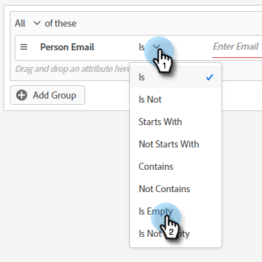

# オーディエンス条件 {#audience-criteria}

Marketo Engageスマートリストと同様に、オーディエンス条件属性を使用すると、ターゲットオーディエンスを定義できます。 推測される人、人、会社の属性（またはその組み合わせ）を使用して、既知の人または不明な人をターゲットに設定できます。

## 優先度 {#priority}

優先度複数該当する場合に、リードが受け取るダイアログを決定します。最初に[ダイアログを作成](/help/marketo/product-docs/demand-generation/dynamic-chat/automated-chat/create-a-dialogue.md){target="_blank"}するときに設定されます。既存のダイアログの優先順位を変更するには、そのダイアログを開き、「**オーディエンス条件**」タブのダイアログの詳細を表示します。

## イベント {#events}

イベントを使用すると、スクロールした量や、ページやサイトでの閲覧時間に基づいて、訪問者をターゲットに設定できます。次の例では、20 秒以上特定のページを閲覧した訪問者をターゲティングします。

1. 「**ページ滞在時間**」イベントを選択し、右にドラッグします。

   

1. 「次よりも大きい」時間を 20 秒に設定します。

   

1. 「[ターゲット](#target)」セクションに、目的のページの URL を入力します。

   

## 属性 {#attributes}

**認識済み人物**

_多数の_&#x200B;属性の組み合わせから選択できます。以下の例では、50 人以上の従業員を擁する会社で働く、カリフォルニア州のすべての&#x200B;**認識済み人物**&#x200B;をターゲティングします。

1. 「**人物の州**」属性を選択し、右にドラッグします。

   

1. 「_次に該当_」はデフォルトで設定されています。「値を選択」フィールドに「CA」と入力します（ドロップダウンをクリックして、リストから選択することもできます）。

   

1. 「**会社の規模**」属性を選択し、「_ここに属性をドラッグ＆ドロップ_」と書いてある場所にドラッグします。

   

   >[!NOTE]
   >
   >属性の **+** アイコンをクリックして選択することもできます。

1. 演算子のドロップダウンをクリックし、「**指定の値より大きい**」を選択します。

   

1. 「50」と入力し、画面の別の場所をクリックして保存します。

   

これで完了です。

**匿名の人物**

まだデータベース内にいない人を特定してターゲット設定するのは簡単です。この例では、ニューヨーク地区にいるすべての&#x200B;**匿名の人物**&#x200B;をターゲットに設定しています。

1. 「**人物のメール**」属性を選択し、右にドラッグします。

   

1. 演算子のドロップダウンをクリックし、「**が空である**」を選択します。

   

1. 「**推測される州**」属性を選択し、「_ここに属性をドラッグ＆ドロップ_」と書いてある場所にドラッグします。

   

   >[!NOTE]
   >
   >Web サイトの訪問者には、[Munchkin](/help/marketo/product-docs/administration/additional-integrations/add-munchkin-tracking-code-to-your-website.md){target="_blank"} Cookie が作成され、訪問者はシステムに格納されます。IP は特別なデータベースで調べられ、あらゆる情報が推測されます。

1. 「_次に該当_」はデフォルトで設定されています。「値を選択」フィールドに「NY」と入力します（ドロップダウンをクリックして、リストから選択することもできます）。

   

## メンバーシップ {#membership}

ダイアログのMarketo Engageオーディエンスに対してターゲットスマートリストを使用します。

1. メンバーシップで、を取得します。 **スマートリストのメンバー** をクリックし、キャンバスにドロップします。

   

1. 目的のスマートリストを選択します。

   

## グループを追加 {#add-groups}

すべての特定の属性を別の属性の「すべてまたは任意」と共に持つ場合に備えて、属性をグループ化することもできます。複数のグループを追加できます。

## ターゲット {#target}

特定のダイアログを表示する URL を入力する場所です。また、除外を追加することもできます。

使用可能な形式：

* `http://website.com`
* `https://*.website.com`
* `http://website.com/folder/*`
* `https://*.website.com/folder/*`

>[!NOTE]
>
>アスタリスクを使用すると包括的なワイルドカードとして機能します。`https://*.website.com` はサブドメイン（例：`support.website.com`）を含み、ダイアログをサイトのすべてのページに配置します。また、`https://website.com/folder/*` は後続のフォルダー内のすべての HTML ページにダイアログを配置します（例：フォルダーが「sports」の場合、website.com/sports/baseball.html、website.com/sports/football.html などになります）。

**除外**

「除外」を使用して、ダイアログがサイトの特定のページや領域に表示&#x200B;**されない**&#x200B;ようにします。「除外」は、「含める」と同じ形式に従います。

>[!MORELIKETHIS]
>
>* [ダイアログの作成](/help/marketo/product-docs/demand-generation/dynamic-chat/automated-chat/create-a-dialogue.md){target="_blank"}
>* [ストリームデザイナー](/help/marketo/product-docs/demand-generation/dynamic-chat/automated-chat/stream-designer.md){target="_blank"}
