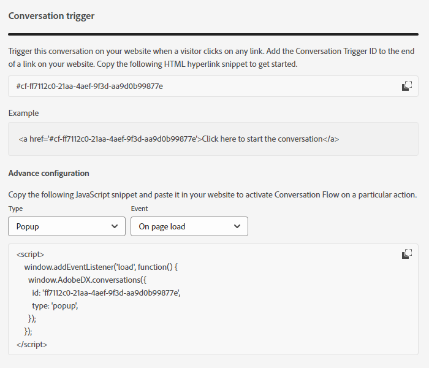

# 対話型フローの概要 {#conversational-flow-overview}

対話型フローをデザインし、特定のアクション（例：コールトゥアクションボタンのクリック、ページの読み込み時、ページの滞在時間など）に基づいて任意の訪問者に対してトリガーします。

## ダイアログと対話型フローの比較 {#dialogues-vs-conversational-flows}

ダイアログと対話型フローにはいくつかの類似点がありますが、これら 2 つの機能は異なります。

<table> 
 <tbody> 
  <tr> 
   <th style="width:50%">ダイアログ</th> 
   <th style="width:50%">対話型フロー</th>
  </tr> 
  <tr> 
   <td>ダイアログにはターゲットが設定されます。実装したパラメーターに基づいて、特定のページとオーディエンスに向けた対話をデザインします。</td> 
   <td>対話型フローはトリガーされます。フォームへの入力、リンクのクリックなど、訪問者のアクションに基づいて、トリガーできる対話をデザインします。</td>
  </tr>
   <tr> 
   <td>チャットボットインターフェイスでのみサポートされます。</td> 
   <td>現在はポップアップインターフェイスでサポートされていますが、さらに多くのインターフェイスが予定されています。</td>
  </tr>
  </tr>
   <tr> 
   <td>リードの同じセグメントに対して優先順位を付けて複数のダイアログを作成できるので、各訪問者は引き続き関与しながら、優先度に従って順番にダイアログを表示できます。</td> 
   <td>対話型フローには優先順位がなく、決定されたコールトゥアクションに基づいて、同じリードによって何度でもトリガーできます。</td>
  </tr>
  <tr>
   <td>チャットボットの対話は、ダイアログによって強化されます。</td>
   <td>Marketo Engage の<a href="/help/marketo/product-docs/demand-generation/dynamic-chat/automated-chat/conversational-flow-settings-for-marketo-engage-forms.md" target="_blank">対話型フォーム</a>は、対話型フローによって強化されます。</td>
  </tr>
 </tbody> 
</table>

## 「ストリームデザイナー」タブ {#stream-designer-tab}

対話型フローのストリームデザイナーは、ダイアログのストリームデザイナーとほとんど同じです。[詳しくは、こちらを参照してください](/help/marketo/product-docs/demand-generation/dynamic-chat/automated-chat/stream-designer.md){target="_blank"}。

## 「レポート」タブ {#reports-tab}

「レポート」タブでは、対話型フローのパフォーマンスに関する指標を確認できます。

既知の訪問者や不明な訪問者別のエンゲージメント率、コンバージョン率、フィルターなどを表示します。

## 「設定」タブ {#settings-tab}

「設定」タブの上半分では、対話型フローの名前を更新し、オプションの説明を追加し、言語を変更できます。

>[!NOTE]
>
>別の言語を選択すると、システムテキストの言語のみが変更されます。コンテンツの翻訳は自分で行う必要があります。

### 対話 SDK {#conversations-sdk}

「設定」タブの下半分で、対話 SDK とも呼ばれる対話トリガーをカスタマイズします。訪問者がリンクをクリックする際や、ページの読み込み時に web サイトで対話をトリガーするかどうかを決定できます。

>[!TIP]
>
>[対話 SDK](https://experienceleague.adobe.com/tools/marketo-dynamic-chatbot/conversations-sdk/?lang=ja){target="_blank"} の実際の動作をご覧ください。

>[!MORELIKETHIS]
>
>[対話型フローの作成](/help/marketo/product-docs/demand-generation/dynamic-chat/automated-chat/create-a-conversational-flow.md){target="_blank"}
