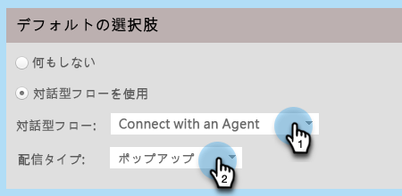
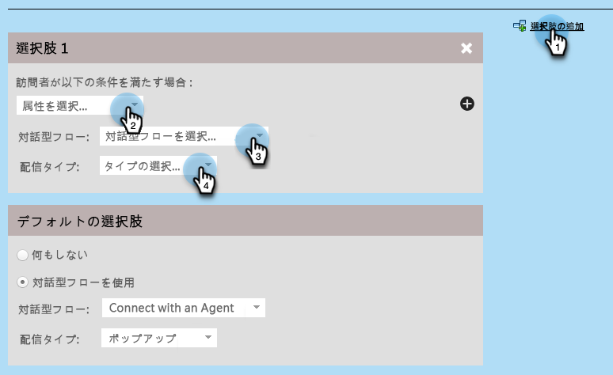
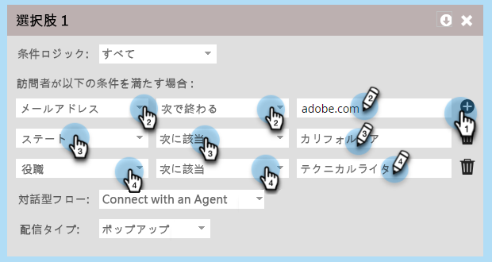
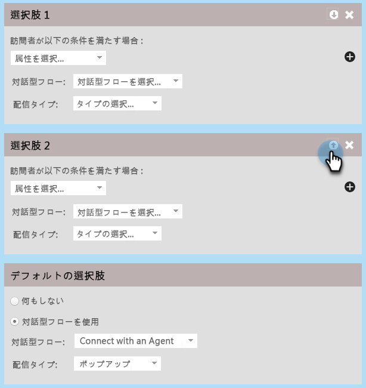
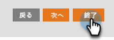

# Marketo Engage フォームの対話型フローの設定{#conversational-flow-settings-for-marketo-engage-forms}

Marketo Engage フォームを Dynamic Chat 対話型フローと統合して、対話型にします。フォームデータまたはスマートリストメンバーシップを使用して、会議の予約、ホワイトペーパーのリンクまたはカスタム目標に対して即座にリードを評価します。

>[!AVAILABILITY]
>
>スマートリストのメンバーまたはリストのメンバーの条件には、Dynamic Chat Prime が必要です。詳しくは、アドビのアカウントチーム（担当のアカウントマネージャー）にお問い合わせください。

1. フォームを見つけて選択します（または新しいフォームを作成します）。

   

1. 「**[!UICONTROL ドラフトを編集]**」をクリックします。

   

1. フォーム編集ページで、「**[!UICONTROL フォーム設定]**」、「**[!UICONTROL 設定]**」の順にクリックします。

   

1. 「**[!UICONTROL 対話型フロー設定]**」スライダーをクリックして有効にします。

   

1. デフォルトの選択モーダルが表示されます。環境設定を選択します。この例では、「**[!UICONTROL 対話型フローを使用]**」を選択しています。

   

1. 目的の&#x200B;**[!UICONTROL 対話型フロー]**&#x200B;と&#x200B;**[!UICONTROL 配信タイプ]**&#x200B;を選択します。

   

   >[!NOTE]
   >
   >[詳しくは、対話型フローを参照してください。](/help/marketo/product-docs/demand-generation/dynamic-chat/automated-chat/conversational-flow-overview.md){target="_blank"}

   **オプションの手順**：「**[!UICONTROL 選択肢を追加]**」をクリックして、特定の条件を満たすチャット訪問者をターゲットにすることができます。合計 10 個に対して最大 9 つの選択肢を追加できます。

   

   >[!NOTE]
   >
   >静的／スマートリストのメンバーとして資格を得るには、フォーム送信の前に訪問者のブラウザーを既知のユーザとして cookie にする必要があります。

   **オプションの手順**：各手順内の「**+**」記号をクリックして属性を追加すると、オーディエンスを絞り込むことができます（使用可能な属性は、フォームで選択したフィールドです）。次の例では、カリフォルニア州のアドビテクニカルライターをターゲットにしています。

   

   >[!NOTE]
   >
   >条件ロジックが「すべて」に設定されている場合は、資格を得るにはすべての属性が満たされる必要があることを意味します。条件ロジックが「任意」に設定されている場合は、いずれかの属性で十分であることを意味します。

   **オプションの手順**：2 つ以上の選択肢を追加する場合は、上／下矢印をクリックして並べ替えることができます。

   

1. 完了したら、「**[!UICONTROL 終了]**」をクリックします。

   
